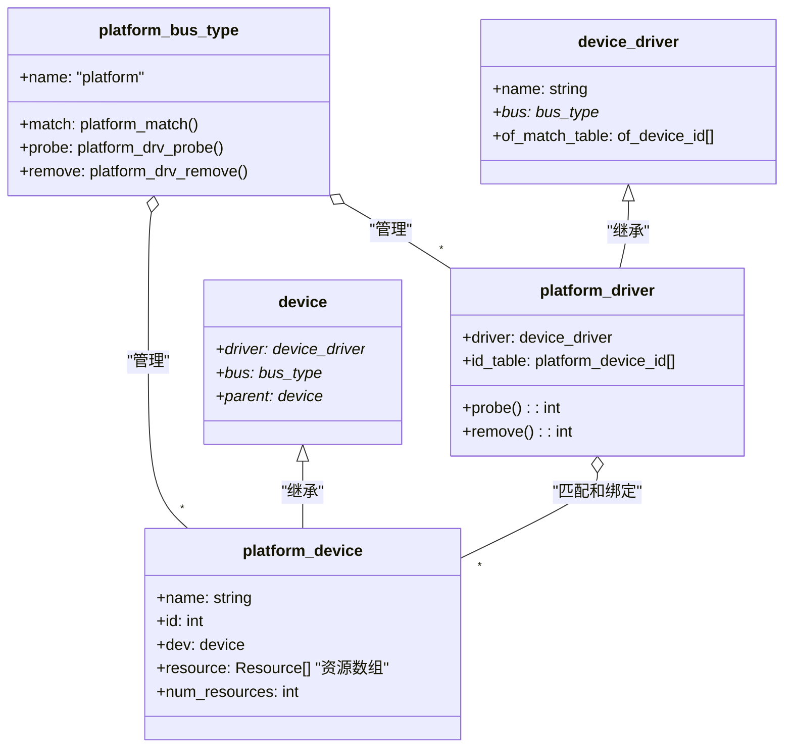
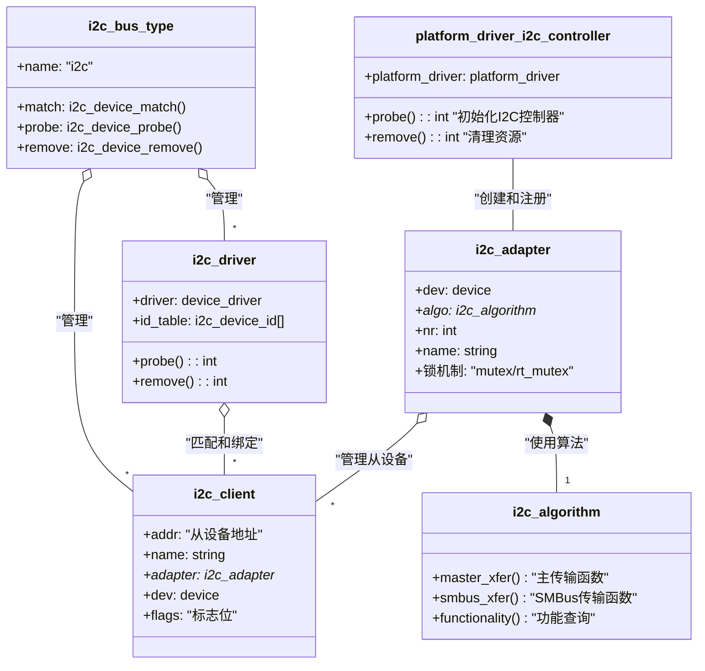
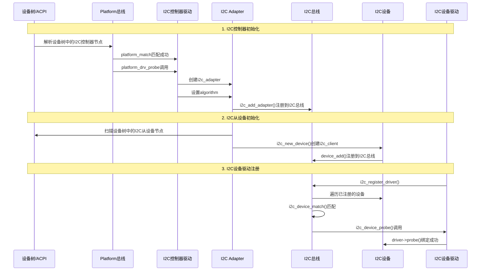
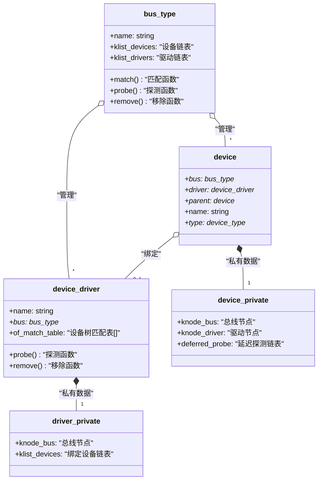
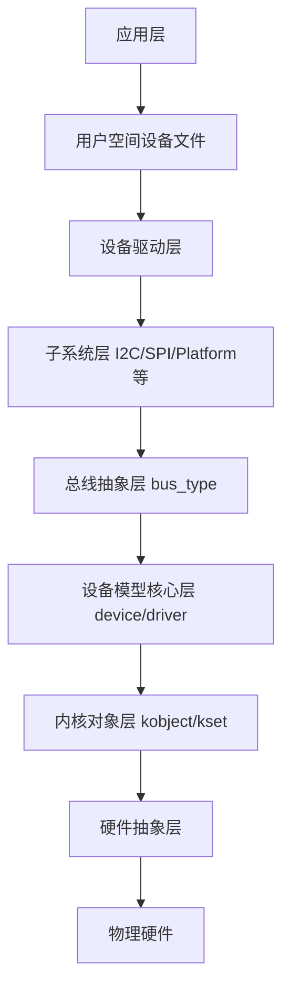

#doing 


# **🔧 今日工作安排**
- cursor 知识库
- SPINand UM 支持
- i2c linux 驱动学习


# **📌 工作进展**


---

# **⚠️ 问题与解决**


---

# **💡 技术总结**


Read file: base/dd. c
Read file: base/bus. c
Read file: base/dd. c
Read file: base/base. h

太好了！现在我找到了关键信息。`driver_match_device` 函数定义在 `base/base.h` 第 120行：

```c
static inline int driver_match_device(struct device_driver *drv,
				      struct device *dev)
{
	return drv->bus->match ? drv->bus->match(dev, drv) : 1;
}
```

这就是调用 `bus->match` 的关键函数！现在让我总结整个框架并制作图表。

## Linux 设备驱动框架详细分析

根据对代码的深入分析，现在我来详细回答您的问题：

### 1. platform_bus_type 的 match 和 probe 调用流程

#### match 回调函数调用位置：

**代码位置：** `drivers/base/base.h:120-123`
```c
static inline int driver_match_device(struct device_driver *drv,
				      struct device *dev)
{
	return drv->bus->match ? drv->bus->match(dev, drv) : 1;
}
```

**调用路径：**
1. **设备注册时的匹配：**
   - `platform_device_register()` → `device_add()` → `bus_probe_device()` → `device_attach()` → `__device_attach()` → `bus_for_each_drv()` → `__device_attach_driver()` → `driver_match_device()` → `platform_bus_type.match()`

2. **驱动注册时的匹配：**
   - `platform_driver_register()` → `driver_register()` → `bus_add_driver()` → `driver_attach()` → `bus_for_each_dev()` → `__driver_attach()` → `driver_match_device()` → `platform_bus_type.match()`

#### probe 回调函数调用位置：

**代码位置：** `drivers/base/platform.c:555-580`
```c
static int platform_drv_probe(struct device *_dev)
{
	struct platform_driver *drv = to_platform_driver(_dev->driver);
	struct platform_device *dev = to_platform_device(_dev);
	int ret;

	/* ... 电源管理代码 ... */
	
	ret = drv->probe(dev);  // 这里调用具体驱动的probe
	
	/* ... 错误处理 ... */
	return ret;
}
```

**调用路径：**
- `driver_match_device()` 匹配成功后 → `driver_probe_device()` → `really_probe()` → `dev->bus->probe()` → `platform_drv_probe()` → `drv->probe()`

### 2. i2c_bus_type 的 match 和 probe 调用流程

#### match 回调函数调用位置：

**代码位置：** `drivers/i2c/i2c-core.c:690-710`
```c
static int i2c_device_match(struct device *dev, struct device_driver *drv)
{
	struct i2c_client	*client = i2c_verify_client(dev);
	struct i2c_driver	*driver;

	/* 设备树匹配 */
	if (of_driver_match_device(dev, drv))
		return 1;

	/* ACPI匹配 */
	if (acpi_driver_match_device(dev, drv))
		return 1;

	driver = to_i2c_driver(drv);
	/* ID表匹配 */
	if (driver->id_table)
		return i2c_match_id(driver->id_table, client) != NULL;

	return 0;
}
```

**调用路径：** 与 platform 相同，通过 `driver_match_device()` 调用

#### probe 回调函数调用位置：

**代码位置：** `drivers/i2c/i2c-core.c:896-970`
```c
static int i2c_device_probe(struct device *dev)
{
	struct i2c_client	*client = i2c_verify_client(dev);
	struct i2c_driver	*driver;
	int status;

	/* ... 参数检查 ... */
	
	status = driver->probe(client, i2c_match_id(driver->id_table, client));
	
	/* ... 错误处理 ... */
	return status;
}
```

**调用路径：** 与 platform 相同，通过 `really_probe()` 调用

### 3. 控制器驱动、控制器设备、slave 驱动、slave 设备的关系

#### Platform 总线框架：




#### I2C 总线框架：



#### 完整的设备驱动注册流程：



### 4. Linux 设备驱动框架总体理解

#### 核心概念关系图：



#### 关键调用路径总结：

1. **设备注册流程：**
   ```
   设备注册 → bus_probe_device() → device_attach() → 
   遍历驱动列表 → driver_match_device() → bus->match() → 
   匹配成功 → driver_probe_device() → bus->probe() → 具体驱动probe()
   ```

2. **驱动注册流程：**
   ```
   驱动注册 → bus_add_driver() → driver_attach() → 
   遍历设备列表 → driver_match_device() → bus->match() → 
   匹配成功 → driver_probe_device() → bus->probe() → 具体驱动probe()
   ```

3. **延迟探测机制：**
   - 当 probe 返回 `-EPROBE_DEFER` 时，设备被加入延迟探测队列
   - 每当有新驱动注册成功时，触发延迟探测队列重新探测

#### 分层架构：



这个框架的设计哲学是：
- **分离关注点**：设备描述、驱动逻辑、总线协议分离
- **统一接口**：所有总线类型都遵循相同的 device/driver 模型
- **延迟绑定**：支持动态加载和卸载
- **层次化管理**：通过 parent 指针形成设备树结构
- **异步探测**：支持并行初始化提高启动速度


---

# **📚 知识关联**


---
# **📌 明日计划**


---

# **💬 扩展记录**


