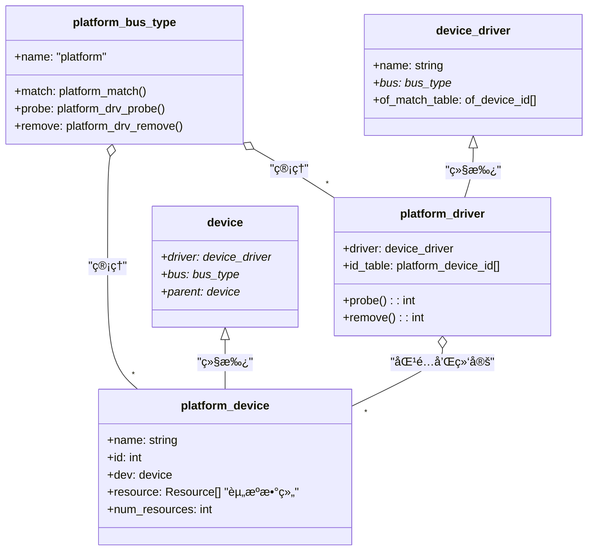
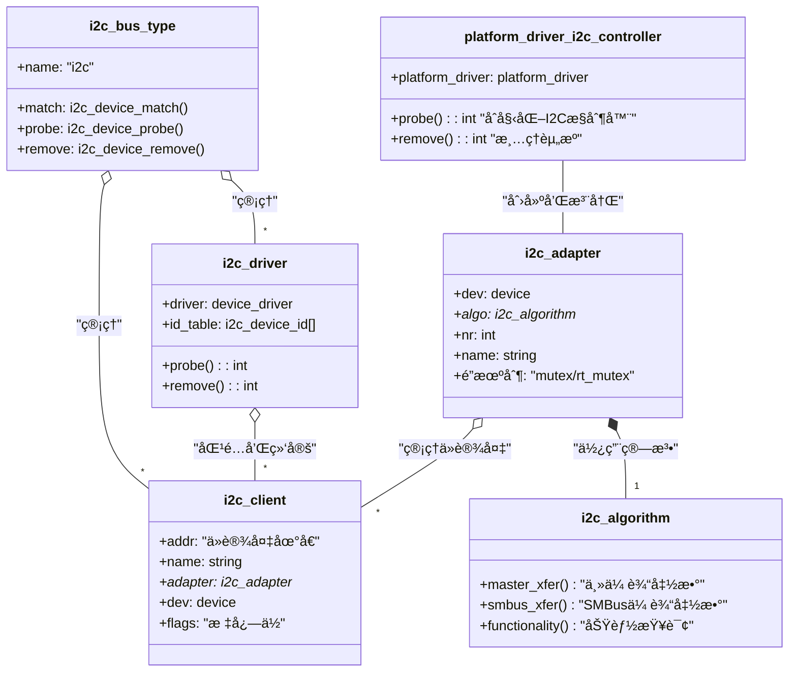
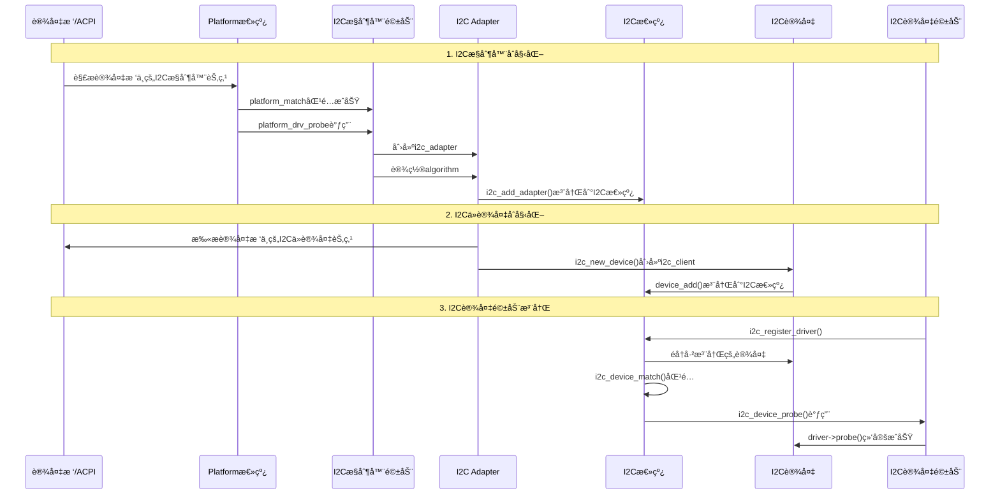
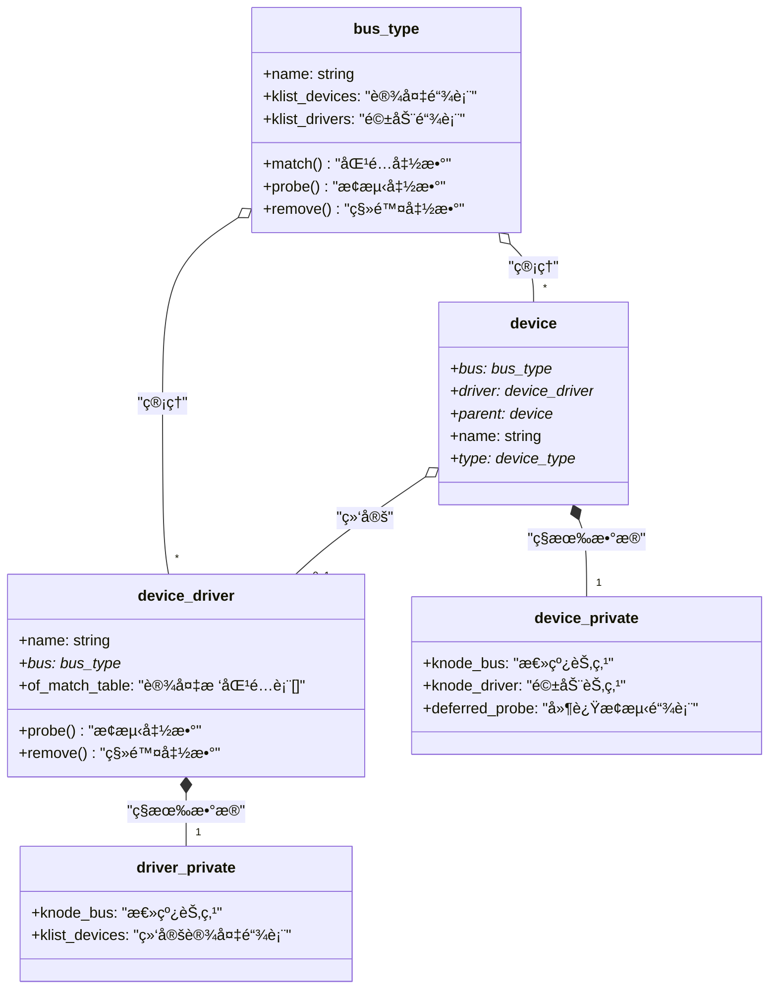
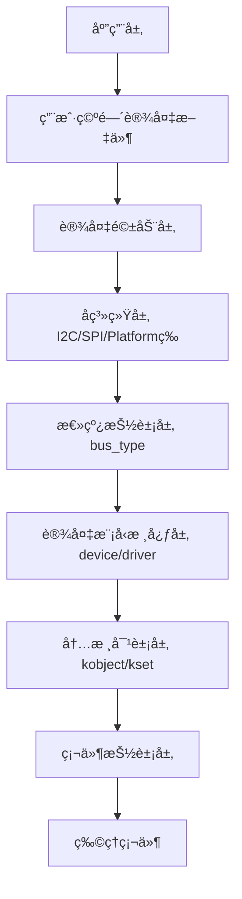

#doing 


# **🔧 今日工作安æ’**
- cursor 知识库
- SPINand UM 支æŒ
- i2c linux 驱动学习


# **📌 工作进展**


---

# **âš ï¸ é—®é¢˜ä¸è§£å†³**


---

# **💡 技术总结**


Read file: base/dd. c
Read file: base/bus. c
Read file: base/dd. c
Read file: base/base. h

太好了ï¼ç°åœ¨æˆ‘找到了关键信æ¯ã€‚`driver_match_device` 函数定义在 `base/base.h` 第 120行：

```c
static inline int driver_match_device(struct device_driver *drv,
				      struct device *dev)
{
	return drv->bus->match ? drv->bus->match(dev, drv) : 1;
}
```

这就是调用 `bus->match` 的关键函数ï¼ç°åœ¨è®©æˆ‘总结整个框æ¶å¹¶åˆ¶ä½œå›¾è¡¨ã€‚

## Linux 设备驱动框æ¶è¯¦ç»†åˆ†æ

æ ¹æ®å¯¹ä»£ç çš„深入分æ，ç°åœ¨æˆ‘æ¥è¯¦ç»†å›ç­”您的问题：

### 1. platform_bus_type çš„ match å’Œ probe 调用æµç¨‹

#### match å›è°ƒå‡½æ•°è°ƒç”¨ä½ç½®ï¼š

**代ç ä½ç½®ï¼š** `drivers/base/base.h:120-123`
```c
static inline int driver_match_device(struct device_driver *drv,
				      struct device *dev)
{
	return drv->bus->match ? drv->bus->match(dev, drv) : 1;
}
```

**调用路径：**
1. **设备注册时的匹é…：**
   - `platform_device_register()` → `device_add()` → `bus_probe_device()` → `device_attach()` → `__device_attach()` → `bus_for_each_drv()` → `__device_attach_driver()` → `driver_match_device()` → `platform_bus_type.match()`

2. **驱动注册时的匹é…：**
   - `platform_driver_register()` → `driver_register()` → `bus_add_driver()` → `driver_attach()` → `bus_for_each_dev()` → `__driver_attach()` → `driver_match_device()` → `platform_bus_type.match()`

#### probe å›è°ƒå‡½æ•°è°ƒç”¨ä½ç½®ï¼š

**代ç ä½ç½®ï¼š** `drivers/base/platform.c:555-580`
```c
static int platform_drv_probe(struct device *_dev)
{
	struct platform_driver *drv = to_platform_driver(_dev->driver);
	struct platform_device *dev = to_platform_device(_dev);
	int ret;

	/* ... 电æºç®¡ç†ä»£ç  ... */
	
	ret = drv->probe(dev);  // 这里调用具体驱动的probe
	
	/* ... é”™è¯¯å¤„ç† ... */
	return ret;
}
```

**调用路径：**
- `driver_match_device()` 匹é…æˆåŠŸå → `driver_probe_device()` → `really_probe()` → `dev->bus->probe()` → `platform_drv_probe()` → `drv->probe()`

### 2. i2c_bus_type çš„ match å’Œ probe 调用æµç¨‹

#### match å›è°ƒå‡½æ•°è°ƒç”¨ä½ç½®ï¼š

**代ç ä½ç½®ï¼š** `drivers/i2c/i2c-core.c:690-710`
```c
static int i2c_device_match(struct device *dev, struct device_driver *drv)
{
	struct i2c_client	*client = i2c_verify_client(dev);
	struct i2c_driver	*driver;

	/* è®¾å¤‡æ ‘åŒ¹é… */
	if (of_driver_match_device(dev, drv))
		return 1;

	/* ACPIåŒ¹é… */
	if (acpi_driver_match_device(dev, drv))
		return 1;

	driver = to_i2c_driver(drv);
	/* IDè¡¨åŒ¹é… */
	if (driver->id_table)
		return i2c_match_id(driver->id_table, client) != NULL;

	return 0;
}
```

**调用路径：** ä¸ platform 相åŒï¼Œé€šè¿‡ `driver_match_device()` 调用

#### probe å›è°ƒå‡½æ•°è°ƒç”¨ä½ç½®ï¼š

**代ç ä½ç½®ï¼š** `drivers/i2c/i2c-core.c:896-970`
```c
static int i2c_device_probe(struct device *dev)
{
	struct i2c_client	*client = i2c_verify_client(dev);
	struct i2c_driver	*driver;
	int status;

	/* ... å‚数检查 ... */
	
	status = driver->probe(client, i2c_match_id(driver->id_table, client));
	
	/* ... é”™è¯¯å¤„ç† ... */
	return status;
}
```

**调用路径：** ä¸ platform 相åŒï¼Œé€šè¿‡ `really_probe()` 调用

### 3. æ§åˆ¶å™¨é©±åŠ¨ã€æ§åˆ¶å™¨è®¾å¤‡ã€slave 驱动ã€slave 设备的关系

#### Platform 总线框æ¶ï¼š




#### I2C 总线框æ¶ï¼š



#### 完整的设备驱动注册æµç¨‹ï¼š



### 4. Linux 设备驱动框æ¶æ€»ä½“ç†è§£

#### 核心概念关系图：



#### 关键调用路径总结：

1. **设备注册æµç¨‹ï¼š**
   ```
   设备注册 → bus_probe_device() → device_attach() → 
   éå†é©±åŠ¨åˆ—表 → driver_match_device() → bus->match() → 
   匹é…æˆåŠŸ → driver_probe_device() → bus->probe() → 具体驱动probe()
   ```

2. **驱动注册æµç¨‹ï¼š**
   ```
   驱动注册 → bus_add_driver() → driver_attach() → 
   éå†è®¾å¤‡åˆ—表 → driver_match_device() → bus->match() → 
   匹é…æˆåŠŸ → driver_probe_device() → bus->probe() → 具体驱动probe()
   ```

3. **延迟æ¢æµ‹æœºåˆ¶ï¼š**
   - 当 probe è¿”å› `-EPROBE_DEFER` 时，设备被加入延迟æ¢æµ‹é˜Ÿåˆ—
   - æ¯å½“有新驱动注册æˆåŠŸæ—¶ï¼Œè§¦å‘延迟æ¢æµ‹é˜Ÿåˆ—é‡æ–°æ¢æµ‹

#### 分层æ¶æ„：



这个框æ¶çš„设计哲学是：
- **分离关注点**：设备æè¿°ã€é©±åŠ¨é€»è¾‘ã€æ€»çº¿å议分离
- **统一æ¥å£**：所有总线类å‹éƒ½éµå¾ªç›¸åŒçš„ device/driver 模å‹
- **延迟绑定**：支æŒåŠ¨æ€åŠ è½½å’Œå¸è½½
- **层次化管ç†**：通过 parent 指针形æˆè®¾å¤‡æ ‘结æ„
- **异步æ¢æµ‹**：支æŒå¹¶è¡Œåˆå§‹åŒ–æ高å¯åŠ¨é€Ÿåº¦


---

# **📚 知识关è”**


---
# **📌 æ˜æ—¥è®¡åˆ’**


---

# **💬 扩展记录**


