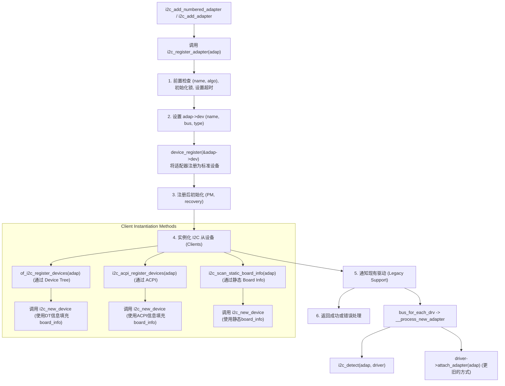
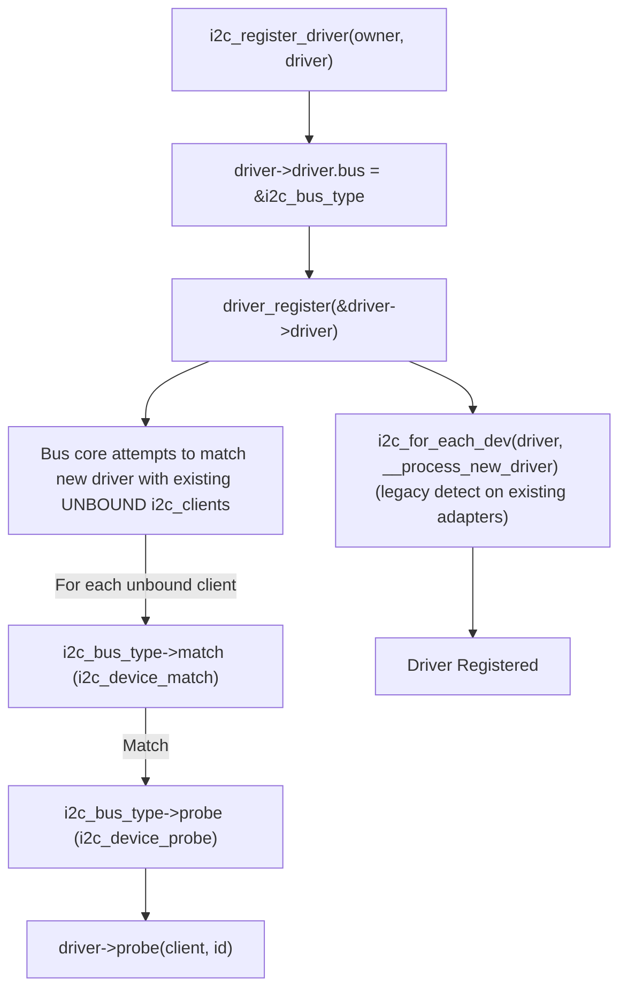
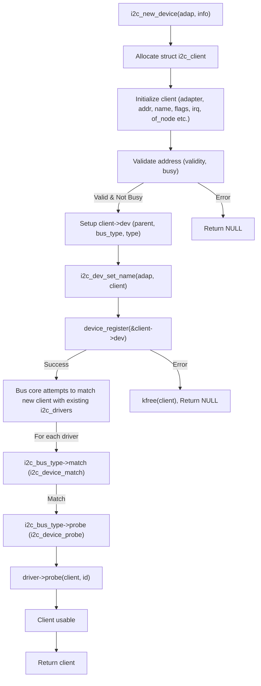

# Linux I2C 子系统学习与分析笔记

## 1. 概述

本文档旨在深入学习和分析 Linux 内核中的 I2C 子系统，重点围绕 Synopsys DesignWare I2C 控制器的驱动实现。通过对 I2C 核心 (`i2c-core.c`, `i2c.h`)、DesignWare 控制器核心驱动 (`i2c-designware-core.c`) 及其平台驱动 (`i2c-designware-platdrv.c`) 的代码级分析，逐步理解以下内容：
* 相关的编译构建配置 (Kconfig, Makefile)。
* I2C 子系统的核心数据结构与基本工作流程。
* I2C 控制器适配器 (Adapter) 的注册、初始化机制。
* I2C 从设备客户端 (Client) 的实例化、驱动匹配及 Probe 过程。
* DesignWare I2C 控制器的数据传输、中断处理和电源管理。
* I2C 子系统与内核其他基础模块 (如 `drivers/base/`) 的交互。
最终目标是清晰掌握 Linux I2C 驱动的完整生命周期和关键实现细节。

## 2. 编译与构建

**2.1 本项目编译的文件及功能概述:**
基于 `virgo_defconfig` 以及相关的 `Kconfig、Makefile` 规则，本项目中与 I2C 相关的关键编译文件及其功能如下：

> [!note]
> - `tristate` 表示 Kconfig 选项可以有三种状态：`y` (编译进内核)，`m` (编译为模块)，`n` (不编译)。
> - `choice` 表示 n 选一，只有一个为 y，其余都为 n

**2.2 virgo_defconfig:**
```
CONFIG_I2C=y
CONFIG_I2C_CHARDEV=y
CONFIG_I2C_DESIGNWARE_PLATFORM=y
```

**2.3 编译的 C 文件及其功能:**
* **`drivers/i2c/i2c-boardinfo.c`**:
    * **功能**: 提供对旧式基于板级信息（board_info）注册 I2C 设备的机制支持。允许在没有设备树或 ACPI 的情况下，通过 C 代码静态声明 I2C 从设备。函数如 `i2c_register_board_info()` 用于此目的。

* **`drivers/i2c/i2c-core.c`**:
    * **功能**: Linux I2C 子系统的核心。它实现了 `i2c_adapter` (控制器)、`i2c_client` (从设备) 和 `i2c_driver` (从设备驱动) 的注册、注销和管理框架。定义了 `i2c_bus_type`，负责设备与驱动的匹配逻辑。提供了核心的 `i2c_transfer()` API 用于数据传输，处理总线锁定、设备树 (OF) 和 ACPI 的 I2C 设备枚举。是整个 I2C 架构的基础。

* **`drivers/i2c/i2c-dev.c`**:
    * **功能**: 实现 I2C 字符设备接口。当此模块加载后，会为每个注册的 I2C 适配器创建 `/dev/i2c-X` 设备节点。用户空间的应用程序可以通过这些设备节点，使用 `ioctl()` 系统调用直接与 I2C 总线上的设备通信（例如，发送原始 I2C 消息、执行 SMBus 命令）。这常用于调试、诊断或特定的用户空间工具/驱动。

* **`drivers/i2c/i2c-gxlayer.c`**:
    * **功能**: 此文件的具体功能依赖于其内容和相关的 Kconfig。从名称推测，它是特定于 "GX" 平台的 I2C 抽象层或辅助驱动。它提供针对该平台上 DesignWare I2C IP 的特定初始化、封装或扩展功能，与通用的 `i2c-designware-core.c` 协同工作或对其进行适配。

* **`drivers/i2c/busses/i2c-designware-core.c`**:
    * **功能**: Synopsys DesignWare I2C IP 核的硬件核心驱动逻辑。它实现了 `struct i2c_algorithm` 接口，特别是 `master_xfer` (即 `i2c_dw_xfer`)，这是 I2C 核心进行数据传输时调用的关键函数。此文件负责直接控制 DesignWare I2C 控制器的寄存器，包括配置目标地址、发送/接收数据、管理 FIFO、处理中断 (`i2c_dw_isr`)、配置 I2C 模式和时序参数等。它被设计为由平台相关的 DesignWare 驱动 (`i2c-designware-platdrv.c`) 调用。

* **`drivers/i2c/busses/i2c-designware-platdrv.c`**:
    * **功能**: Synopsys DesignWare I2C IP 核的平台驱动。作为标准的 `platform_driver` 注册到内核。它负责：
        1. 与内核中的 `platform_device` (通常从设备树 DT 或 ACPI 表中为 DesignWare I2C 控制器创建) 进行匹配。
        2. 在 `probe` 函数中，获取特定平台的资源，如 DesignWare 控制器寄存器的内存映射基地址、中断号、时钟源。
        3. 解析设备树或 ACPI 中的配置参数（如总线频率、FIFO 深度、SDA 保持时间等）。
        4. 初始化 `dw_i2c_dev` 结构体，该结构体保存 DesignWare I2C 控制器的上下文信息。
        5. 调用 `i2c-designware-core.c` 中定义的函数（如 `i2c_dw_probe`) 来初始化 IP 核心硬件，并最终通过 `i2c_add_numbered_adapter` 将适配器注册到 I2C 子系统。
        6. 实现电源管理相关的回调函数 (suspend/resume)。

## 3. Linux I2C 子系统核心 (`i2c-core.c`, `i2c.h`)

* **3.1 关键数据结构**
    * `struct i2c_adapter`: 代表 I2C 控制器/总线。
    * `struct i2c_client`: 代表连接到 I2C 总线的从设备。
    * `struct i2c_driver`: 代表 I2C 从设备的驱动。
    * `struct i2c_algorithm`: 控制器操作接口 (由 DesignWare 驱动实现)。
    * `struct bus_type i2c_bus_type`: I2C 总线类型定义。
    * `struct i2c_msg`: I2C 传输消息结构。
* **3.2 核心流程与机制**
    * 适配器 (Adapter) 注册 (`i2c_add_adapter`, `i2c_add_numbered_adapter`) 与注销 (`i2c_del_adapter`)。
    * 客户端 (Client) 实例化与注册 (`i2c_new_device`, `of_i2c_register_devices`) 与注销 (`i2c_unregister_device`)。
    * 驱动 (Driver) 注册 (`i2c_register_driver`) 与注销 (`i2c_del_driver`)。
    * 设备与驱动的匹配 (`i2c_device_match`):
        * OF (Device Tree) 匹配。
        * ACPI 匹配。
        * ID Table 匹配。
    * Probe 流程 (`i2c_device_probe`)。
    * 数据传输接口 (`i2c_transfer`, `__i2c_transfer`, SMBus 接口)。
    * 总线锁定 (`i2c_lock_bus`, `i2c_unlock_bus`)。

下面详细分析这些核心机制：

**3.2.1 `i2c_bus_type` 与设备驱动匹配**

`i2c_bus_type` (定义于 `i2c-core.c`) 是 Linux 设备模型中代表 I2C 总线的核心结构。它的关键作用之一是定义设备 (`i2c_client`) 和驱动 (`i2c_driver`) 如何匹配并绑定。
- I2C 总线上有两条链表，一条用于挂接驱动，一条用于挂接设备；
- 其中 I2C 上挂接的设备有两类：`i2c_client_type` 和 `i2c_adapter_type`；
- `i2c_adapter_type` 是代表适配器，`i2c_client_type` 是 adap 注册时结合 `struct i2c_board_info` 结构体产生的；
- 工作流程：当设备向 I2C 总线注册时，会遍历 I2C 总线上已经注册的驱动是否有匹配的，如果匹配则调用驱动的 `probe` 方法；驱动向 I2C 总线注册时，也会遍历 I2C 总线上的设备是否有匹配的，如果匹配则调用驱动的 `probe` 方法；

* **`match` 回调: `i2c_device_match(struct device *dev, struct device_driver *drv)`**
* **调用时机**: 当新 `i2c_client` 注册或新 `i2c_driver` 注册时，由内核总线逻辑调用。
* **功能**: 判断给定的 `i2c_client` 是否可以由给定的 `i2c_driver` 处理。
* **匹配逻辑顺序**:
	1. **设备树 (OF) 匹配**: 调用 `of_driver_match_device()`，比较设备的 `compatible` 属性和驱动的 `of_match_table`。
	2. **ACPI 匹配**: 调用 `acpi_driver_match_device()`，比较 ACPI ID。
	3. **ID 表匹配**: 如果驱动提供了 `id_table` (`struct i2c_device_id` 数组)，则调用 `i2c_match_id()` 比较 `client->name` 与 `id_table` 中的 `name` 字段。
* **返回值**: 成功匹配返回非零值 (1 或指向匹配项的指针)，否则返回 0。

* **`probe` 回调: `i2c_device_probe(struct device *dev)`**
* **调用时机**: 在 `i2c_device_match` 返回成功后，由内核总线逻辑调用。
* **功能**: 执行 `i2c_client` 的最终初始化并调用其对应 `i2c_driver` 的 `probe` 方法。
* **主要步骤**:
	1. **IRQ 初始化**: 如果 `client->irq` 未设置，尝试从 DT 或 ACPI 获取中断号。
	2. **Wakeup IRQ 初始化**: 如果客户端支持唤醒功能 (`I2C_CLIENT_WAKE`)，初始化唤醒中断。
	3. **OF 时钟设置**: `of_clk_set_defaults()`。
	4. **PM Domain 附加**: `dev_pm_domain_attach()`。
	5. **调用驱动的 `probe`**: `driver->probe(client, matched_id)`。
	6. **错误处理**: 若驱动 `probe` 失败，则回滚之前的设置。

    **Mermaid 图示: I2C 设备与驱动匹配及 Probe 流程**
    ```mermaid
    graph TD
        subgraph I2C Core / Bus Logic
            A[New i2c_client registers OR New i2c_driver registers] --> B{Bus attempts match};
            B -- For each client/driver pair --> C["i2c_device_match(client, driver)"];
            C -- Match? --> D{Yes};
            C -- No Match? --> E[No further action for this pair];
            D --> F["i2c_device_probe(client)"];
            F --> G["Call client_driver->probe(client, id)"];
        end

        subgraph i2c_device_match
            M1[Start: i2c_device_match] --> M2{i2c_verify_client};
            M2 -- Valid --> M3["OF Match? (of_driver_match_device)"];
            M2 -- Invalid --> M_End_Fail[Return 0];
            M3 -- Yes --> M_End_OK[Return 1];
            M3 -- No --> M4["ACPI Match? (acpi_driver_match_device)"];
            M4 -- Yes --> M_End_OK;
            M4 -- No --> M5{Driver has id_table?};
            M5 -- Yes --> M6["i2c_match_id(id_table, client)"];
            M6 -- Name Match? --> M_End_OK_Ptr["Return id_entry_ptr (True)"];
            M6 -- No Name Match? --> M_End_Fail;
            M5 -- No --> M_End_Fail;
        end

        subgraph i2c_device_probe
            P1[Start: i2c_device_probe] --> P2{i2c_verify_client};
            P2 -- Valid --> P3["Setup IRQ (OF/ACPI)"];
            P3 --> P3a["Setup Wakeup IRQ (if I2C_CLIENT_WAKE)"];
            P3a --> P3b[OF Clock Setup];
            P3b --> P3c[PM Domain Attach];
            P3c --> P4["driver = to_i2c_driver(dev->driver)"];
            P4 --> P5["Call driver->probe(client, matched_id)"];
            P5 -- Success --> P_End_OK[Return 0];
            P5 -- Failure (e.g. -ENODEV) --> P6[Cleanup PM/WakeIRQ];
            P6 --> P_End_Fail[Return error];
            P2 -- Invalid --> P_End_Fail_Early[Return error];
        end
    ```

**3.2.2 适配器 (Controller) 注册: `i2c_register_adapter`**

I2C 适配器代表一个物理的 I2C 控制器。它的注册通常由 I2C 控制器驱动 (例如 DesignWare 驱动在其 `probe` 函数中) 调用 `i2c_add_adapter` 或 `i2c_add_numbered_adapter`，这些函数内部会调用核心的 `i2c_register_adapter` 函数。此函数负责将适配器注册到 Linux 内核的 I2C 子系统中，并根据设备树 (DT)、ACPI 或静态板级信息 (board_info) 来实例化其上的从设备 (clients)。

以下是其详细流程和核心步骤：

1.  **前置检查与基本设置**:
    *   确保驱动模型已初始化。
    *   检查适配器名称 (`adap->name`) 和算法回调 (`adap->algo`) 是否已提供。
    *   若未提供自定义锁操作，使用默认的 `i2c_adapter_lock_ops`。
    *   初始化适配器相关的锁：`bus_lock` (用于传输串行化)，`mux_lock` (用于多路复用器)，以及 `userspace_clients_lock` (用于用户空间客户端列表)。
    *   若未设置超时时间 (`adap->timeout`)，则设置为默认值 1 秒 (`HZ`)。

2.  **设备命名与注册为标准设备 (对应您流程图中的"配置 struct i2c_adapter"部分)**:
    *   `dev_set_name(&adap->dev, "i2c-%d", adap->nr)`: 设置适配器设备名称，如 `i2c-0`。
    *   `adap->dev.bus = &i2c_bus_type;`: 设置设备的总线类型为 `i2c_bus_type`。
    *   `adap->dev.type = &i2c_adapter_type;`: 设置设备的类型为 `i2c_adapter_type`。
    *   `device_register(&adap->dev);`: **关键步骤**。将适配器的 `struct device` 注册到 Linux 设备模型。
        *   成功后，适配器在 sysfs 中可见 (例如 `/sys/class/i2c-adapter/i2c-0` 或 `/sys/bus/i2c/devices/i2c-0`)。

3.  **注册后的初始化**:
    *   启用并配置设备的运行时电源管理 (Runtime PM)。
    *   可选地，为旧的 `/proc/bus/i2c` 接口创建兼容性符号链接 (`CONFIG_I2C_COMPAT`)。
    *   `i2c_init_recovery(adap)`: 初始化 I2C 总线恢复机制 (如果适配器支持)。

4.  **实例化 I2C 从设备 (Clients) (对应流程图中的 `of_i2c_register_devices` 和 `i2c_scan_static_board_info` 分支)**:
    *   **通过设备树 (Device Tree) 实例化 - `of_i2c_register_devices(adap)`**:
        *   遍历适配器设备树节点 (`adap->dev.of_node`) 的子节点 (或者 "i2c-bus" 子节点下的子节点)。
        *   对每个代表 I2C 从设备的子节点，调用 `of_i2c_register_device(adap, node)`:
            *   从子节点的 "compatible" 属性获取设备类型 (`info.type`)。
            *   从子节点的 "reg" 属性获取 I2C 从设备地址 (`info.addr`)。
            *   填充 `struct i2c_board_info info` 结构体。
            *   调用 `i2c_new_device(adap, &info)` 创建并注册 `i2c_client`。
    *   **通过 ACPI 实例化 - `i2c_acpi_register_devices(adap)`**: 类似地处理 ACPI 表中定义的从设备。
    *   **通过静态板级信息实例化 - `i2c_scan_static_board_info(adap)`**:
        *   仅当适配器编号是静态分配时执行。
        *   遍历全局的 `__i2c_board_list` (由 `i2c_register_board_info()` 填充)。
        *   如果某条静态信息中的总线号与当前适配器匹配，则调用 `i2c_new_device(adapter, &devinfo->board_info)` 创建并注册 `i2c_client`。
    *   **`i2c_new_device(adap, info)` 的核心作用 (对应流程图右侧的 `i2c_new_device` 详细展开)**:
        1.  分配 `struct i2c_client` 内存。
        2.  根据传入的 `adap` 和 `info` 初始化 `client` 成员 (如 `adapter`, `addr`, `name` (来自 `info->type`), `flags`, `irq`, `dev.of_node` 等)。
        3.  检查地址的有效性和是否已被占用。
        4.  设置 `client->dev` 的 `parent` (指向适配器设备), `bus` (指向 `&i2c_bus_type`), `type` (指向 `&i2c_client_type`)。
        5.  `i2c_dev_set_name(adap, client)`: 设置客户端设备名 (如 `0-0050`)。
        6.  `device_register(&client->dev)`: 将此 `i2c_client` 注册到内核。此步骤会触发总线层尝试将此新客户端与已注册的 `i2c_driver` 进行匹配。

5.  **通知现有驱动 (Legacy Support) (对应流程图中的 "legacy" 分支)**:
    *   `bus_for_each_drv(&i2c_bus_type, NULL, adap, __process_new_adapter)`:
        *   遍历所有已注册的 `i2c_driver`。
        *   对每个驱动调用 `i2c_do_add_adapter(driver, adap)`，其内部会:
            *   `i2c_detect(adap, driver)`: 执行旧的、基于类的设备探测。驱动的 `detect` 回调（如果存在）会尝试在给定的地址列表上查找设备，并使用 `i2c_new_device` 创建客户端。
            *   `driver->attach_adapter(adap)`: 如果驱动实现了更旧的 `attach_adapter` 回调，则调用它。

6.  **返回与错误处理**:
    *   成功返回 0。
    *   失败时，从 IDR 中移除适配器编号并返回错误码。
**Mermaid 图示: `i2c_register_adapter` 流程**


**3.2.3 驱动 (I2C Slave Driver) 注册: `i2c_register_driver`**

I2C 从设备驱动用于控制连接到 I2C 总线上的具体芯片 (如传感器、EEPROM)。

* **核心步骤**:
1. **驱动属性设置**: 设置 `driver->driver.owner` (通常是 `THIS_MODULE`) 和 `driver->driver.bus = &i2c_bus_type`。
2. **驱动注册**: 调用 `driver_register(&driver->driver)` 将驱动注册到内核的驱动模型中。
	* 注册后，总线核心会立即尝试将这个新驱动与所有当前在 `i2c_bus_type` 上已注册但尚未绑定驱动的 `i2c_client` 进行匹配 (通过 `i2c_device_match`)。
	* 如果匹配成功，则会调用 `i2c_device_probe`，进而调用该驱动的 `probe` 方法。
3. **处理现有适配器**: 调用 `i2c_for_each_dev(driver, __process_new_driver)`。
	* 此函数会遍历所有已注册的 I2C *适配器*。
	* 对于每个适配器，调用 `i2c_do_add_adapter`，其中会执行 `i2c_detect(adapter, driver)`，允许驱动在这些已存在的适配器上进行旧式的设备探测。

**Mermaid 图示: `i2c_register_driver` 流程**


**3.2.4 客户端 (I2C Slave Device) 实例化: `i2c_new_device`**

`i2c_client` 代表一个 I2C 从设备。`i2c_new_device` 函数用于根据提供的 `i2c_board_info` 在指定的适配器上创建一个这样的设备实例。

* **调用场景**: 主要由 I2C 核心内部调用，例如在 `of_i2c_register_devices` 解析设备树子节点时，或 `i2c_scan_static_board_info` 处理静态板级信息时。
* **核心步骤**:
	1. **内存分配**: 为 `struct i2c_client` 分配内存。
	2. **客户端初始化**: 根据传入的 `info` 和 `adap` 初始化 `client` 的各个字段 (如 `adapter`, `addr`, `name`, `flags`, `irq`, `dev.of_node`)。
	3. **地址有效性检查**: 调用 `i2c_check_addr_validity()` 和 `i2c_check_addr_busy()`。
	4. **设备结构初始化**: 设置 `client->dev` 的 `parent` (指向适配器设备), `bus` (指向 `&i2c_bus_type`), `type` (指向 `&i2c_client_type`)。
	5. **设备命名**: `i2c_dev_set_name(adap, client)` 创建唯一的设备名 (如 `0-0050`)。
	6. **设备注册**: 调用 `device_register(&client->dev)` 将此 `i2c_client` 注册到内核。
		* 注册后，总线核心会尝试将这个新客户端与所有已注册的 `i2c_driver` 进行匹配 (通过 `i2c_device_match`)。
		* 如果匹配成功，则会调用 `i2c_device_probe`，进而调用匹配驱动的 `probe` 方法。

**Mermaid 图示: `i2c_new_device` 流程**


## 4. I2C 控制器驱动：Synopsys DesignWare 详解

* **4.1 驱动分层**
    * 平台驱动层 (`i2c-designware-platdrv.c`): 特定于平台的初始化和资源管理。
    * 核心 IP 驱动层 (`i2c-designware-core.c`): 通用 DesignWare IP 逻辑，实现 `i2c_algorithm`。
* **4.2 控制器 (Adapter) 的注册与初始化**
    * **4.2.1 硬件描述 (Device Tree / ACPI)**
        * 控制器节点属性: `compatible = "snps,designware-i2c"`, `reg`, `interrupts`, `clocks`, 时序参数 (`*-hcnt`, `*-lcnt`, `sda-hold-time-ns` 等)。
        * `platform_device` 的创建。
    * **4.2.2 平台驱动 (`dw_i2c_driver`)**
        * 注册: `platform_driver_register`。
        * `probe` 函数 (`dw_i2c_plat_probe` in `i2c-designware-platdrv.c`):
            * 与 `platform_device` 匹配。
            * 资源获取与解析: 内存, IRQ, 时钟, DT/ACPI/平台配置。
            * 初始化 `struct dw_i2c_dev` (DesignWare 特定设备结构)。
            * 调用核心 IP 驱动的 `i2c_dw_probe`。
    * **4.2.3 核心 IP 驱动初始化 (`i2c_dw_probe` in `i2c-designware-core.c`)**
        * 填充 `struct i2c_adapter`: `name`, `algo = &i2c_dw_algo`, `dev.parent` 等。
        * `i2c_set_adapdata`。
        * DesignWare 硬件初始化 (`i2c_dw_init`):
            * 禁用/使能控制器 (`DW_IC_ENABLE`)。
            * SCL 时钟计数器配置 (`DW_IC_SS_SCL_HCNT/LCNT`, `DW_IC_FS_SCL_HCNT/LCNT`等)。
            * SDA 保持时间配置 (`DW_IC_SDA_HOLD`)。
            * FIFO 阈值配置 (`DW_IC_TX_TL`, `DW_IC_RX_TL`)。
            * 主模式、重启使能等配置 (`DW_IC_CON`)。
        * 中断请求 (`devm_request_irq` 关联 `i2c_dw_isr`)。
        * 注册 `i2c_adapter` (`i2c_add_numbered_adapter`)。
    * **4.2.4 `struct i2c_algorithm` 实现 (`i2c_dw_algo`)**
        * `master_xfer`: 映射到 `i2c_dw_xfer`。
        * `functionality`: 映射到 `i2c_dw_func`。
* **4.3 DesignWare I2C 数据传输 (`i2c_dw_xfer`)**
    * 获取 Runtime PM。
    * 初始化传输状态 (`dev->msgs`, `dev->cmd_err`等)。
    * 等待总线空闲 (`i2c_dw_wait_bus_not_busy`，检查 `DW_IC_STATUS_ACTIVITY`)。
    * 传输初始化 (`i2c_dw_xfer_init`):
        * 设置从设备地址 (`DW_IC_TAR`)，处理 10 位地址。
        * 清除和使能中断 (`DW_IC_INTR_MASK`, `DW_IC_CLR_INTR`)。
    * 使用 `completion` (`dev->cmd_complete`) 等待中断处理完成。
    * 超时处理和错误处理 (`i2c_dw_handle_tx_abort`, `dev->abort_source`)。
* **4.4 DesignWare 中断处理 (`i2c_dw_isr`)**
    * 读取中断状态 (`DW_IC_INTR_STAT`, `DW_IC_RAW_INTR_STAT`)。
    * 清除中断 (`DW_IC_CLR_*` 寄存器)。
    * 事件处理:
        * `DW_IC_INTR_TX_ABRT`: 传输中止，记录错误源，唤醒等待队列。
        * `DW_IC_INTR_RX_FULL`: RX FIFO 有数据，调用 `i2c_dw_read`。
        * `DW_IC_INTR_TX_EMPTY`: TX FIFO 空，调用 `i2c_dw_xfer_msg` 继续发送。
        * `DW_IC_INTR_STOP_DET`: 传输完成，唤醒等待队列。
* **4.5 DesignWare 核心传输函数 (`i2c_dw_xfer_msg`, `i2c_dw_read`)**
    * `i2c_dw_xfer_msg`: 填充 TX FIFO (`DW_IC_DATA_CMD`)，处理读写命令、RESTART 和 STOP 位。
    * `i2c_dw_read`: 从 RX FIFO (`DW_IC_DATA_CMD`) 读取数据。
* **4.6 DesignWare 电源管理 (PM)**
    * Runtime PM: `pm_runtime_*` API, `dw_i2c_plat_suspend`/`resume`。
    * System Sleep PM: `dw_i2c_plat_suspend`/`resume`。
    * Suspend: 禁用控制器 (`i2c_dw_disable`), 禁用时钟 (`clk_disable_unprepare`)。
    * Resume: 使能时钟 (`clk_prepare_enable`), 重新初始化控制器 (`i2c_dw_init`)。

## 5. I2C 从设备 (Client) 驱动

* **5.1 I2C Client 实例化**
    * **5.1.1 设备树 (Device Tree) 方式**
        * 控制器节点下的子节点定义 (属性: `reg`, `compatible`)。
        * I2C 核心通过 `of_i2c_register_devices` 和 `i2c_new_device` 创建 `i2c_client`。
    * **5.1.2 其他方式** (ACPI, Board Info, 动态实例化 - 简述)。
* **5.2 `struct i2c_driver` (从设备驱动)**
    * 注册: `i2c_register_driver`。
    * 匹配表: `id_table`, `driver.of_match_table`, `driver.acpi_match_table`。
    * `probe` 函数: 与硬件交互，初始化设备。
    * `remove` 函数: 释放资源。
* **5.3 Client 与 Driver 匹配 (`i2c_device_match`)**
    * 触发时机与匹配顺序。
* **5.4 `probe` 函数实现要点**
    * 获取私有数据: `i2c_set_clientdata`/`i2c_get_clientdata`。
    * 数据通信: `i2c_master_send/recv`, SMBus 函数, `i2c_transfer`。
* **5.5 数据交互示例 (`struct i2c_msg`)**
    * 填充 `addr`, `flags` (`I2C_M_RD`), `len`, `buf`。

## 6. Linux 内核 `drivers/base/` 与 I2C 的集成

* **6.1 总线模型 (`bus.c`, `driver.c`, `core.c`)**
    * `bus_register(&i2c_bus_type)` 的作用和影响。
    * `i2c_bus_type` 的回调如何被通用总线逻辑调用。
* **6.2 平台设备与驱动 (`platform.c`)**
    * DesignWare I2C 控制器驱动作为 `platform_driver` 的意义。
* **6.3 设备树与属性 (`property.c`, `drivers/of/`)**
    * 内核解析 DT 节点并提供给驱动的机制。
* **6.4 电源管理框架 (`drivers/base/power/`)**
    * 与 `dev_pm_ops` 的交互。

## 7. 整体框架图

* *(此部分预留，用于后续绘制 I2C 子系统、控制器驱动、客户端驱动以及它们与内核其他部分交互的框图)*

## 8. 整体流程：从启动到 I2C 设备通信

* **8.1 系统启动与 I2C 核心初始化**
    * `i2c_init` in `i2c-core.c`。
* **8.2 DesignWare 控制器平台驱动注册与 Probe**
    * `dw_i2c_init_driver` -> `platform_driver_register`。
    * DT/ACPI 匹配 -> `dw_i2c_plat_probe`。
    * `dw_i2c_plat_probe` -> `i2c_dw_probe` (core)。
    * `i2c_dw_probe` (core) -> `i2c_add_numbered_adapter`。
* **8.3 I2C Client (从设备) 实例化**
    * `i2c_add_numbered_adapter` -> `of_i2c_register_devices`。
    * `i2c_new_device` -> `device_register(&client->dev)`。
* **8.4 I2C Client 驱动注册与 Probe**
    * 从设备驱动通过 `i2c_register_driver` 注册。
    * `i2c_client` 与其 `i2c_driver` 匹配 (通过 `i2c_device_match`)。
    * `i2c_device_probe` (core) -> 调用从设备驱动的 `probe`。
* **8.5 数据通信**
    * 从设备驱动 `probe` 或其他函数中调用 `i2c_transfer` 等。
    * 最终调用到 DesignWare 的 `i2c_dw_xfer` -> 中断 -> `i2c_dw_isr` -> `i2c_dw_xfer_msg`/`i2c_dw_read`。

## 9. 调试与工具

* `i2c-tools` (`i2cdetect`, `i2cdump`, `i2cget`, `i2cset`)。
* 内核日志 (printk, dev_dbg)。
* 动态调试 (ftrace, kprobes)。
* I2C Tracepoints (在 `i2c-core.c` 中查找 `trace_i2c_*`)。
* DesignWare 寄存器查看与特定调试方法。

## 10. 总结与展望

* 学习过程中的关键收获。
* 遇到的挑战及解决思路。
* 未来可深入研究的方向。
