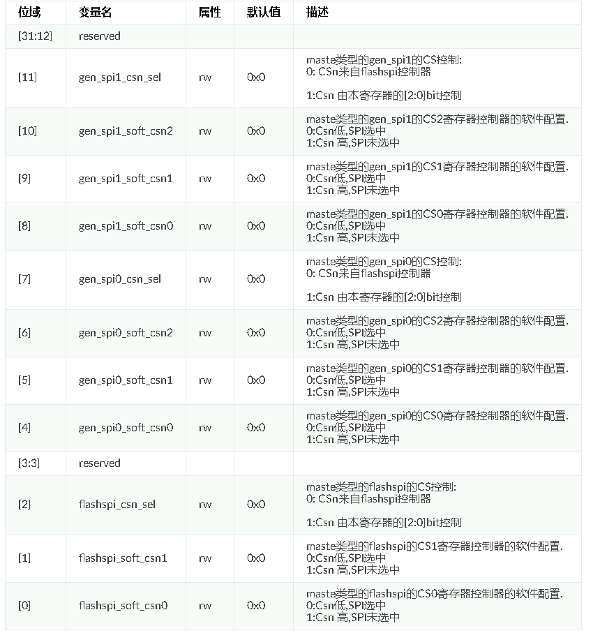
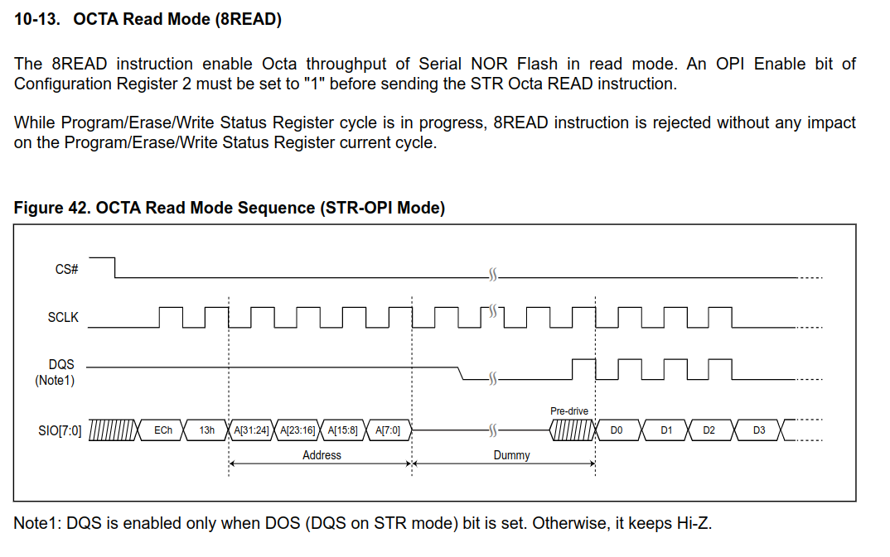
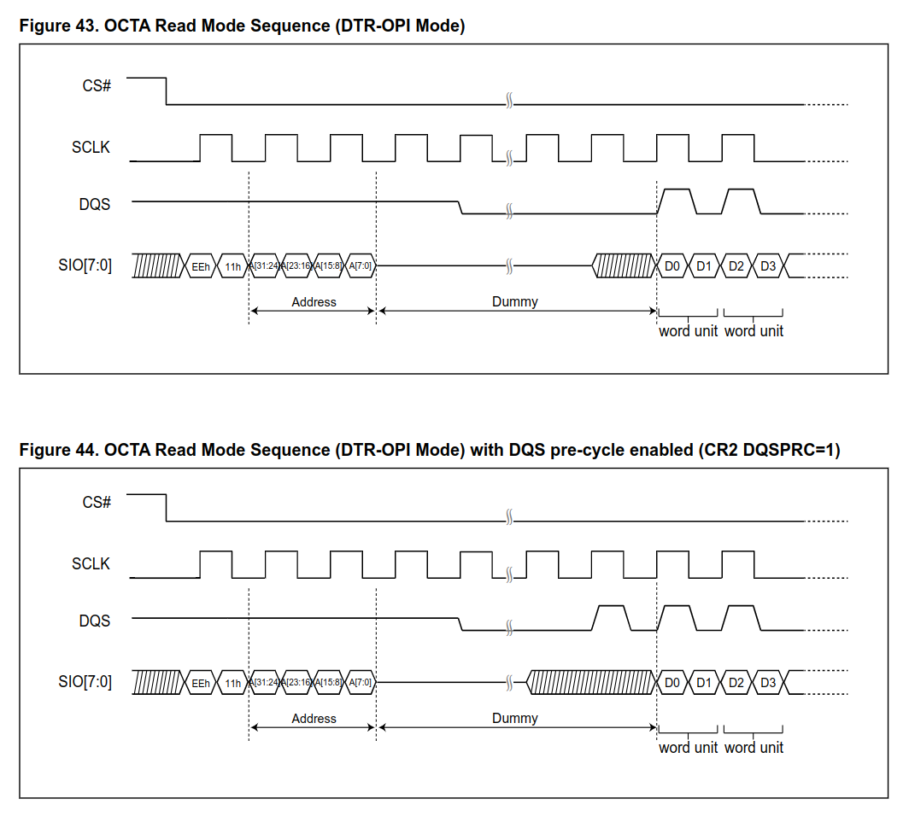

# Virgo 芯片测试


## Flash SPI

### v13p_top_sub.bit (54.6 MB) v13p_top_sub.bit     test5 最新工程

- SPI 基地址：`0x84100000`，CS 基地址：`0x84990080`
- 有两个 cs 可选，通过寄存器 `0x84990080` 控制，并且此寄存器还包括 `gen spi` 的 cs 控制




- Q：Flash spi 的两个 cs 是只需要测通路，还是驱动也要支持两个 cs 给事业部用？


- Q：通用 SPI 和 flash  spi 的 cs 控制都放在同一个寄存器里，会不会容易受影响？这里需要先确认 gen spi 的驱动是否和 flash spi 用同一套


- scpu 中 gen_spi 驱动

  ```c
  // master
  dw_spi_probe()
      
  spi_flash_register_master(spi_master)
  spi_setup(&spi_master->spi)
  
  
  // slave
  dw_spi_probe()
  dw_spi_master_get_dws(spi_master)
  gx_hal_spi_hw_init(&dws->hal_dws->spi, &config)
      
      
      	if(config->is_master == 1)
  		dws->device_context.cr0_solid = GX_HAL_SPI_MST | ((config->clk_mode << GX_HAL_SPI_MODE_OFFSET) \
  			& GX_HAL_SPI_MODE_MASK);
  	else
  		dws->device_context.cr0_solid = ((config->clk_mode << GX_HAL_SPI_MODE_OFFSET) \
  			& GX_HAL_SPI_MODE_MASK);
      1 << 31
  
  // tx
  // tx_only 方式
  gx_hal_qspi_transfer_prepare(&dws->hal_dws_spi, &trans)
          // 配寄存器，不需要配 master、baudr、ser
  gx_hal_spi_transfer_prepare(&dws->hal_dws_spi, &trans)
      
  gx_hal_spi_transfer(&dws->hal_dws_spi, &trans)
          // 一直发数据
          
  // rx
  // rx_only 方式
  gx_hal_qspi_transfer_prepare(&dws->hal_dws_spi, &trans)
          // 配寄存器，不需要配 master、baudr、ser
  
  gx_hal_spi_trasnfer(&dws->hal_dws_spi, &trans)
          // 如果是 standard 模式，先发一个 0x00 以发出 clock，一直读数据
  ```

- Master  -- Slave：

  - SPI_CTRLR0：bit31 配成 Slave
  - baud：从机时不需要配置
  - SER：从机时不需要配置

- 需要测试 2 个 cs、无 XIP


### octal 模式

- dqs：
- command：
  - SPI模式：有 3 字节地址，有 4 字节地址
  - OPI模式：2字节命令，4字节地址
    - dtr 模式下起始地址必须为偶数字节，且数据字节数必须是偶数
    - 8READ 命令之前，需要配置寄存器2的 OPI 位为1
    - 0xEC、0x13、4字节地址、dummy、data
    - DQS 线仅当 DOS bit 配置为1时才启用，其余时间为高阻态




- 8线  dtr 模式：




### dw_spi_config 在多 spi_device 的情况会有问题，需要改代码


## Gen SPI

master：

```c
static struct sflash_master g_spi_master = {
    .bus_num = 0,
    .spi = {
        .master = NULL,
        .chip_select = 0,
    },
};

g_spi_master.bus_num = 0;
g_spi_master.spi.chip_select = 0;
g_spi_master.spi.max_speed_hz = 100000;
g_spi_master.spi.mode = 0;

spi_flash_register_master(&g_spi_master);

spi_setup(&g_spi_master.spi);

spi_write(&g_spi_master.spi, dout, tx_len);

spi_write_then_read(&g_spi_master.spi, dout, tx_len, din, rx_len);

spi_read(&g_spi_master.spi, din, rx_len);
```


slave：

```c
static struct spi_device spi_slave = {
    .bits_per_word = 8,
};

spi_slave_init(&spi_slave);
	dws->regs = ;
	disable spi;
	enable interrupt;
	sample_delay = 1;
	tx_fifo_len,rx_fifo_len;


spi_slave_rx(&spi_slave, dout, len, NULL);
spi_slave_tx(&spi_slave, dout, len, NULL);
	bits = 8;
	mode = spi->mode;
	cr0 = spi->mode | TMOD_TO | bits_per_word | data_format
    disable spi;
	CTRLR0 = cr0;

dw_half_duplex_poll_transfer
    tx：
    	enable spi
    	readl(SPIM_TXFLR) 寄存器有多少数据
    	write TXDR
    	wait tx fifo empty
    	wait busy
    rx:
		readl(SPIM_RXFLR) 寄存器有多少数据
        readl RXDR
    disable spi
            
            
            
disable spi
cs low
close all interrupt
sample_delay
clk_div
RXFTLR
enable spi

wait busy
disable spi
ctlr0 eeprom 8bit
len CTRLR1
enable slave
0<<16 SPIM_TXFTLR
enable spi
cmd -> TXFIFO
read RXFIFO
```


```c
// Apus Slave Driver

// Init

if((iRet = spi_slave_init(spi_slave)) != 0)

struct spi_master *master = &dw_spi_master;
struct spi_data *dws = NULL;

device_list_init();
dw_spi_master_set_dws(master, &dws_spi_data);

dws = dw_spi_master_get_dws(master);
dws->base_regs = GX_REG_BASE_SPI2;
dws->cs_reg = GX_REG_BASE_SPI2_CS;
dws->master = master;

master->bus_num    = CONFIG_GENERAL_SPI_BUS_SN;
master->num_chipselect = CONFIG_SPI_SLAVE_NUM_MAX;
master->cleanup    = dw_spi_cleanup;
master->setup   = dw_spi_setup;
master->transfer   = dw_spi_transfer;


gx_hal_spi_hw_init(&dws->hal_dws_spi, &config);
	gx_hal_spi_enable_chip(dws, 0);
	gx_hal_dw_writel(dws, GX_HAL_SPI_IMR, GX_HAL_SPI_INT_OVERFLOW);
	gx_hal_spi_set_clk_div(dws, div);
	gx_hal_dw_writel(dws, GX_HAL_SPI_SAMPLE_DLY, ((dws->device_context.sample_delay%2)<<16) | (dws->device_context.sample_delay/2));
	gx_hal_spi_enable_chip(dws, 1);
gx_hal_spi_flush_rx(&dws->hal_dws_spi);
	while (!gx_hal_spi_rf_is_empty(dws))
		gx_hal_dw_readl(dws, GX_HAL_SPI_RXDR);
	while(gx_hal_spi_is_busy(dws));


// Read
	// qspi_transfer_prepare
	gx_hal_spi_enable_chip(dws, 0);
	gx_hal_dw_writel(dws, GX_HAL_SPI_DMACR,  0);
	gx_hal_dw_writel(dws, GX_HAL_SPI_SER, 0);
	cr0 = (GX_HAL_SPI_TMOD_RO << GX_HAL_SPI_TMOD_OFFSET) | \
			(transfer->bus_mode << GX_HAL_SPI_FRF2_OFFSET);
	cr0 |= transfer->bits_per_word - 1;
	cr0 |= dws->device_context.cr0_solid;
	gx_hal_dw_writel(dws, GX_HAL_SPI_CTRLR0, cr0);
	gx_hal_dw_writel(dws, GX_HAL_SPI_SAMPLE_DLY, ((dws->device_context.sample_delay%2)<<16) | (dws->device_context.sample_delay/2));
	/** if master  **/
		gx_hal_spi_set_clk_div(dws, dws->device_context.clk_div);
	gx_hal_dw_writel(dws,GX_HAL_SPI_SPI_CTRLR0, val);
	gx_hal_dw_writel(dws, GX_HAL_SPI_TXFTLR, val << 16);
	gx_hal_dw_writel(dws, GX_HAL_SPI_RXFTLR, dws->rx_fifo_len - 1);
	gx_hal_dw_writel(dws, GX_HAL_SPI_CTRLR1, len/dws->n_bytes-1);
	/** if master **/
		gx_hal_dw_writel(dws, GX_HAL_SPI_SER, 1 << dws->chip_select);
	gx_hal_spi_enable_chip(dws, 1);
	if(transfer->instruction.size)
		gx_hal_dw_writel(dws, GX_HAL_SPI_TXDR_BE, transfer->instruction.content);
	if(transfer->address.size)
		gx_hal_dw_writel(dws, GX_HAL_SPI_TXDR_BE, transfer->address.content);
	if(transfer->trans_mode == GX_HAL_SPI_TRANS_RX_ONLY && transfer->instruction.size == 0 && transfer->address.size == 0)
		gx_hal_dw_writel(dws, GX_HAL_SPI_TXDR_BE, 0x00);        // no ins and no addr, write tx fifo for starting transfer


	// spi_transfer_prepare
	gx_hal_spi_enable_chip(dws, 0);
	gx_hal_dw_writel(dws, GX_HAL_SPI_DMACR,  0);
	gx_hal_dw_writel(dws, GX_HAL_SPI_SER, 0);
	gx_hal_dw_writel(dws, GX_HAL_SPI_SPI_CTRLR0, 0);

	gx_hal_dw_writel(dws, GX_HAL_SPI_SAMPLE_DLY, ((dws->device_context.sample_delay%2)<<16) | (dws->device_context.sample_delay/2));
	gx_hal_dw_writel(dws, GX_HAL_SPI_CTRLR0, cr0);
	/** if master **/
		gx_hal_spi_set_clk_div(dws, dws->device_context.clk_div);
	if(transfer->tx_len && transfer->trans_mode != GX_HAL_SPI_TRANS_TX_AND_RX) {
		gx_hal_dw_writel(dws, GX_HAL_SPI_TXFTLR,
				(gx_hal_spi_min(dws->tx_fifo_len, transfer->tx_len/dws->n_bytes) - 1) << 16);
	}
	else
		gx_hal_dw_writel(dws, GX_HAL_SPI_TXFTLR, 0);
	gx_hal_dw_writel(dws, GX_HAL_SPI_RXFTLR, 0);
	gx_hal_dw_writel(dws, GX_HAL_SPI_CTRLR1, transfer->rx_len/dws->n_bytes-1);
	if(dws->is_master)
		gx_hal_dw_writel(dws, GX_HAL_SPI_SER, 1 << dws->chip_select);
	gx_hal_spi_enable_chip(dws, 1);


	// gx_hal_spi_transfer
	if(transfer->bus_mode == GX_HAL_SPI_STAND)//这里写是为了发出clock，下面读的时候会判断FIFO空
		gx_hal_dw_writel(dws, GX_HAL_SPI_TXDR, 0x00);
	gx_hal_spi_poll_recv_msg(dws, transfer);
		while(!(gx_hal_dw_readl(dws, GX_HAL_SPI_SR) & GX_HAL_SR_RF_NOT_EMPT));
		((uint8_t*)transfer->rx_buf)[i] = gx_hal_dw_readl(dws, GX_HAL_SPI_RXDR);

// Write

	// qspi_transfer_prepare

	// spi_transfer_prepare

	// gx_hal_spi_transfer
	items = dws->tx_fifo_len - gx_hal_dw_readl(dws, GX_HAL_SPI_TXFLR);
	size = gx_hal_spi_min(items, steps);

	for (j = i; j < i+size; j++) {
		if (dws->n_bytes == 1) {
			gx_hal_dw_writel(dws, GX_HAL_SPI_TXDR, ((uint8_t*)transfer->tx_buf)[j]);
		} else if (dws->n_bytes == 2) {
			gx_hal_dw_writel(dws, GX_HAL_SPI_TXDR, ((uint16_t*)transfer->tx_buf)[j]);
		} else if (dws->n_bytes == 4) {
			gx_hal_dw_writel(dws, GX_HAL_SPI_TXDR, ((uint32_t*)transfer->tx_buf)[j]);
		}
```

```c
Read:
		spi_slave_test_init(&g_spi_slave_test);
		spi_slave_rx(&g_spi_slave_test, spi_test_buf, len, NULL);
	Standard: sample_delay、cr0、ctrlr1、enable spi、write dummy to tx fifo、read rx fifo
		读的时候没有限制，可以随便读
		gx_hal_spi_transfer_prepare
			gx_hal_spi_enable_chip(dws, 0);
			gx_hal_dw_writel(dws, GX_HAL_SPI_DMACR,  0);
			gx_hal_dw_writel(dws, GX_HAL_SPI_SER, 0);
			gx_hal_dw_writel(dws, GX_HAL_SPI_SPI_CTRLR0, 0);
		
			gx_hal_dw_writel(dws, GX_HAL_SPI_SAMPLE_DLY, ((dws->device_context.sample_delay%2)<<16) | (dws->device_context.sample_delay/2));
			gx_hal_dw_writel(dws, GX_HAL_SPI_CTRLR0, cr0);
			/* no clk div */
			gx_hal_dw_writel(dws, GX_HAL_SPI_TXFTLR, 0);
			gx_hal_dw_writel(dws, GX_HAL_SPI_RXFTLR, 0);
			/* read len --> CTRLR1 */
			gx_hal_dw_writel(dws, GX_HAL_SPI_CTRLR1, transfer->rx_len/dws->n_bytes-1);
			/* no ser */
			gx_hal_spi_enable_chip(dws, 1);

		gx_hal_spi_transfer:Rx Only 时需要写一个 dummy 到 txfifo 来启动传输
			gx_hal_dw_writel(dws, GX_HAL_SPI_TXDR, 0x00);
			while(!(gx_hal_dw_readl(dws, GX_HAL_SPI_SR) & GX_HAL_SR_RF_NOT_EMPT));
			((uint8_t*)transfer->rx_buf)[i] = gx_hal_dw_readl(dws, GX_HAL_SPI_RXDR);
	Dual:
	Quad:
		gx_hal_qspi_transfer_prepare(&dws->hal_dws_spi, &trans)
			gx_hal_spi_enable_chip(dws, 0);
			gx_hal_dw_writel(dws, GX_HAL_SPI_DMACR,  0);
			gx_hal_dw_writel(dws, GX_HAL_SPI_SER, 0);
			gx_hal_dw_writel(dws, GX_HAL_SPI_CTRLR0, cr0);
			gx_hal_dw_writel(dws, GX_HAL_SPI_SAMPLE_DLY, ((dws->device_context.sample_delay%2)<<16) | (dws->device_context.sample_delay/2));
			/* no clk div */
			gx_hal_dw_writel(dws,GX_HAL_SPI_SPI_CTRLR0, val);
			gx_hal_dw_writel(dws, GX_HAL_SPI_TXFTLR, val << 16);
			gx_hal_dw_writel(dws, GX_HAL_SPI_RXFTLR, dws->rx_fifo_len - 1);
			/* RX Only 模式时，控制器要连续接收的数据长度 */
			gx_hal_dw_writel(dws, GX_HAL_SPI_CTRLR1, len/dws->n_bytes-1);
			/* no ser */
			gx_hal_spi_enable_chip(dws, 1);
			/* Rx Only 时需要写一个 dummy 到 txfifo 来启动传输 */
			gx_hal_dw_writel(dws, GX_HAL_SPI_TXDR_BE, 0x00);        // no ins and no addr, write tx fifo for starting transfer
		gx_hal_spi_transfer(&dws->hal_dws_spi, &trans)
			while(!(gx_hal_dw_readl(dws, GX_HAL_SPI_SR) & GX_HAL_SR_RF_NOT_EMPT));
			((uint8_t*)transfer->rx_buf)[i] = gx_hal_dw_readl(dws, GX_HAL_SPI_RXDR);

Write:
		spi_slave_test_init(&g_spi_slave_test);
		spi_slave_tx(&g_spi_slave_test, spi_test_buf, len, NULL);
	Standard:单线要发数据直接发
		gx_hal_spi_enable_chip(dws, 0);
		gx_hal_dw_writel(dws, GX_HAL_SPI_DMACR,  0);
		gx_hal_dw_writel(dws, GX_HAL_SPI_SER, 0);
		gx_hal_dw_writel(dws, GX_HAL_SPI_SPI_CTRLR0, 0);
	
		gx_hal_dw_writel(dws, GX_HAL_SPI_SAMPLE_DLY, ((dws->device_context.sample_delay%2)<<16) | (dws->device_context.sample_delay/2));
		gx_hal_dw_writel(dws, GX_HAL_SPI_CTRLR0, cr0);
		/* no clk div */
		gx_hal_dw_writel(dws, GX_HAL_SPI_TXFTLR, 0);
		gx_hal_dw_writel(dws, GX_HAL_SPI_RXFTLR, 0);
		/* 时钟延展和TX Only 模式时，此寄存器用于表示要连续传输的数据大小 */
		gx_hal_dw_writel(dws, GX_HAL_SPI_CTRLR1, transfer->rx_len/dws->n_bytes-1);
		/* no ser */
		gx_hal_spi_enable_chip(dws, 1);
			items = dws->tx_fifo_len - gx_hal_dw_readl(dws, GX_HAL_SPI_TXFLR);
			gx_hal_dw_writel(dws, GX_HAL_SPI_TXDR, ((uint8_t*)transfer->tx_buf)[j]);

	Quad:
		gx_hal_spi_enable_chip(dws, 0);
		gx_hal_dw_writel(dws, GX_HAL_SPI_DMACR,  0);
		gx_hal_dw_writel(dws, GX_HAL_SPI_SER, 0);
		gx_hal_dw_writel(dws, GX_HAL_SPI_CTRLR0, cr0);
		gx_hal_dw_writel(dws, GX_HAL_SPI_SAMPLE_DLY, ((dws->device_context.sample_delay%2)<<16) | (dws->device_context.sample_delay/2));
		/* no clk div */
		gx_hal_dw_writel(dws,GX_HAL_SPI_SPI_CTRLR0, val);
		/* txfifo 中的数据量达到val 后开始传输 */
		val = 0;
		/* instruction.size、address.size 都没有 */
		if(transfer->tx_buf && transfer->tx_len)
		{
			if(transfer->instruction.size)
				val++;
			if(transfer->address.size)
				val++;
		}
		gx_hal_dw_writel(dws, GX_HAL_SPI_TXFTLR, val << 16);
		/* rxfifo 中的数据量达到多少产生中断 */
		gx_hal_dw_writel(dws, GX_HAL_SPI_RXFTLR, dws->rx_fifo_len - 1);
		/* 时钟延展和TX Only 模式时，此寄存器用于表示要连续传输的数据大小 */
		gx_hal_dw_writel(dws, GX_HAL_SPI_CTRLR1, len/dws->n_bytes-1);
		/* no ser */
		gx_hal_spi_enable_chip(dws, 1);

		items = dws->tx_fifo_len - gx_hal_dw_readl(dws, GX_HAL_SPI_TXFLR);
		size = gx_hal_spi_min(items, steps);
				gx_hal_dw_writel(dws, GX_HAL_SPI_TXDR, ((uint8_t*)transfer->tx_buf)[j]);

```


```c
// Master

// Init
	spi_master_test_init
		dw_spi_probe()
		iRet = spi_flash_register_master(spi_master);
		spi_setup(&spi_master->spi);

// Read
	buffer,len --> message --> spi->master->transfer --> dw_pump_transfer

	// Standard
		gx_hal_spi_transfer_prepare
	// Dual、Quad
		trans.instruction.spi_lines = multi line
		trans.address.spi_lines = multi line
		instruction, address either transfer in multi line

	gx_hal_spi_transfer(&dws->hal_dws_spi, &trans)

// Write
	buffer,len --> message --> spi->master->transfer --> dw_pump_transfer

	// Standard
		gx_hal_spi_transfer_prepare
	// Quad

	/* 如果位宽为32位，则buf的前4个字节分别放在instruction 1个字节， address 3个字节，以便tx_buf的地址4字节对齐；
	 * 如果位宽为8位，则buf的第一个字节放在instruction中即可，address不需要放数据，没有对齐要求 */
		// 8bit 位宽
		trans.tx_buf = buf + 1;
		trans.tx_len -= 1;
		trans.instruction.size = 8;
		trans.instruction.content = buf[0]:
		trans.instruction.spi_lines = multi line
		trans.address.size = 0;
		trans.address.content = 0;
		trans.address.spi_lines = multi line

		// 32bit 位宽
		trans.tx_buf = buf + 4;
		trans.tx_len -= 4;
		trans.instruction.size = 8;
		trans.instruction.content = buf[0]:
		trans.instruction.spi_lines = multi line
		trans.address.size = 24;
		trans.address.content = (buf[1] << 16) | (buf[2] << 8) | buffer[3];
		trans.address.spi_lines = multi line

		if(transfer->instruction.size)
			gx_hal_dw_writel(dws, GX_HAL_SPI_TXDR_BE, transfer->instruction.content);
		if(transfer->address.size)
			gx_hal_dw_writel(dws, GX_HAL_SPI_TXDR_BE, transfer->address.content);

		gx_hal_qspi_transfer_prepare(&dws->hal_dws_spi, &trans);


	gx_hal_spi_transfer(&dws->hal_dws_spi, &trans);
```

### 应用场景：

#### slave:

- 准备好 trans --> prepare --> transfer

1. 写 0x1 个字节数据
	a. 单线
		配寄存器，把数据发到 txfifo
	b. 四线
		配寄存器，把数据发到 txfifo
2. 读 0x1 个字节数据
	a. 单线
		配寄存器，把数据收到 rxfifo
	b. 双线
		配寄存器，把数据收到 rxfifo
	c. 四线
		配寄存器，把数据收到 rxfifo

3. 先写 0x5 个字节数据，然后再读 0x10 个字节数据
	先调 tx 发数据，然后调 rx 收数据

#### master:

- spi_write --> pump / message
1. 写 0x1 个字节数据
	a. 单线
	b. 四线
2. 读 0x1 个字节数据
	a. 单线
	b. 双线
	c. 四线

3. 先写 0x5 个字节数据，然后再读 0x10 个字节数据


## IR

#### driver


## DMA

#### driver


### 驱动

- 写 Chx_CTL 寄存器
- 写 CHx_CFG 寄存器
- 写 CHx_CFGREG:0x10 使能 dma
- 写 CHxINTCLEAR 寄存器清中断
- 写 CHxINTSTATUSEN 寄存器使能 dma 传输完成、通道暂停、disable 中断
- 写 SRC 寄存器
- 写 DST 寄存器
- 写 BLOCK_TS 寄存器
- 写 CHENREG 寄存器 --> 写不进去


# 进度：

## 5.16：

```
Flash spi、通用 spi、dma、ir 测试用例已提供给芯片
Flash spi 能够从 rom 启动，单线、双线、四线在 develop2 分支测试通过，还需要验证： 中断、多个 CS、DMA、八线模式
通用 SPI、DMA、IR 都没开始测试
```


