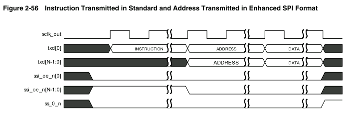
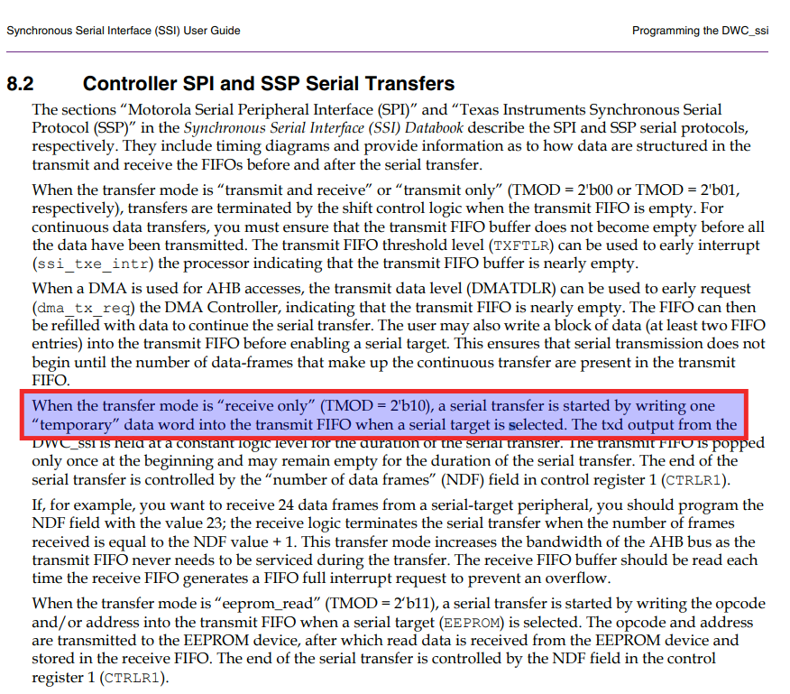

# 传输模式：

- TX & RX

  - 当TMOD = 0时，发送和接收逻辑都有效。数据传输按照所选帧格式正常进行。传输数据从传输FIFO弹出，并通过TXD线发送到目标设备，目标设备用RXD线上的数据回复。来自目标设备的接收数据在每个数据帧的末尾从接收移位寄存器移动到接收FIFO。

- TX ONLY

  - 当TMOD = 1时，接收数据是无效的，不应该存储在接收FIFO中。按照规定的帧格式，数据传输正常进行，传输数据从传输FIFO弹出，并通过TXD线发送到目标设备，目标设备用RXD线上的数据回复。在数据帧的最后，接收移位寄存器不加载其新接手的数据到接收FIFO。接收移位寄存器中的数据被下一次传输覆盖。当进入此模式时，应该屏蔽接收逻辑的中断。

- RX ONLY

  - 当TMOD = 2时，传输数据无效。发送FIFO不会在Receive Only模式下弹出。TXD输出电平在传输期间保持不变。数据传输按照所选帧格式正常进行。来自目标设备的接收数据在每个数据帧的末尾从接收以为寄存器移动到接收FIFO。当进入此模式时，应该屏蔽传输逻辑的中断。(对于 Receive Only 传输，从 DWC_ssi 传输到外部串行设备的数据是无效的，因此需要将一个 dummy 写入 TXFIFO 开始串行传输。在串行传输器件，DWC_ssi 的 txd线输出将保持恒定的逻辑电平)

- EEPROM

  - 当TMOD = 3 时，传输数据用于向EEPROM设备传输操作码或地址。通常这需要3个数据帧(8位操作码+ 8位高地址 + 8位低地址)。在传输操作码和地址期间，接收逻辑不会捕获数据(只要控制器在txd上传输数据，rxd上的数据就会被忽略)。控制器继续传输数据，直到传输FIFO为空。因此，在传输FIFO中应该只有足够的数据帧来为EEPROM提供操作码和地址。如果传输FIFO中的数据帧比需要的多，那么读取的数据就会丢失。
  - 当发送FIFO变为空时，接收线上的数据是有效的，并存储在接收FIFO中；TXD输出保持在一个恒定的逻辑级别。串行传输继续，直到控制器接收到的数据帧的数量与CTRLR1中NDF字段的值+1相匹配。

- 数据传输启动条件：

  - DWC_ssi 控制器使能(SSI_EN = 1)
  - 串行从设备使能(SER)
  - TX FIFO的数据数量 > TXFTLR.TFTHR

  当开始传输时，BUSY被置位，需要等待 busy 完成，才能开始传输

# 接收和发送FIFO缓冲区

- FIFO收发缓冲区简介

  - DWC_ssi使用的FIFO缓冲区是内部的d型触发器，可以再8~256之间进行深度配置。由于串行规范，发送和接收FIFO缓冲区的宽度都固定在32位，其中规定串行传输(数据帧)的长度可以是4~32位的。当写入传输FIFO缓冲区时，小于32位的数据帧必须右对齐。接收时移位寄存器自动右对齐接收数据到接收FIFO。

- TX & RX FIFO 详解

  - FIFO中的每个数据都包含一个数据帧，在一个FIFO位置只能存储一个数据帧。

  - 发送FIFO由AHB写命令加载到控制器的DR寄存器。数据由移位控制逻辑从TX FIFO传输到TX 移位寄存器。

    - 当发送FIFO的数据少于`FIFO的阈值(TXFTLR)`时，发送FIFO会产生FIFO EMPTY中断。
    - 如果将数据写入已满的TX FIFO，则会生成一个传输FIFO溢出中断。

  - 数据通过AHB读命令从RX FIFO传输到控制器的DR寄存器。接收FIFO由移位控制逻辑从接收移位寄存器加载。当接收FIFO的数量≥FIFO阈值 (RXFTLR)

    \+ 1，产生FIFO-FULL中断。
    
    - 当接收移位逻辑试图将数据加载到已满的接收FIFO时，会产生接收FIFO溢出中断。新接收的数据会丢失。
  - 如果试图从空的接收FIFO读取，将产生接收FIFO下溢中断。
  
- 外部双端口SRAM

  - 使用参数SSIC_HAS_EXT_RAM进行配置
  - 启用后，在控制器上添加端口与外部SRAM连接，数据寄存器(DR)通常用于与SRAM的接口
  - 为执行传输和接收操作，控制器有两个单独的SRAM接口，分别存储写和读数据。
    - SSIC_HAS_TX_RX_EN参数启用
    - 外部RAM的深度通过SSIC_RX_FIFO_DEPTH和SSIC_TX_FIFO_DEPTH参数配置

# RXD Sample Delay


- 从设备使用来自主设备的clk作为时钟源，即delay的是以主设备的clk来delay。
- 主设备对rxd信号采样之前，rxd可能还没稳定到正确的值，所以增加采样延迟来保证采样数据的正确
- 若没有RXD采样延迟，必须增加传输的波特率，以确保RXD信号的设置时间在范围内
- 通过设置RX_SAMPLE_DLY寄存器来配置采样延迟周期数量
  - SE设置为0，则延迟周期为RX_SAMPLE_DLY设置的周期数
  - SE设置为1，则延迟周期为RX_SAMPLE_DLY + 半个周期


# SPI 中断

SPI 控制器支持可以被屏蔽的合并中断请求。合并中断请求是屏蔽后的所有其它 SPI 中断的 ORed 结果。所有 SPI 中断都有有效高极性电平。SPI 中断的描述如下：

- 发送FIFO空中断–发送FIFO缓冲器等于或低于其阀值并且需要执行以防止下溢时设置。通过软件可编程寄存器设置的阀值决定中断被生成的发送 FIFO 缓冲器入口的的水平。当数据写入发送 FIFO 缓冲器时<font color=red>**该中断由硬件清除**</font> , 从而使该缓冲器高于阀值水平。

- 发送FIFO上溢中断–主器件尝试将数据写入完全填充后的发送FIFO缓冲器时设置。设置时，新数据写操作被丢弃。该中断保持设置状态直到您读取发送 FIFO 上溢中断清除寄存器 (TXOICR)。

- 接收FIFO满中断–当接收FIFO缓冲器等于或高于其阀值加1并且需要执行以防止上溢时设置。通过软件可编程寄存器设置的阀值决定中断被生成的接收 FIFO 缓冲器入口的水平。当数据从接收 FIFO 缓冲器读取时<font color=red>**该中断由硬件清除**</font>，从而使该缓冲器低于阀值水平。

- 接收 FIFO 上溢中断 – 当接收逻辑尝试将数据放入完全填充后的接收 FIFO 缓冲器设置。设置时，新接收的数据被丢弃。该中断保持设置状态直到您读取接收 FIFO 上溢中断清除寄存器 (RXOICR)。

- 接收FIFO下溢中断–当系统总线访问尝试从空的接收FIFO缓冲器读取时设置。设置时，零从接收 FIFO 缓冲器读回。该中断保持设置状态直到您读取接收 FIFO 下溢中断清除寄存器 (RXUICR)。合并中断请求 – 屏蔽以上所有中断请求后导致 ORed。要屏蔽该中断信号，您必须屏蔽所有其它 SPI 中断请求。

- 发送 FIFO 上溢、发送 FIFO 空、接收 FIFO 满、接收 FIFO 下溢和接收 FIFO 上溢中断均可通过使用中断屏蔽寄存器 (IMR) 被单独地屏蔽


# DMA 控制器接口

DWC_ssi 具有可选的内置 DMA 功能，可以在配置时选择；它有一个与DMA控制器握手的接口来请求和控制传输。AHB总线用于执行与DMA之间的数据传输。

- 控制器使用两个DMA通道，一个用于传输数据，另一个用于接收数据

  - DMACR：控制寄存器，配置DMA操作
  - DMATDLR：用于设置DMA请求所处的 TX DATA LEVEL，也就是 TXFIFO 有多少数据请求 dma 传输
  - DMARDLR：用于设置DMA请求所处的RX DATA LEVEL

- DWC_ssi 使用以下握手信号与DMA控制器交互：

  - dma_tx_req
  - dma_rx_req
  - dma_tx_ack
  - dma_rx_ack
  - dma_tx_single
  - dma_rx_single

- DMA输出 dma_finish 是一个状态信号，表明DMA块传输完成

- 为了在DWC_ssi 上启用DMA控制器接口，必须写入DMACR寄存器，在DMACR寄存器中的TDMAE位写1，可以启用TX；写入RDMAE位 启用RX。

- 操作简介：

  - 作为一个块流控设备，DMA控制器由处理器编写数据项的数量(块大小)，这些数据项将由DWC_ssi传输或接收，这被编程到CTLx寄存器到BLOCK TS字段，在增强 SPI 操作模式下，块大小包括指令、地址和数据。

  - 块被分解成许多burst，每个burst都是由来自DWC_ssi的请求发起的。DMA控制器还必须编程为每个DMA请求传输的数据项的数量，即burst length。并被编程到DW-AHB_DMAC 的 CTLx寄存器的SRC_MSIZE、DST_MSIZE字段中，分别用于源和目标。

  - 下面显示了单个块传输，要传输的块大小是 12，burst 长度为 4。此时，块大小是burst长度的倍数，因此块传输全部由 burst 传输组成。

    

  - 当要传输的块大小不是burst传输的倍数时，需要一系列的burst传输，然后是单个传输

    

- 发送水位等级和TXFIFO下溢：阈值寄存器的典型值是 <font color=red>**一半**</font>

  - 在传输器件，当TXFIFO中的数量≤ DMATDLR寄存器的值时，TX FIFO 请求就会发送到DMA，DMA通过向TX FIFO写一个长度为CTLx.DEST_MSIZE的数据进行burst来进行响应。
  - 应该经常从DMA读取数据，以免 TX FIFO 连续执行串行传输。也就是说：当FIFO开始清空时，应该触发另一个DMA请求。否则FIFO将没有数据(下溢)，要避免这种情况，必须正确设置水线。

- 选择 Transmit Watermark Level

  - 考虑做出假设的例子：`DMA.CTLx.DEST_MSIZE = FIFO_DEPTH - SSI.DMATDLR`

    - Case1: `DMATDLR = 2，FIFO_DEPTH = 8，DMA.CTLx.DEST_MSIZE = 8 - 2 = 6`

      - 当 TXFIFO 的数据等于或小于 2 个，则请求 DMA 产生 burst，一次搬 6 个字节到 TXFIFO。如果请求 DMA 不及时，则会导致 TXFIFO 数据下溢。

      

    - Case2:`DMATDLR = 6，FIFO_DEPTH = 8，DMA.CTLx.DEST_MSIZE = 8 - 6 = 2`

      - 当 TXFIFO 的数据等于或小于 6 个，就请求 DMA 产生 burst，一次搬 2 个字节到 TXFIFO。此时 TXFIFO 溢出的概率很低，因为 DMA 有足够的时间在 TXFIFO 变空之前处理目标 burst 请求。

        

    - 第二种情况以更多的 burst 请求为代价，具有较低的溢出概率。这提供了比前一种情况更多的 burst 请求和更差的总线利用率。

    - 因此，选择水线的目标是在减少 burst 请求的同时，将溢出的概率保持在可接受的水平。

- 选择 `DEST_MSIZE` 和 `Transmit FIFO Overflow`

  - 如果将 `DMA.CTLx.DEST_MSIZE` 设置的比 `DMATDLR` 大，可能会导致 TXFIFO 中没有足够的空间来存放 DMA burst 传输的数据，而发生溢出。因此，为了避免溢出，比如遵循一下等式：
    - `DMA.CTLx.DEST_MSIZE <= SSI.FIFO_DEPTH - SSI.DMATDLR`
  - 在 Case2 中，`DMATDLR = 6`，发生 `Burst` 请求时 `TXFIFO` 中剩余的空间量等于 `DMA.CTLx.DEST_MSIZE`。此时 TXFIFO 可能已满，但不会溢出。
    - 因此，为了获得最佳操作，`DMA.CTLx.DEST_MSIZE` 应根据下面的等式设置：
    - `DMA.CTLx.DEST_MSIZE = SSI.FIFO_DEPTH - SSI.DMATDLR`


- 选择 `Receive Watermark Level`

  - 类似 TX 水线，RX 水线需要配置尽可能小的溢出概率。

  - 如果将 `DMA.CTLx.SRC_MSIZE` 设置的比 `DMARXLR` 大，当没有足够的数据往源中填充时，会发生下溢。

  - 如果两者相等，则 `RXFIFO` 可能会被清空，但不会产生下溢。

  - 为了获得最佳操作，`DMA.CTLx.SRC_MSIZE` 应与水线设置相等。

    `DMA.CTLx.SRC_MSIZE = SSI.DMARDLR + 1`


- 握手接口操作

  - `dma_tx_req、dma_rx_req`
    - 源和目标的请求信号 `dma_rx_req、dma_tx_req` 在其相应的 FIFO 达到水线时被激活，如前所述。
    - ahb dma 用上升沿选中 `dma_tx_req、dma_rx_req` 来识别通道上的请求。收到来自 ahb dma 的 dma_tx_ack、dma_rx_ack 信号表明 burst 传输完成，`DWC_ssi` 取消断言 burst 请求信号 `dma_tx_req、dma_rx_req`，直到 ahb dma 的`dma_tx_ack、dma_rx_ack` 信号取消断言。当 `DWC_ssi` 采样 `dma_tx_ack、dma_rx_ack` 信号取消断言，如果其相应的 FIFO 达到水线时，它可以重新启动请求线上的`dma_tx_req、dma_rx_req` 。如果这不是 case，DMA请求线保持取消断言。

  - 两件事保持 mind：
    - burst 请求线，`dma_tx_req、dma_rx_req` 信号，一旦断言保持断言直到相应的 `dma_tx_ack、dma_rx_ack` 信号接收


- 中断

  - 传输FIFO空中断(ssi_txe_intr)：当TX FIFO ≤ TX FIFO阈值时产生中断。

    - 当数据写入传输FIFO缓冲区时，此中断被硬件清除。
    
  - 传输FIFO溢出中断(ssi_txo_intr)：TX FIFO已满时，AHB试图写入TX FIFO时产生中断。当中断存在时，丢弃新写入的数据。

    - 当读取`TX FIFO`溢出中断清除寄存器，此中断清除。

  - 接收FIFO满中断(ssi_rxf_intr)：当RX FIFO ≥ RX FIFO阈值 + 1时产生中断用于防止数据溢出。

    - 当从接收FIFO 读取数据时，硬件清除该中断。

  - 接收FIFO溢出中断(ssi_rxo_intr)：当RX FIFO已满，接收逻辑试图将数据放入接收FIFO时产生中断。当中断存在时，丢弃新接收的数据。

    - 读取接收FIFO溢出中断清除寄存器，此中断清除。

  - 接收FIFO下溢中断(ssi_rxu_intr)：当RX FIFO为空时，AHB试图从 RX FIFO读取数据时产生中断。当中断存在时，读取RX FIFO返回0。

    - 读取接收FIFO下溢中断清除寄存器，此中断清除。
- 增强型SPI模式

  - 控制器支持SSIC_SPI_MODE来配置使用双倍速、四倍速和八倍速。
    - SPI增强模式写操作：
      - 指令阶段
      - 地址阶段
      - 数据阶段
      - 寄存器：
        - CTRLR0：SPI_FRF指定帧传输的格式
        - SPI_CTRLR0：指定指令、地址和数据的长度
        - SPI_CTRLR0：指令长度(0/4/8/16)
        - SPI_CTRLR0：ADDR_L指定地址长度
        - CTRLR0：DFS指定数据长度
      - 指令、地址和数据可以编程以DUAL/QUAD/OCTAL方式发送：SPI_CTRLR0 → TRANS_TYPE_CTRLR0：SPI_FRF





- 增强SPI传输中的时钟延展
  - 控制器在增强SPI模式中包含时钟延展特性，可用于分别在发送或接收数据时防止FIFO下溢和溢出情况。
    - 写：当TX FIFO变为空，控制器会停止时钟，直到新数据被放入到TX FIFO。
    - 读：当控制器检测到RX FIFO 已满，控制器就会屏蔽时钟，直到从FIFO读取数据。
  - 相关寄存器：
    - SPI_CTRLR0
    - TXFTLR
    - CTRLR1
    - RXFTLR
- XIP
  - 控制器提供了一个直接从AHB执行内存读取操作的模式，就地执行模式(XIP)。
    - 此模式中，控制器充当到SPI内存的内存映射接口。
    - 配置参数SSIC_XIP_EN来启用XIP模式。
    - xip_en决定AHB传输是寄存器读写还是XIP读取
      - XIP操作时只支持AHB读
    - 如果xip_en = 1，那么DWC_ssi从AHB接口发出一个读请求，该请求被转换成串行接口上的SPI读取，一旦接收到数据，它将返回到AHB接口，使用hadr派生要在SPI接口上发送的地址。
  - XIP用法
    - XIP操作仅在Dual、Quad或Octal模式中支持，因此CTRLR0_SPI FRF位不能被编程为0。通常，XIP操作由地址阶段和数据阶段组成。
      - 在CTRLR0寄存器中设置SPI帧格式
      - 在SPI_CTRLR0中设置地址长度、等待周期和传输类型
      - 若SSIC_XIP_INST_EN参数设置为1，那么也可以使用SPI_CTRLR0将指令阶段包括在XIP传输中。XIP_INST_EN情况，必须设置以下寄存器：
        - 设置SPI_CTRLR0寄存器中的指令长度
        - 在XIP_INCR_INST和XIP_WRAP_INST寄存器中写入指令操作码
      - 编程完成后，通过AHB接口启动读取数据，该接口使用已编程的值传输到SPI外围设备。
- XIP传输
  - 一旦用正确的传输值对CTRLR0和SPI_CTRLR0寄存器进行编程，就可以通过将xip_en信号驱动到1并在AHB总线上执行读操作来启动XIP传输。
    - DWC_ssi首先接收的数据然后发送AHB接口。一旦为特定突发获取了所需的数据量，从站就被取消选择。对于每一个新的突发请求，在AHB接口上再次发送地址。

# 寄存器描述

## address_block Register

### CTRLR0

- Control Register 0:
- 该寄存器控制串行数据传输，当控制器被使能，无法写入此寄存器。

|                 |       |                                  |
| --------------- | ----- | -------------------------------- |
| SSI_IS_MST      | 31    | 选择工作主从模式                 |
| SPI_HYPERBUS_EN | 24    | SPI Hyperbus(超级总线)帧格式使能 |
| SPI_FRF         | 23:22 | SPI 数据帧模式                   |
| CFS             | 19:16 | 控制帧长度                       |
| SSTE            | 14    | 从机选择翻转使能                 |
| SRL             | 13    | 移位寄存器循环                   |
| SLV_OE          | 12    | 从机输出使能                     |
| TMOD            | 11:10 | 传输模式                         |
| SCPOL           | 9     | 串行时钟极性                     |
| SCPH            | 8     | 串行时钟相位                     |
| FRF             | 7:6   | 帧格式                           |
| DFS             | 4:0   | 数据帧长度                       |

只用作测试。当内部激活，连接发送移位寄存器输出到接收移位寄存器输入，可以使用串行主机和串行从机模式。当被配置成从机环回模式，信号必须是外部资源私有，在这个模式，从机不能产生信号因为

选择数据框架长度。当数据大小被写成小于32bit，接收数据由接收逻辑自动右对齐，接收 fifo 的高位补零。

你必须在写到发送fifo之前右对齐发送数据，这个发送逻辑在传输数据时忽略高位未使用的位

### CTRLR1

- Control Register 1
- 该寄存器只有当DWC_ssi 配置成主设备时存在。当DWC_ssi配置成串行从机，写这个寄存器没有印象，读这个寄存器会返回0，仅接收模式下该寄存器控制串行传输结束。当控制器被使能时，无法写入此寄存器。

|      |      |                    |
| ---- | ---- | ------------------ |
| NDF  | 15:0 | 连续接收数据的数量 |

- 数据帧的数量。当TMOD=10或TMOD=11时，这个寄存器字段设置控制器连续接收数据帧的数量 ，控制器连续接收串行数据直到接收的数据数量等于这个寄存器的值+1，能够最多连续接收到64Kb数据。当 DWC_ssi 配置为串行从机时，只要选择从机，传输就会继续。因此，该寄存器没有任何作用，并且 当 DWC_ssi 配置为串行从机时不存在。
- 当时钟延展打开，并且是 Transmit Only 的模式下，这个字段表示连续发送的数据数量

### SSIENR

- SSI Enable Register
  - 此寄存器使能或使能控制器

|         |      |            |
| ------- | ---- | ---------- |
| SSIC_EN | 0    | 使能控制器 |

SSI Enable.Enable and disables all DWC_ssi operations.when disable ,all serial transfers are halted immediately.Transmit and receive FIFO buffers are cleared when the device is [disable.it](http://disable.it) is impossible to program some of the DWC_ssi control registers when enabled.when disable the ssi sleep output is set(after delay)to inform the system that it is safe to remove the ssi_clk,thus saving power consumption in the system.

控制器使能，使能或失能控制器所有操作。当失能的时候，所有的串行传输立即停止，传输和接收FIFO缓冲区被清除。当使能的时候不能写控制寄存器。禁用时 设置 ssi 睡眠输出（延迟后）以通知系统可以安全移除 ssi_clk，从而节省系统功耗。

### MWCR

- microwire control register
  - 该寄存器控制 半双工microwire串行协议数据字方向。控制器使能时，无法写该寄存器。

|       |      |                          |
| ----- | ---- | ------------------------ |
| MHS   | 2    | Microwire 握手           |
| MDD   | 1    | Microwire 控制发送或接收 |
| MWMOD | 0    | Microwire 传输模式       |

MicroWire 传输模式。定义无论MicroWire传输是队列还是非队列模式。当使用队列模式，一个block数据长度只有一个控制字需要传输或者接收。当使用非队列模式，必须每一个数据字节传输或接受时都要提供一个控制字。

Microwire控制。定义当Microwire串行协议使用时的数据方向。当这一bit设置为0，DWC_ssi MacroCell 从外部串行设备接收数据字；设置为1，发送数据字到外部串行设备。

### SER

- Slave Enable Register
  - <font color=red>该寄存器仅在 DWC_ssi 配置为主设备时有效。当 DWC_ssi 配置为串行从设备时，写入该位置无效；从该位置读取返回 0。</font>该寄存器使能各个从设备选择输出线 DWC-ssi 主机。DWC_ssi 主机上最多有 15 个从选择输出引脚可用。当 DWC_ssi 忙且 SSIC_EN = 1 时，您不能写入此寄存器。

|      |      |                  |
| ---- | ---- | ---------------- |
| SER  | x:0  | 从机选择使能标志 |

SER：该寄存器中的每一位都对应于DWC_ssi主机中的一个从选择行。当该寄存器中的一个位被设置为1时，串行传输开始时，从主机相应的从选择行被激活。在开始传输之前，应该启用寄存器中与主机想要通信的从设备相对应的位。

### BAUDR

- Baud Rate Select
- 波特率选择
  - 这个寄存器导出串行时钟调节数据传输频率。这16bit字段在寄存器中定义时钟分频值。当控制器被使能时，不能写入此寄存器。

|       |      |          |
| ----- | ---- | -------- |
| SCKDV | 15:1 | 时钟分频 |

```
  这个最低位常被设置为0，并且不受写操作的影响。这确保这个分频值总是为偶数。如果这个值被设置为0，串行时钟输出禁止。
```

### TXTFLR

- Transmit FIFO Threshold Level：该寄存器控制发送FIFO寄存器的阈值。

|        |      |                    |
| ------ | ---- | ------------------ |
| TXFTHR | x:16 | 传输开始的FIFO等级 |
| TFT    | x:0  | 发送FIFO的阈值     |

控制发送fifo控制器触发中断的阈值，该FIFO的深度配置在范围8~256.此寄存器的大小取决于访问 fifo 所需的地址位数。如果你尝试设置这个值大于或等于深度，当发送fifo的数量阈值小于或等于这个值，触发发送FIFO空中断 .

### RXTFLR

- Receive FIFO Threshold Level：该寄存器控制接收FIFIO寄存器的阈值。

|      |      |                |
| ---- | ---- | -------------- |
| RFT  | x:0  | 接收FIFO的阈值 |

RFT：控制接收FIFO控制器触发中断的阈值，该FIFO的深度配置在范围8~256。当接收FIFO的数据阈值大于或等于设定的值，触发接收FIFO满中断。

### TXFLR

- Transmit FIFO Level Register:该寄存器包含发送 FIFO 存储器中有效数据条目的数量。

|       |      |                    |
| ----- | ---- | ------------------ |
| TXTLF | x:0  | 发送FIFO的数据数量 |

### RXFLR

- Receive FIFO Level Register:该寄存器包含接收FIFO寄存器中有效数据条目的数量。任何时候可读。

|       |      |                    |
| ----- | ---- | ------------------ |
| RXTLF | x:0  | 接收FIFO的数据数量 |

### SR

- status register
  - 这个状态寄存器用来表明当前传输状态、FIFO状态和任何传输或接收可能发生的错误。可以在任何时候读取该状态寄存器。该寄存器中的任何位都不会请求中断。

|           |       |                         |
| --------- | ----- | ----------------------- |
| CMPLTD_DF | 31:15 | 完成dma传输的数据量大小 |
|           |       |                         |
| DCOL      | 6     | 数据冲突错误            |
| TXE       | 5     | 传输错误                |
| RFF       | 4     | 接收FIFO满              |
| RFNE      | 3     | 接收FIFO非空            |
| TFE       | 2     | 传输FIFO空              |
| TFNF      | 1     | 传输FIFO非满            |
| BUSY      | 0     | 忙标志                  |

当BUSY=1，表示正在进行串行传输，当清除时表示控制器空闲或禁用。

### IMR

- interrupt mask register：中断屏蔽寄存器
  - 该读写寄存器包括控制器屏蔽或者使能所有中断产生。当控制器配置成从设备，MSTIM位不是当前的。串行主设备的复位值为0x3f，串行从设备的复位值为0x1f

|        |      |                         |
| ------ | ---- | ----------------------- |
| XRXOIM | 6    | XIP接收FIFO溢出中断屏蔽 |
| MSTIM  | 5    | 多主连接中断屏蔽        |
| RXFIM  | 4    | 接收FIFO满中断屏蔽      |
| RXOIM  | 3    | 接收FIFO溢出屏蔽        |
| RXUIM  | 2    | 接收FIFO下溢中断屏蔽    |
| TXOIM  | 1    | 发送FIFO溢出中断屏蔽    |
| TXEIM  | 0    | 发送FIFO空中断屏蔽      |

### ISR

- Interrupt Status Register
  - 该寄存器报告控制器中断被屏蔽后的状态

|        |      |                         |
| ------ | ---- | ----------------------- |
| XRXOIS | 6    | XIP接收FIFO溢出中断状态 |
| MSTIS  | 5    | 多主连接中断状态        |
| RXFIS  | 4    | 接收FIFO满中断状态      |
| RXOIS  | 3    | 接收FIFO溢出中断状态    |
| RXUIS  | 2    | 接收FIFO下溢中断状态    |
| TXOIS  | 1    | 发送FIFO溢出中断状态    |
| TXEIS  | 0    | 发送FIFO空中断状态      |

### RISR

- raw interrupt status register:原始中断状态寄存器

|        |      |                         |
| ------ | ---- | ----------------------- |
| XRXOIR | 6    | XIP接收FIFO溢出中断状态 |
| MSTIR  | 5    | 多主连接中断状态        |
| RXFIR  | 4    | 接收FIFO满中断状态      |
| RXOIR  | 3    | 接收FIFO溢出中断状态    |
| RXUIR  | 2    | 接收FIFO下溢中断状态    |
| TXOIR  | 1    | 发送FIFO溢出中断状态    |
| TXEIR  | 0    | 发送FIFO空中断状态      |

### TXOICR

- Transmit FIFO Overflow interrupt clear register

|        |      |                      |
| ------ | ---- | -------------------- |
| TXOICR | 0    | 清除发送FIFO溢出中断 |

### RXOICR

- Receive FIFO Overflow interrupt Clear Register

|        |      |                      |
| ------ | ---- | -------------------- |
| TXOICR | 0    | 清除接收FIFO溢出中断 |

### RXUICR

- Receive FIFO Underflow interrupt Clear Register

|        |      |                      |
| ------ | ---- | -------------------- |
| RXUICR | 0    | 清除接收FIFO下溢中断 |

### MSTICR

- Multi-Master Interrupt Clear Register

|        |      |                    |
| ------ | ---- | ------------------ |
| MSTICR | 0    | 多主中断清除寄存器 |

### ICR

- Interrupt Clear Register

|      |      |          |
| ---- | ---- | -------- |
| ICR  | 0    | 清除中断 |

如果任何中断存在，此寄存器被置位。读取会清除TXO、RXU、RXO、MST中断。写此寄存器没有影响。

### DMACR

- DMA Control Register
- 该寄存器只有当控制器配置成DMA控制接口信号(SSIC_HAS_DMA = 1)或(SSIC_HAS_DMA=2)时才有效。当未配置时写此寄存器无影响，读会返回0.该寄存器用来使能DMA控制器接口操作。

|       |            |                                   |
| ----- | ---------- | --------------------------------- |
| 31:y  | RSVD_DMACR | 保留位                            |
| x:15  | AUD        | AXI awid/arid signal value        |
| 14:12 | APROT      | AXI arprot/awprot signal value    |
| 11:8  | ACACHE     | AXI arcache/awcache signal value  |
| 6     | AINC       | 地址递增，每次传输时增加AXI的地址 |
| 4:3   | ATW        | 传输宽度，该值必须小于AXI_DW      |
| 2     | IDMAE      | 使能内部 DMA                      |
| 1     | TDMAE      | 发送DMA使能                       |
| 0     | RDMAE      | 接收DMA使能                       |

### DMATDLR

- DMA Transmit data level
- 该寄存器只有当控制器配置成DMA控制接口信号(SSIC_HAS_DMA = 1)时才有效。当未配置时写此寄存器无影响，读会返回0.该寄存器用来使能DMA控制器接口操作。

|        |      |              |
| ------ | ---- | ------------ |
| DMATDL | 0    | 传输数据数量 |

当发送 FIFO 中的有效数据条目数等于或低于时寄存器设置的值且TDMAE=1时，生成 dma_tx_req 信号 。

### AXIAWLEN

- Destination Burst Length

|      |       |              |
| ---- | ----- | ------------ |
| x:8  | AWLEN | 目标突发长度 |

### DMARDLR

- DMA Receive data level
- 该寄存器只有当控制器配置成DMA控制接口信号(SSIC_HAS_DMA = 1)时才有效。当未配置时写此寄存器无影响，读会返回0.该寄存器用来使能DMA控制器接口操作。

|        |      |              |
| ------ | ---- | ------------ |
| DMARDL | 0    | 接收数据数量 |

当接收 FIFO 中的有效数据条目数等于或低于时寄存器设置的值+1且RDMAE=1时，生成 dma_rx_req 信号

### AXIARLEN

- Source Burst Length

|      |       |            |
| ---- | ----- | ---------- |
| x:8  | ARLEN | 源突发长度 |

### IDR

- Identification Register

|        |      |        |
| ------ | ---- | ------ |
| IDCODE | 31:0 | 识别码 |

### SSIC_VERSION_ID

- 此只读寄存器存储特定的 DWC_ssi 组件版本

|                   |      |        |
| ----------------- | ---- | ------ |
| SSIC_COMP_VERSION | 31:0 | 版本号 |

### DRx(for i = 0; i ≤ 35)

- DWC_ssi Data Register
- 该数据寄存器是提供给发送或接收FIFO的32bit读写缓冲区。当该寄存器被读，数据进入接收FIFO。当该寄存器被写，数据移动到发送FIFO。仅当 SSIC_EN = 1 时才会发生写操作。当 SSIC_EN = 0 时，FIFO 会被复位。

|      |      |            |
| ---- | ---- | ---------- |
| DR   | 31:0 | 数据寄存器 |

数据寄存器。当写该寄存器时，必须右对齐数据。读数据时会自动右对齐。

Read = Receive FIFO buffer

Write = Transmit FIFO buffer

### RX_SAMPLE_DELAY

- RX Sample Delay Register

|      |      |                  |
| ---- | ---- | ---------------- |
| SE   | 16   | 接收数据采样边沿 |
| RSD  | 7:0  | 接收数据采样延时 |

接收数据 (rxd) 采样延迟。该寄存器用于延迟 rxd 输入端口的采样。每个值表示 rxd 采样上的单个 ssi_clk 延迟。

该寄存器用于决定 ssi_clk 的 RXD 信号的采样边沿。然后该位设置为 1，则 ssi_clk 的负边沿将用于对传入的数据进行采样，否则将使用正边沿进行采样。

### SPI_CTRLR0

- SPI_CTRLR0 SPI Control Register
- 此寄存器用于控制增强型 SPI 操作模式下的串行数据传输。该寄存器仅在 SPI_FRF（在 CTRLR0 中）设置为 01 或 10 或 11 时相关。 DWC_ssi 启用（SSIC_EN = 1）。

|                       |       |                                                         |
| --------------------- | ----- | ------------------------------------------------------- |
| CLK_STRETCH_EN        | 30    | 时钟延展                                                |
| XIP_PREFETCH_EN       | 29    | 使能XIP 预取                                            |
| XIP_MBL               | 27:26 | XIP模式位宽                                             |
| SPI_RXDS_SIG_EN       | 25    | Hyperbus 传输的地址和命令阶段启用 rxds 信号             |
| SPI_DM_EN             | 24    | SPI数据屏蔽使能位                                       |
| RXDS_VL_EN            | 23    | RXDS 可变延迟使能.当该位设置时，DWC_ssi 在停止 SCLK_OUT 之前等待所有数据被采样。|
| SSIP_XIP_CONT_XFER_EN | 21    | 使能xip模式的连续传输                                   |
| XIP_INST_EN           | 20    | XIP指令使能位                                           |
| XIP_DFS_HC            | 19    | 修复XIP传输的数据帧大小                                 |
| SPI_RXDS_EN           | 18    | 使能 RXDS.一旦使能，将会用 rxds 去捕获数据    |
| INST_DDR_EN           | 17    | 指令阶段启用双数据速率传输。                            |
| SPI_DDR_EN            | 16    | Dual/Quad/Octal模式下启用双数据速率传输。               |
| WAIT_CYCLES           | 15:11 | Dual/Quad/Octal模式下控制帧发送和数据接收之间的等待周期 |
| INST_L                | 9:8   | Dual/QUAD/Octal模式指令长度                             |
| XIP_MD_BIT_EN         | 7     | 模式位(XIP模式下才启用)                                 |
| ADDR_L                | 5:2   | 传输地址长度                                            |
| TRANS_TYPE            | 1:0   | 地址和指令传输格式                                      |

TRANS_TYPE:

0x0:指令和地址将在标准SPI模式发送

0x1:指令在标准SPI模式发送，地址依据CTRLR0.SPI_FRF(单倍速、两倍速、四倍速)的配置发送

0x2:指令和地址依据SPI_FRF的配置发送

模式位在 XIP 模式下启用。如果该位设置为 1，则在 XIP 操作模式下，DWC_ssi 将在地址阶段之后插入模式位，这些位在寄存器 XIP_MODE_BITS 寄存器中设置。模式位的长度始终设置为 8 位 .

Dual/Quad/Octal 模式下控制帧发送和数据接收之间的等待周期。指定为 SPI 时钟周期数。

指令阶段启用双数据速率传输。

修复 XIP 传输的 数据帧大小。 如果该位设置为 1，则 XIP 传输的数据帧大小将固定为 CTRLR0.DFS 中的编程值。要获取的数据帧数将由 HSIZE 和 HBURST 信号确定。如果该位设置为 0，则 数据帧大小和要获取的数据帧数将由 HSIZE 和 HBURST 信号确定。

在 Hyperbus 传输的地址和命令阶段启用 rxds 信号。

该位在命令、地址 (CA) 阶段启用 Hyperbus 从设备的 rxds 信号。如果在传输的 命令、地址 阶段将 rxds 信号设置为 1，则 DWC_ssi 在地址阶段后发送 (2*SPI_CTRLR0.WAIT_CYCLES - 1) 个等待周期 已经完成。

XIP模式位宽。

设置XIP模式操作位宽。只有在SPI_CTRLR0.XIP_MD_BIT_EN设置为1时有效。

在 DWC_ssi 中启用 XIP 预取功能。一旦启用 DWC_ssi 将从下一个连续位置预取数据帧，以减少即将到来的连续传输的延迟。如果下一个 XIP 请求不连续，则预取位将被丢弃。

在 SPI 传输中启用时钟延长功能。在写入的情况下，如果 FIFO 变空，DWC_ssi 将延长时钟，直到 FIFO 有足够的数据继续传输。在读取的情况下，如果接收 FIFO 变满，DWC_ssi 将停止时钟，直到 数据已从 FIFO 中读取。

### DDR_DRIVER_EDGE

- 发送驱动沿寄存器
- 仅当SSIC_HAS_DDR = 1时此寄存器有效。此寄存器用做控制驱动边沿

|      |      |                  |
| ---- | ---- | ---------------- |
| TDE  | 7:0  | 发送驱动沿寄存器 |

此寄存器仅在 SSIC_HAS_DDR 等于 1 时有效。此寄存器用于控制 DDR 模式下 TXD 寄存器的驱动沿。当 DWC_ssi 使能时（SSIC_EN = 1）无法写入此寄存器。最大值是 `maxnum = (BADUR/2)-1`。

> 使用 DDR 模式时最快的分频就是 4，不能用 2 分频。

### XIP_MODE_BITS

- eXecute in Place - Mode bits

该寄存器承载在地址阶段之后在 XIP 操作模式下发送的模式位。这是一个 8 位寄存器，只有在 SSIENR 寄存器设置为 0 时才能写入。

|             |      |           |
| ----------- | ---- | --------- |
| XIP_MD_BITS | 15:0 | XIP模式位 |

XIP传输地址阶段之后携带的模式位

仅用于测试目的。当内部有效时，将发送移位寄存器输出连接到接收移位寄存器输入。可用于串行从机和串行主机模式。当 dwc_ssi 在环回模式下配置为从机时， ss_in_n 和 ssi_clk 信号必须由外部源提供。在这种模式下，从机无法生成 ss 信号，因为没有可环回的信号。

## brige_block_registers

### CTRLR0

- Control Register 0
- 该寄存器控制串行数据传输，当控制器被使能时无法写入该寄存器。

|       |      |              |
| ----- | ---- | ------------ |
| SCPOL | 9    | 串行时钟极性 |
| SCPH  | 8    | 串行时钟相位 |

### SSIENR

- SSI Enable Register
- 该寄存器使能和失能控制器

|         |      |            |
| ------- | ---- | ---------- |
| SSIC_EN | 0    | 控制器使能 |

### RXFBTR

- Receive Burst Threshold Register
- 该寄存器用来控制AHB接口从RX FIFO的突发阈值

|        |      |                   |
| ------ | ---- | ----------------- |
| RXFBTL | x:0  | 接收FIFO 突发阈值 |

### TXFTLR

- Transmit FIFO Threshold Level
- 该寄存器控制传输FIFO的阈值

|      |      |              |
| ---- | ---- | ------------ |
| TFT  | x:0  | 传输FIFO阈值 |

### RXFTLR

- Receive FIFO Threshold Level
- 该寄存器控制接收FIFO的阈值

|      |      |              |
| ---- | ---- | ------------ |
| RFT  | x:0  | 接收FIFO阈值 |

RFT：当接收FIFO的数据大于或等于设定接收FIFO阈值+1，产生接收FIFO满中断。

### SR

- Status Register
- 该寄存器是只读寄存器，用来表示当前传输状态，FIFO状态和可能产生的任意传输/接收错误。可以在任意时间读取该寄存器。

|      |      |                |
| ---- | ---- | -------------- |
| BUSY | 0    | 控制器BUSY标志 |

### IMR

- Interrupt Mask Register
- 此寄存器屏蔽或使能来自控制器所有的中断产生。

|        |      |                      |
| ------ | ---- | -------------------- |
| SPIMEM | 9    | SPI主机错误中断屏蔽  |
| AHBEM  | 8    | AHB错误中断屏蔽      |
| TXUIM  | 7    | 传输FIFO下溢中断屏蔽 |
| RXFIM  | 4    | 接收FIFO溢出中断屏蔽 |
| RXOIM  | 3    | 接收FIFO溢出中断屏蔽 |
| TXEIM  | 0    | 传输FIFO空中断屏蔽   |

### ISR

- Interrupt status register
- 该寄存器报告控制器中断被屏蔽后的状态

|        |      |                      |
| ------ | ---- | -------------------- |
| SPIMES | 9    | SPI主机错误中断状态  |
| AHBES  | 8    | AHB错误中断状态      |
| TXUIS  | 7    | 传输FIFO下溢中断状态 |
| RXFIS  | 4    | 接收FIFO溢出中断状态 |
| RXOIS  | 3    | 接收FIFO溢出中断状态 |
| TXEIS  | 0    | 传输FIFO空中断状态   |

### RISR

- 原始中断状态寄存器

|        |      |                          |
| ------ | ---- | ------------------------ |
| SPIMER | 9    | SPI主机错误中断原始状态  |
| AHBER  | 8    | AHB错误中断原始状态      |
| TXUIR  | 7    | 传输FIFO下溢中断原始状态 |
| RXFIR  | 4    | 接收FIFO溢出中断原始状态 |
| RXOIR  | 3    | 接收FIFO溢出中断原始状态 |
| TXEIR  | 0    | 传输FIFO空中断原始状态   |

### TXUICR

- TX FIFO下溢中断清除寄存器

|        |      |                     |
| ------ | ---- | ------------------- |
| TXUICR | 0    | 清除TX FIFO下溢中断 |

### RXOICR

- RX FIFO溢出中断清除寄存器

|        |      |                     |
| ------ | ---- | ------------------- |
| RXOICR | 0    | 清除RX FIFO溢出中断 |

### SPIMECR

- SPI 主机错误中断清除寄存器

|         |      |                     |
| ------- | ---- | ------------------- |
| SPIMECR | 0    | 清除SPI主机错误中断 |

### AHBECR

- AHB错误清除寄存器

|        |      |                   |
| ------ | ---- | ----------------- |
| AHBECR | 0    | AHB错误清除寄存器 |

### ICR

- 中断清除寄存器

|      |      |          |
| ---- | ---- | -------- |
| ICR  | 0    | 清除中断 |

### IDR

- 鉴别寄存器

|        |      |        |
| ------ | ---- | ------ |
| IDCODE | 31:0 | 鉴别码 |

### SSIC_VERSION_ID

- 控制器版本寄存器

|                   |      |        |
| ----------------- | ---- | ------ |
| SSIC_COMP_VERSION | 31:0 | 版本号 |

## xip_address_block_registers

### XIP_INCR_INST

- XIP_INCR_INST - XIP INCR 传输操作码
- 此寄存器仅当SSIC_XIP_INST_EN = 1有效。此寄存器用来存储AHB接口请求INCR事务时使用的指令操作码。当启用控制器(SSIC_EN = 1)时，不可写入该寄存器。

|           |      |                    |
| --------- | ---- | ------------------ |
| INCR_INST | 15:0 | XIP INCR传输操作码 |

XIP INCR传输操作码。当SPI_CTRLR0的XIP_INST_EN位为1，控制器发送所有XIP传输的指令，这个寄存器字段存储当前在AHB总线上请求INCR数据类型时要发送的指令操作码。指令阶段发送的比特数有SPI_CTRLR0的INST_L字段决定。

### XIP_WRAP_INST

- XIP WRAp传输操作码

|           |      |                    |
| --------- | ---- | ------------------ |
| WRAP_INST | 15:0 | XIP WRAP传输操作码 |

### XIP_CTRL

- XIP 控制寄存器
- 该寄存器仅当SSIC_CONCURRENT_XIP_EN = 1时有效。该寄存器用来存储XIP传输将用作并发模式的控制信息。当控制器启动后，不可写入该寄存器。

| RXDS_VL_EN      | 30    | RXDS 可变延迟使能位。当该位设置时，DWC_ssi 在停止 SCLK_OUT 之前等待所有数据被采样。 |
| --------------- | ----- | ------------------------------------------------------------ |
| XIP_PREFETCH_EN | 29    | 使能XIP预取功能。启用后，DWC_ssi 将从下一个连续位置预取数据帧，以减少即将到来的连续传输的延迟。如果下一个 XIP 请求不连续，则预取位将被丢弃。 |
| XIP_MBL         | 27:26 | XIP模式位长度                                                |
| RXDC_SIG_EN     | 25    | 在 Hyperbus 传输的地址和命令阶段使能rxds信号                   |
| XIP_HYPERBUS_EN | 24    | SPI Hyperbus 帧格式XIP传输使能                                 |
| CONT_XFER_EN    | 23    | XIP连续传输                                                  |
| INST_EN         | 22    | XIP指令使能位，XIP传输开启指令阶段                           |
| RXDS_EN         | 21    | RXDS 使能位，一旦这bit配为1，DWC_ssi 将使用 rxds 去捕获接收数据 |
| INST_DDR_EN     | 20    | 双数据速率传输指令使能位                                     |
| DDR_EN          | 19    | 使能SPI的DUAL/QUAD/OCTAL格式的双数据速率传输                 |
| DFS_HC          | 18    | 修复XIP传输的数据帧大小                                      |
| WAIT_CYCLES     | 17:13 | 在控制帧传输和接收之间以DUAL/QUAD/OCTAL模式等待周期，指定为SPI时钟周期数 |
| MD_BITS_EN      | 12    | XIP模式下的模式位使能。为1时,XIP模式下控制器将在地址阶段之后插入模式位 |
| INST_L          | 10:9  | DUAL/QUAR/OCTAL模式指令长度                                  |
| ADDR_L          | 7:4   | 传输地址长度                                                 |
| TRANS_TYPE      | 3:2   | 传输类型                                                     |
| FRF             | 1:0   | SPI帧格式                                                    |

### XIP_SER

- 从设备使能寄存器

|      |      |                  |
| ---- | ---- | ---------------- |
| SER  | x:0  | 从机选择使能标志 |

### XRXOICR

- XIP接收FIFO溢出中断清除寄存器

|         |      |                         |
| ------- | ---- | ----------------------- |
| XRXOICR | 0    | 清除XIP接收FIFO溢出中断 |

### XIP_CNT_TIME_OUT

- XIP连续传输超时寄存器

|      |      |           |
| ---- | ---- | --------- |
| XTOC | 7:0  | XIP超时值 |

### AXIAR0

- AXI source 地址寄存器0

|      |            |                               |
| ---- | ---------- | ----------------------------- |
| 31:0 | AXIAR_0_31 | lsb :用于 dma 操作的 AXI 地址 |

### SPIAR

- SPI Device Address Register

|      |      |                                              |
| ---- | ---- | -------------------------------------------- |
| 31:0 | SDAR | SPI 设备地址寄存器。这个地址用作dma的spi读写 |

### SPIDR

- SPI Device  Register

|      |          |                                     |
| ---- | -------- | ----------------------------------- |
| 15:0 | SPI_INST | SPI 指令码，这个指令码用作 SPI 操作 |

# SPI 传输

1. 如果启用了 DWC_ssi，则通过将0写入SSIENR 寄存器来禁用它。
2. 为传输设置DWC_ssi 控制寄存器，这些寄存器可以按任何顺序设置：
   1. CTRLR0寄存器，对于SPI 传输，时钟极性和相位必须与目标从设备相同
   2. 如果传输模式是Receive only，写CTRLR1寄存器传输的帧数 -1
   3. BAUDR寄存器来设置寄存器的波特率
   4. TXFTLR和RXFTLR(发送FIFO阈值水平和接收FIFO阈值水平寄存器)来配置FIFO阈值水平
   5. 写入 TXFTLR.TXFTHR寄存器来开始tx fifo 开始传输阈值
   6. IMR寄存器用来设置中断屏蔽
   7. SER（从机使能寄存器）启用目标从机选择。如果此处启用从机，则传输FIFO中出现一个有效数据后立即开始传输。如果在写入DR之前没有启用任何从设备，则在启用从设备之前不会开始传输
3. SSIENR寄存器写入1来启用DWC_ssi
4. 将要传输到目标从机的数据写入传输FIFO(TX DR)
5. 轮询BUSY状态等待传输完成
   1. 如果TX FIFO empty中断，则写入TX FIFO
   2. 如果 RX FIFO full 中断，则读取 RX FIFO
6. 当TX FIFO为空时，以为寄存逻辑停止传输，如果传输模式为 Receive only(TMOD = 10)，则在接收到指定数量的帧后，传输将由以为寄存逻辑停止。传输完成后，BUSY状态重置为0。
7. 如果传输模式不是Transmit Only(TMOD≠01)，读取RX FIFO直到为空。
8. 通过将 0 写入 SSIENR来禁用 DWC_ssi

# 内部 DMA 传输


DWC_ssi 内部DMA负责从内部存储器(或芯片存储器)到外部 SPI 设备的数据传输，反之亦然。DWC_ssi 在一端使用 AXI 主接口，另一端使用 SPI 接口，后者根据编程作为源或目标。

在 DWC_ssi 被编程之后，它负责完成内部存储器和外部 SPI 设备之间的传输。

- 内部 DMA 操作仅支持增强操作(Dual/Quad/Octal)模式
- 当启用内部 dma 时，对数据寄存器的任何读取或写入操作都会导致 ahb 从接口的错误响应
- 在内部DMA 模式下不支持数据掩码功能
- 对于内部 DMA 操作，SPI 接口上的地址长度最大可达 32 位。


## SPI 写操作

在 SPI 写操作中，SPI 设备作为目标，内部寄存器作为源。DWC_ssi 使用 AXI 主接口获取数据，并在 SPI 设备上传输数据。该操作的编程要求如下：

1. 写入 CTRLR0.TMOD = 1(SPI write)
2. 写入CTRLR0.SPI_FRF 寄存器字段，配置 传输帧格式
3. 配置 CTRLR0、BAUDR、TXFTLR、TXFTHR、SPI_CTRLR0中设置SPI的传输特性。
4. 写入CTRLR1.NDF 位配置要传输到设备的数据量
5. 写入DMACR.IDMAE寄存器字段启用DMA传输
6. 写入DMACR.ATW中设置源传输位宽
7. 配置 DMACR.AID，DMACR.AINC，DMACR.APROT，DMACR.ACACHE 和 AXIARLEN.ARLEN 寄存器字段
8. 配置AXIAR0 和 AXIAR1 寄存器源地址
9. 配置SPIAR目标设备地址
10. 配置 SPIDR.SPI_INST字段设置SPI指令码
11. 使用SSIENR寄存器使能DWC_ssi

启用DWC_ssi后，DWC_ssi开始使用AXI接口从数据源获取数据。获取数据使用AXIARLEN.ARLEN字段 burst length直到FIFO的的剩余空间小于AXIARLEN.ARLEN为止。为了获得传输FIFO的最大利用率，建议使用AXIARLEN.ARLEN寄存器字段值，这样在一次突发中读取的数据量是FIFO深度的倍数。如果DMACR.AINC寄存器字段设置为0，则在每次AXI突发请求后，AXIARO寄存器中的AXI地址会递增到下一个地址。

> 在从控制器开始SPI写操作之前，请确保SPI从设备中使能了写，并且不繁忙;否则SPI从设备上的传输可能无法成功完成。

- 当DWC_ssi在传输FIFO中有足够的数据量后( (TXFTLR.TXFTHR)，它使用SPIDR.SPI_INST中设置的指令代码和SPIAR.SDAR寄存器配置的地址来启动SPI操作。整个block的传输在单个block中完成。
- 如果FIFO为空且时钟拉伸未启用，DWC_ssi将取消选择从机，并断言发送FIFO下溢中断。
- 如果启用了时钟延展，DWC_ssi将延展时钟，直到数据可用为止。
- 在内部DMA模式下，TXFTLR.TXFTHR寄存器字段设置在DWC_ssi开始传输之前FIFO中可用的最小数据帧数。
- 当DWC_ssi将所需的数据量传输到设备后，DWC_ssi将清除SSIENR寄存器，并将中断(ssi_done_intr(_n))提供给软件。


### Example for SPI Write Transfer

- 要传输的数据总量是每个 AXI burst 数据量的倍数

  - CTRLR1.NDF = 11（total 12 data）
  - DFS = 31(data frame size of 32)
  - ATW = 10(AXI transfer size = 4 bytes)
  - ARLEN = 3(4 beats per AXI burst)

  每个 axi burst 的数据量 ：12 bytes = (ATW * ARLEN)

  要传输的数据总量：48 bytes = (NDF * DFS)

  AXI 接口通过执行三个突发来完成此传输，SPI 接口在一次传输中将该数据发送到目标设备

- 要传输的数据总量不是每个 AXI burst 数据量的倍数

  - CTRLR1.NDF = 12（total 13 data）
  - DFS = 31(data frame size of 32)
  - ATW = 10(AXI transfer size = 4 bytes)
  - ARLEN = 3(4 beats per AXI burst)

  每个 axi burst 的数据量：12 bytes = (ATW * ARLEN)

  要传输的数据总量：52 bytes = (NDF * DFS)

  此传输可以通过执行三个长度为四的突发和一个长度为一的突发来完成

- 数据帧大小不是 axi burst大小的倍数

  - CTRLR1.NDF = 24（total 25 data）
  - DFS = 15(data frame size of 16)
  - ATW = 10(AXI transfer size = 4 bytes)
  - ARLEN = 3(4 beats per AXI burst)

  每个 axi burst 的数据量：12 bytes = (ATW * ARLEN)

  要传输的数据总量：50 bytes = (NDF * DFS)

  此传输可以通过执行三个长度为四的突发和一个长度为二的突发来完成，其中 arsize = 3

## SPI 读操作

在 SPI 读操作中，SPI 设备作为源，内部寄存器作为目标。DWC_ssi 使用 SPI接口获取数据，并在 AXI 接口上传输数据。该操作的编程要求如下：

1. 写入 CTRLR0.TMOD = 2'b10(SPI read)
2. 写入CTRLR0.SPI_FRF 寄存器字段，配置 传输帧格式
3. 配置 CTRLR0.BAUDR、SPI_CTRLR0中设置SPI的传输特性。
4. 写入CTRLR1.NDF 位配置要读取的数据量
5. 使能DMACR.IDMAE寄存器字段启用DMA传输
6. 写入DMACR.ATW中设置源传输位宽
7. 配置 DMACR.AID，DMACR.AINC，DMACR.APROT，DMACR.ACACHE 和 AXIAWLEN.AWLEN ()寄存器字段
8. 配置AXIAR0 和 AXIAR1 寄存器源地址
9. 配置SPIAR目标设备地址
10. 配置 SPIDR.SPI_INST字段设置SPI指令码
11. 使用SSIENR寄存器使能DWC_ssi

启用DWC_ssi后，DWC_ssi使用SPI_DR .SPI_INST作为指令代码和SPIAR.SDAR作为地址启动SPI 传输，这些数据存储在接收FIFO中，然后传输到AXI接口，RX_FIFO 接收到大于或等于 AXIAWLEN.AWLEN 值，DWC_ssi 在 AXI 接口上启动操作。这个过程一直持续到整个数据块(CTRLR1.NDF)被传输到 AXI接口为止。如果 DMACR.AINC位被配成0，则每次 AXI burst 请求后，AXIARO 中的AXI地址会递增到下一个地址。

- 如果rxFIFO已满，且时钟延展未开，则DWC_ssi 将取消选择从设备，并在下一个连续地址上开始新的传输。
- 如果时钟延展打开，则DWC_ssi 时钟停止直到rxFIFO有足够的空间。
- 当DWC_ssi 从设备接收到所需的数据量后，DWC_ssi 将清除 SSIENR寄存器，并将中断 提供给软件


### Examples for SPI Read Transfer

- 要传输的数据总量是每个 AXI burst 数据量的倍数

  - CTRLR1.NDF = 11（total 12 data）
  - DFS = 31(data frame size of 32)
  - ATW = 10(AXI transfer size = 4 bytes)
  - AWLEN = 3(4 beats per AXI burst)

  每个 axi burst 的数据量 ：12 bytes = (ATW * ARLEN)

  要传输的数据总量：48 bytes = (NDF * DFS)

  AXI 接口通过执行三个突发来完成此传输，SPI 接口在一次传输中将该数据发送到目标设备

- 要传输的数据总量不是每个 AXI burst 数据量的倍数

  - CTRLR1.NDF = 12（total 13 data）
  - DFS = 31(data frame size of 32)
  - ATW = 10(AXI transfer size = 4 bytes)
  - ARLEN = 3(4 beats per AXI burst)

  每个 axi burst 的数据量：12 bytes = (ATW * ARLEN)

  要传输的数据总量：52 bytes = (NDF * DFS)

  此传输可以通过执行三个长度为四的突发和一个长度为一的突发来完成

- 数据帧大小不是 axi burst大小的倍数

  - CTRLR1.NDF = 24（total 25 data）
  - DFS = 15(data frame size of 16)
  - ATW = 10(AXI transfer size = 4 bytes)
  - ARLEN = 3(4 beats per AXI burst)

  每个 axi burst 的数据量：12 bytes = (ATW * ARLEN)

  要传输的数据总量：50 bytes = (NDF * DFS)

  此传输可以通过执行三个长度为四的突发和一个长度为二的突发来完成，其中 arsize = 3

# 增强型SPI

DWC_ssi 使用 SSIC_SPI_MODE 配置参数来配置Dual、Quad、Octal模式。当此参数选择Dual、Quad、Octal时，txd、rxd和ssi_oe_n信号的宽度分别变为2、4、8.因此，数据在不只一条线上传输，从而增加了吞吐量。串行时钟极性和相位的四种组合在这种模式下是有效的。

## 增强型模式下写入操作

Dual、Quad、Octal模式SPI写操作可以分为三个部分：

- 指令阶段
- 地址阶段
- 数据阶段

以下寄存器字段用于写操作：

- CTRLR0.SPI_FRF 位：用于指定帧的传输格式(Standard、Dual、Quad)
- SPI_CTRLR0.TRANS_TYPE：用于指定指令长度、地址和数据以什么模式传输
- SPI_CTRLR0.INST_L：用于指定一个指令的长度(可能是0、4、8、16)
- SPI_CTRLR0.ADDR_L：用于指定地址长度
- CTRLR0.DFS：用于指定数据长度(bit per word)

一条指令有一个fifo位置，地址可以有多个FIFO位置。指令和地址都必须在DR中编程。DWC_ssi等待两者都被编程后才开始写操作。

指令、地址和数据可以编程以Dual、Quad、Octal模式发送，可以通过配置SPI_CTRLR0.TRANS_TYPE 和 CTRLR0.SPI_FRF

在Dual、Quad、Octal模式下，典型的写操作如下：

对于一个写操作，指令和地址只在DR中编程的数据帧之后发送，直到传输FIFO变为空。

- 指令、地址和数据都以标准模式发送：TRANS_TYPE:00

  

- 指令、地址以标准模式发送，数据以增强型模式发送：TRANS_TYPE:01

  

- 指令以标准模式发送，地址和数据以增强型模式发送：TRANS_TYPE：10

  

- 指令、地址和数据都在增强型模式发送：TRANS_TYPE：11

  

# 增强型SPI传输中的时钟延展

DWC_ssi 在增强型SPI模式中包括时钟延展功能，可用于防止发送和接收数据时的FIFO上溢和下溢情况。

- 如果TX FIFO在传输完成之前变为空，则DWC_ssi_master 将屏蔽掉CLK，然后在 TX FIFO变为非空时恢复时钟。
- 接收数据时，当RX FIFO变为满，将会屏蔽时钟，直到数据被从RXFIFO中读出(数据等级低于RXFTLR寄存器中编程的RX 满阈值)后恢复时钟。
- DWC_ssic 在SPI_CTRLR0寄存器中提供了一个编程位(SPI_CTRLR0.SPI_CLOCK_STRETCH_EN)启用时钟延展。

### 增强SPI传输中的时钟延展描述

当DWC_ssi 从SPI 设备发送或接收数据时，由于从接口上的带宽问题，软件可能无法跟上传输传输速率。在这种情况下，在收发数据时，TXFIFO可能变为空或RXFIFO溢出。

为了避免数据损坏，CPU必须放弃当前操作并开始新的传输，这个过程即耗时又低效。

为了处理这样的场景，在DWC_ssi 中添加了时钟延展支持。

- 对于写操作：无论何时TXFIFO变为空，DWC_ssi都不会取消从机的选择，相反，它会屏蔽时钟，直到新数据被推入TXFIFO。因此传输不会中断，也不需要CPU干预。TXFIFO中至少有一个数据后，传输恢复。
- 对于读操作：当DWC_ssi 检测到RXFIFO已满时，时钟将被屏蔽，直到从FIFO中读取数据，当FIFO中的数据低于RXFTLRL寄存器中设置的阈值水平时，传输将恢复。

如果为所有写操作启用了时钟延展功能，则应该对CTRLR1寄存器中的数据帧数进行编程。时钟延展只发生在增强SPI传输的数据阶段。如果在DR中只写指令和地址，DWC_ssi 在指令和地址传输阶段后不会停止传输。为了确保到达数据阶段，确保传输FIFO中至少有一个数据(除了指令和地址)。在TXFTLR.TXFTHR中设置最小阈值来实现这一点。

# SPI 动态等待状态功能

传统SPI设备不允许在SPI接口上使用任何流量控制机制。SPI动态等待状态特性定义了一种协议，SPI从站可以在传输过程中控制数据流。该特性允许SPI从站在SPI主站请求事务后动态地插入等待状态。

### Legacy SPI 模式中的动态等待状态

在SPI的正常操作模式下，对于读操作：

- 命令和地址由TXD线上的SPI主机驱动
- 从机响应返回数据在第一个驱动边沿后的地址相位

与动态等待状态功能，SPI从机可以使用rxd引脚来传输数据。状态和最后一个地址位一起采样。

- 如果状态表明数据可用，则操作将以正常SPI模式继续运行
- 如果装维被设置为0，那么DWC_ssi 将引入在SPI_CTRLR1.DYN_WS 中编程的等待状态

> 动态等待状态特性只能在SSIC_SPI_MODE ≠ 0 时可用！

# Dual Data-Rate(DDR) Support

在标准操作中，数据传输发生在时钟的上升沿或下降沿。为了提高吞吐量，DDR传输可用于读取或写入内存。DDR模式支持以下两种SPI协议模式：

- mode0：SCPH = 0 & SCPOL = 0
- mode1：SCPH = 1 & SCPOL = 1

### DDR支持描述

- DDR命令允许数据在时钟的两端传输，可以有以下两种模式：

  - 地址和数据以DDR格式传输，而指令以标准格式传输

  - 指令、地址和数据都以DDR格式传输或接收

- `SPI_CTRLR0.SPI_DDR_EN` 位用于确定**地址和数据**是否必须以DDR模式传输
- `SPI_CTRLR0.INST_DDR_EN` 位用于确定**指令**是否必须以DDR模式传输。
- 仅当`CTRLR0.SPI_FRF`位在Dual、Quad、Octal模式下可用。

- DDR 模式下，数据在两个边沿上传输，因此很难正确采样数据。DWC_ssi 使用内部寄存器来确定应发送数据的边沿。这确保了接收器在采样时能够获得稳定的数据。内部寄存器`DDR_DRIVER_EDGE`决定数据传输的边沿。DWC_ssi 使用波特率时钟发送数据，波特率是内部时钟的整数倍(ssi_clk * BAUDR)。
- 数据需要在半个时钟周期`BAUDR/2`内传输，因此`DDR_DRIVER_EDGE` 寄存器的最大值为`BADUR/2-1`。
- 数据在采样边沿之前的 `BAUD/2-TXD_DRIVER_EDGE` 个 ssi_clk 之前被驱动。如果`DDR_DRIVE_EDGE`寄存器被编程为 `1`，则数据在 `sclk_out` 边沿之前的两个 `ssi_clk` 时钟周期进行传输。


- 使能 DDR 传输在 SPI 帧格式<font color=green>(IP 需要打开此配置)</font>
  - 使能 DDR 传输在 SPI 帧格式，把`Include DDR transfers in SPI frame format`字段配置成 `Yes`。当 DWC_ssi 配置成串行控制器的时候才能配置。

- 相关寄存器
  - CTRLR0
  - SPI_CTRLR0
  - DDR_DRIVER_EDGE


- DDR 模式传输数据
  - 在 DDR 模式下，数据在两个边沿上传输，因此很难正确采样数据。DWC_ssi 使用内部寄存器来确定应传输数据的边沿。这将确保接收器在采样时能够获得稳定的数据。内部寄存器`DDR_DRIVE_EDGE`决定数据传输的边沿。`DWC_ssi`相对于波特率时钟发送数据，也就是模块频率。数据需要在半个时钟周期`(baudr/2)`内传输，因此`DDR_DRIVE_EDGE`的最大值等于`(baudr/2)-1)`。数据在采样沿之前的`(baud/2)-TXD_DRIVE_EDGE` ssi_clk 之前驱动。如果 `DDR_DRIVE_EDGE`的编程值为0，则数据传输相对于`sclk_out`边沿对齐。如果为1，则数据在`sclk_out`边沿之前传输两个 `ssi_clk`。


# SPI Brige 特性

当DWC_ssi 被配置为SPI桥接模式(SSIC_SPI_BRIDGE = 1)，DWC_ssi 将所有从SPI到AHB的传输转换为AHB传输。外部SPI主机发送地址到DWC_ssi。DWC_ssi获取地址，并将其转换为AHB传输。这使得外部主机可以直接访问内部内存，而不需要任何CPU干预。如果需要，DWC_ssi可以通过外部主机上的复位和加载应到程序上的引导模式特性启用。


# XIP 模式

DWC_ssi 提供了一个从AHB直接执行内存读取操作的函数，这就被称为就地执行模式。在这种模式下，DWC_ssi 充当到SPI内存的内存映射接口。在DWC_ssi 中，可以通过选择配置参数SSIC_XIP_EN或SSIC_XIP_WRITE_EN。这包括在AHB接口上的一个额外的边沿信号，这个信号值决定AHB传输是寄存器读写传输还是XIP传输。

如果xip_en 被驱动到1，那么DWC_ssi 期望在AHB接口上发出一个读请求，此请求被转换为SPI，在串行接口上读取，一旦接受到数据，它就会返回到AHB接口。haddr 信号用于发送地址到SIP接口。

### XIP 读

XIP操作仅在**Dual、Quad、Octal**增强模式中得到支持，所以CTRLR0.SPI_FRF位不能编程为0。通常，XIP操作由地址阶段和数据阶段组成，设置XIP传输的编程流程如下：

1. 在CTLR0寄存器中设置传输模式(Dual、Quad、Octal)
2. 在 SPI_CTRLR0 中设置地址长度、等待周期和传输类型(地址长度为大为32)

通过使用SPI_CTRLR0.XIP_INST_EN寄存器位来使指令阶段也可以包含在XIP传输中。在这种情况下，必须设置以下寄存器：

1. 在SPI_CTRLR0 寄存器中设置地址长度、等待周期和传输类型
2. 在XIP_INCR_INST寄存器和XIP_WRAP_INST寄存器中写入指令操作码

在编程完成后，可以通过AHB接口发起读取操作，该操作使用编程值传输到SPI外设。

当SPI_CTRLR0.XIP_DFS_HC位设置为0时，使用AHB控制信号来导出数据帧大小的值和设备要获取的数据帧数。hsize信号用于获取传输数据帧大小的值。

|         |                      |
| ------- | -------------------- |
| hsize   | Data frame size(DFS) |
| 3'b000  | 8                    |
| 3'b001  | 16                   |
| ≥3'b010 | 32                   |

|        |        |                              |
| ------ | ------ | ---------------------------- |
| HBURST | Type   | 数据帧数(NDF)                |
| 000    | single | 1                            |
| 001    | INCR   | 在突发完成之前，一直提取数据 |
| 010    | WRAP4  | 4                            |
| 011    | INCR4  | 4                            |
| 100    | WRAP8  | 8                            |
| 101    | INCR8  | 8                            |
| 110    | WRAP16 | 16                           |
| 111    | INCR16 | 16                           |

### XIP 传输

一旦CTRLR0和SPI_CTRLR0寄存器被编程为正确的传输值，那么可以通过将xip_en 信号驱动到1并在AHB总线上执行读取操作来启动XIP传输。

- DWC_ssi工作在Octal 模式
- 数据帧的长度来源于32位的AHB信号
- 对于突发的地址长度，xip_en信号必须是使能的
- AHB SPI线发送的地址和AHB接口发送的地址相同。SPI线上发送的比特数由SPI_CTRLR0寄存器的ADDR_L字段决定。

DWC_ssi 首先接收所有数据，然后在AHB接口上进行传输，一旦获取了特定burst所需的数据量，就会取消对slave的选择。对于每个新的突发请求，在AHB接口上再次发送地址。


有两种类型的AHB传输，由DWC ssi以不同的方式处理。下面几节描述DWC_ssi对于每个AHB传输的行为：

- Case A：固定的 INCR/WRAP Burst 传输
  - 当DwC ssi接收到一个FixED突发请求时，它只从SPI设备获取固定数量的数据。数据帧数(NDF)字段由hburst决定，数据帧大小由hsize信号决定。
  - 对于WRAP请求，设备必须发送正确的数据，DWC ssi通过AHB接口转发数据。
- Case B：未定义Burst递增(INCR)
  - 在这种情况下，DwC ssi继续从设备获取数据，除非在从接口上检测到突发结束(IDLE传输)。DwC ssi从SPi设备获取这种传输类型的最大1kb数据
  - INCR递增，从而导致DwC ssi从选信号的去断言。最后收到的数据是传输到AHB主机完成AHB突发传输。

# 中断

DWC_ssi 支持组合中断请求和单独中断请求，每种中断请求都可以被屏蔽。合并中断请求是所有其它DWC_ssi 中断屏蔽后的 or 结果。系统设计者可以选择是将单个中断请求路由到中断控制器，还是只将组合中的中断请求路由到中断控制器。

### 中断描述：

- 发送FIFO空中断：当发送FIFO等于或小于其阈值时，需要服务以防止停止运行，通过软件可以配置这个阈值。当数据写入TX FIFO时，该中断被硬件清除。
- 发送FIFO溢出中断：当AHB尝试在TX FIFO已满的情况下继续写入TX FIFO是被设置。设置后，从AHB写入的数据被丢弃。在读取TX FIFO错误中断清除寄存器(TXEICR)之前，此中断一直保持设置。
- 发送FIFO下溢中断：仅当启用内部DMA模式或SPI桥模式或XIP写传输时存在。当从串行FSM发送FIFOT拿出且FIFO为空时设置中断。在读取TX FIFO错误中断清除寄存器之前(TXEICR)之前，此中断一直保持设置。
- 接收
- AHB错误中断：仅在SPI模式启用时出现。当AHB Master接收到错误响应时，中断被设置。这个中断一直保持设置，直到读取AHB错误中断清除寄存器(AHBECR)。
- SSI 完成中断，仅在启用内部DMA模式时出现。当内部DMA传输完成时，将设置中断。在读取SSI完成中断清除寄存器(DONECR)之前，该中断一直保持设置。
- AXI错误中断：仅在启用内部DMA模式时出现。当AXI Master 接收到错误响应时，设置中断。这个中断一直保持设置，直到读取AXI错误中断清除寄存器(AXIECR)。
- 合并中断请求屏蔽后所有终端请求的结果。要屏蔽此中断信号，必须屏蔽所有其它DWC_SSI中断请求。

### 配置中断引脚

要将DWC_ssi 配置为包括单独或组合中断。

- 组合中断：指定单个组合中断(所有DWC_ssi中断输出的逻辑或)必须作为设计的输出出现。
- 单独中断：指定每个单独的中断必须作为宏单元的单独输出引脚出现。当配置为主中断时，有6个单独的中断。当配置为从机时，有5个独立的中断。缺省情况下，中断引脚被配置为一个单独的中断。

### 与中断相关的信号

- ssi_txe_intr
- ssi_txo_intr
- ssi_rxf_intr
- ssi_rxo_intr
- ssi_rxu_intr
- ssi_mst_intr
- ssi_intr

### 与中断相关的寄存器

- TXEICR
- RXOICR
- RXUICR
- MSTICR


# 增强型 SPI 传输中的时钟延展

- DWC_ssi 包括增强型 SPI 模式下的时钟延展功能，可用于分别在发送或接收数据时放置 FIFO 下溢或溢出的情况。

  - 如果 TXFIFO 在传输完成之前变空，则 DWC_ssi 串行控制器会屏蔽 sclk_out，然后在 TXFIFO 变为非空时，恢复时钟
  - 在接收数据时，当 RXFIFO 变满时，DWC_ssi 会屏蔽 sclk_out，直到从 RXFIFO 中读出数据(数据级别低于 RXFTLR 寄存器中编程的 RX 阈值)
  - 通过 `SPI_CTRLR0` 寄存器中的 `SPI_CLOCK_STRETCH_EN` 位用于启用时钟延展功能

  > 注：对于时钟延展功能，RXTFLR 的值必须为 1 或更大，因为使用值 0 对于时钟延展场景无效

- 当 DW_ssi 正在从 SPI 设备发送或接收数据时，由于串行目标接口上的带宽问题，软件可能无法跟上传输速率。在这种情况下，发送和接收数据时可能出现 TXFIFO 变空或 RXFIFO 溢出。
- 对于写入操作，只要 `TX FIFO` 变为空，DWC_ssi 就不会取消选择串行目标。相反，它会屏蔽时钟，直到新数据被推入 `TX FIFO`。因此，传输不会中断，并且不需要 CPU 干预。在 `TXFIFO` 接收到至少一个数据时，恢复传输。
- 对于读操作，只要 DWC_ssi 检测到 `RX FIFO`已满，时钟就会被屏蔽，直到从 `RX FIFO` 中读出数据，当 `RX FIFO` 的值少于 `RXFTLR` 寄存器中设置的阈值水平时，恢复传输。

- <font color=red>如果为所有写操作启用了时钟延展功能，则应在 CTRLR1 寄存器中编程数据帧的数量。时钟延展仅发生在增强型 SPI 传输的数据阶段。</font>


# XIP

- DWC_ssi 提供了直接从 AHB 事务执行内存读取操作的函数。这称为就地执行模式，其中 DWC_ssi 充当 SPI 存储器的存储器映射接口。可以通过选择配置参数 SSIC_XIP_EN 在 DWC_ssi 中启用 XIP 模式。这包括 AHB 接口上的额外边带信号 xip_en。该信号电平决定 AHB 传输是寄存器读写还是 XIP 读取。
- 意思就是说通过配置 `xip_en` 信号，来决定 AHB 传输操作是寄存器读写还是 XIP 读取(最后都是转换成实际的命令发送给 flash)


## xip 使用方法

- XIP 仅在 `Dual、Quad、Octal` 增强型 SPI 操作模式下支持，因此 `CTRLR0.SPI_FRF` 位不能被编程为 0。
- XIP 操作通常由地址阶段和数据阶段组成：
  - 在 `CTRLR0` 寄存器中设置 `SPI` 帧格式值
  - 在 `SPI_CTRLR0` 中设置地址长度、等待周期和事务类型
  - 若需要的话可以配置指令长度使能，并在 `SPI_CTRLR0` 寄存器中设置指令长度，将操作码写入 `XIP_INCR_INST` 和 `XIP_WRAP_INST` 寄存器。
  - 编程完成后，可以通过 AHB 启动读事务，该事务使用编程值传输到 SPI 外设。
  - 当 SPI_CTLR0.XIP_HC_DFS 设置为 0 时，AHB 控制信号用于导出数据帧大小的值以及器件要获取的数据帧的数量。 HSIZE 信号用于获取传输的数据帧大小值。
  - 要获取的数据帧的数量源自 HBURST 信号


## xip 传输

- 一旦 CTRLR0 和 SPI_CTRLR0 寄存器被编程为正确的传输值，则可以通过将 xip_en 信号驱动为 1 并在 AHB 总线上执行读取操作来启动 XIP 传输。


## Hyperbus 模式下的 xip 传输

- 对于 xip 传输，32位地址从 `HADDR` 总线获取，然后打包成 `Hyperbus` 设备所需的 48 位命令地址(CA)帧格式。由于 `Hyperbus` 存储格式是字(16位)可寻址的，因此在以 CA 帧格式打包地址时不考虑 `HADDR` 的最低有效位。
- 

- `Hyperbus`的xip模式下，仅支持`FIXED`突发类型
- `Hyperbus` 的xip运行模式下不支持连续突发模式


## SPI 模式下的 xip 功能

- 要在 DWC_ssi 中启用 spi 模式下的 xip 功能，需要在配置 ip 时打开这个功能选项。仅当 `DWC_ssi` 工作在 `Dual、Quad、Octal SPI` 模式下功能时，才能启用 xip 功能。
- 相关寄存器：
  - `CTRLR0`
  - `XIP_CTRL`
  - `SPI_CTRLR0`
  - `XIP_WRAP_INST`：递增指令
  - `XIP_INCR_INST`：环绕指令
  - `XIP_MODE_BITS`：如果开启了 `XIP_CTRL.MD_BITS_EN`，这里的值就是要写的值
    - 指令 --> 地址 --> Mode Bits --> Wait cycles --> Data
    - Nor Flash 的指令要求：指令 + 地址 + 模式位 + Data


## XIP write

- XIP 操作仅支持 Enhanced SPI 模式。DWC_ssi 可以写到 SPI 内容通过软件   写 指令和地址  separately inside 传输 buffer。XIP 的写特性执行 写传输 directly without software intervention. DWC_ssi 支持这个特性使用 xip_en 信号。断言信号  当性能 写到 DWC_ssi。稍后 DWC_ssi 选中


## XIP 模式下的指令相位

- 默认情况下，XIP 模式下不存在指令阶段功能。要启用此功能，请将 SSIC_XIP_INST_EN 参数设置为 1，并设置 SPI 控制寄存器中的 SPI_CTRLR0.XIP_INST_EN 位。当 SSIC_XIP_INST_EN 设置为 1 时，XIP_INCR_INST 和 XIP_WRAP_INST 寄存器可用。
- 指令阶段的长度由 SPI_CTRLR0.INST_L 寄存器位决定。当 SPI_CTRLR0.XIP_INST_EN 位设置为 1 并且 DWC_ssi 接收 XIP 传输时，指令操作码也会发送到设备，后跟 AHB 总线上的地址。
- 图 2-73 显示了具有指令阶段使能 XIP 传输的传输。使用 hburst 信号在 XIP_INCR_INST 和 XIP_WRAP_INST 寄存器之间选择指令操作码。如果 hburst 信号指示它是 INCR 传输（例如 INCR、INCR4），则发送 XIP_INCR_INST 操作码，否则在 SPI 接口上发送 XIP_WRAP_INST 操作码。
- 


## Concurrent XIP and Non-XIP Operation

- XIP 和非 XIP 传输是互斥的。因此，假设当启动新的 XIP 或非 XIP 传输时，接收和发送 FIFO 为空。因此，您必须按顺序安排两次传输，以确保在任何传输期间不会出现重叠或数据丢失。由于复杂性和吞吐量要求的增加，一些系统可能无法满足这样的要求。然而，DWC_ssi 提供了一个单独的配置选项来增加 XIP 和非 XIP 传输之间的并行性。 DWC_ssi 将有一个单独的 FIFO 用于 XIP 数据，因此在请求新的 XIP 传输之前，您无需确保 TX FIFO 和 RX FIFO 为空。因此，通过启用此功能，DWC_ssi 可确保不会损坏数据。

- 要启用并发 XIP 和非 XIP 操作支持，请将 SSIC_CONCURRENT_XIP_EN 参数设置为 1。如果 SSIC_CONCURRENT_XIP_EN 参数设置为 1，
  - 您可以使用 XIP 传输执行并发非 XIP（读或写）事务。 DWC_ssi 具有用于 XIP 传输的单独的发送和接收存储，这可确保不会损坏数据。在串行接口上，一次仅执行一项事务。 DWC_ssi 按照先到先服务的原则对事务进行优先级排序，这意味着如果 SPI 接口上已经正在进行非 XIP 传输，则在当前传输完成之前，XIP 传输请求不会通过，反之亦然。
  - 寄存器存储器映射中添加了单独的 XIP 配置 (XIP_CTRL) 和从机选择 (XIP_SER) 寄存器。 XIP 传输使用 XIP_CTRL 寄存器中的传输特性来定义 XIP 传输。对于非 XIP 传输，现有的 CTRLR0 和 SPI_CTRLR0 寄存器决定 SPI 串行传输的性质。
- 考虑一个 DWC_ssi 与多个主设备连接的子系统。 Master-A负责DMA事务； Master-B负责XIP传输。双方主人都可以随时请求转移


- SSIC_CONCURRENT_XIP_EN=0

  - 如果 DWC_ssi 的 SSIC_CONCURRENT_XIP_EN 设置为 0，则控制器在为来自 Master-A 的 DMA 请求提供服务时不会处理来自 Master-B 的任何传入 XIP 请求。 DWC_ssi 以错误状态响应，并且仅当 DMA 传输和相应的 SPI 事务完成时才会为 XIP 事务提供服务。或者，CPU 可以使用以下步骤中断以允许 XIP 传输：

  - 每当 Master-B 请求 XIP 传输时，CPU

    ```
    1. 停止正在进行的 DMA 传输。 
    2. 确保 TX 和 RX FIFO 为空。 
    3. （可选步骤）发出 SPI 挂起命令。 
    4. 确保 SPI 设备完成其内部操作（这可能需要从设备中的状态位进行轮询）。 
    5. 允许继续进行 XIP 传输。 
    6. 如果在步骤 3 中发出了 SPI 挂起命令，则发出 SPI 恢复命令。 
    7. 检查 SPI 设备是否已准备好再次恢复 DMA 事务。 （这可能需要从设备中的状态位进行轮询）。 8. 通过将命令地址附加到其余数据来恢复 DMA 事务。在上述过程中，由于执行步骤3、4、6和7非常耗时，因此整体性能受到严重影响。因此，最好单独执行 DMA 和 XIP
    ```

    

- SSIC_CONCURRENT_XIP_EN=1

  - 如果 SSIC_CONCURRENT_XIP_EN 设置为 1，则不需要“SSIC_CONCURRENT_XIP_EN=0”部分中描述的步骤。 DWC_ssi 通过应用以下编程规则提供最大吞吐量：

    ```
    ■ 在DWC_ssi 中设置DMA 控制和DMA 阈值寄存器。 
    ■ 在SER 寄存器中设置DMA 事务的从机编号。
    ■ 在 XIP_SER 寄存器中设置 XIP 事务的从站编号。 
    ■ 确保DMA 事务长度等于TXFTLR.TXFTHR 字段值
    ```

  - 在 SPI 接口上开始新传输之前，DWC_ssi 等待数据帧在 TXFTLR.TXFTHR 寄存器中设置。将值设置为等于 DMA 事务长度，以确保整个 DMA 事务在一次尝试中完成。因此，DWC_ssi 在 TX FIFO 中累积 DMA 事务的数据，直到达到阈值水平。在此期间，如果Master-B请求任何XIP交易，它将立即通过。因此，消除了任何 CPU 参与和轮询。

  - 一旦 DMA 事务所需的所有数据都存在于 TX FIFO 中，仅当设备不忙时，DWC_ssi 才会向设备发起写入事务。直到 FIFO 为空时，该事务才会中断。在此期间，如果向设备发出任何 XIP 请求，则需要等待写入数据传输完成。

> 上述行为仅适用于 Adesto EcoXiP 设备，该设备允许在写入事务正在进行时立即进行读取事务。对于其余设备，CPU 必须通过轮询正在进行写入/忙碌状态或在向设备发出任何其他事务之前发出挂起命令来确保设备已准备好接受 XIP 传输

这样，该功能提高了设计的整体吞吐量，CPU 干预仅限于正确编程 DWC_ssi


要为 DWC_ssi 启用并发 XIP 和非 XIP 操作，请为“启用并发 XIP 传输模式？”选择“是”选项。在 coreConsultant 中指定配置活动期间使用增强型 SPI 参数选项卡字段。

相关寄存器：

- XIP_SER
- XIP_CTRL
- CTRLR0


## XIP 模式下的连续传输

- 当 DWC_ssi 收到 XIP 请求时，来自 AHB 接口的地址直接传输到 SPI 接口（具体情况请参见第 93 页的“带指令阶段的 XIP 模式”）。 AHB 接口上的每个新传输（XIP 读取）都以相同的方式处理。因此，对于每个请求，都必须将新地址发送到设备，从而导致系统延迟。
- 如果存储设备允许在 XIP 读取传输之间延长从设备选择信号，则可以对 DWC_ssi 进行编程以实现连续 XIP 模式，以实现更高的性能。在此模式下，主机通过确保命令和地址不会重传，将两个或多个 AHB 突发请求融合为单个 SPI 命令，并且主机控制器无需等待这些突发之间的任何虚拟周期。

- 通过将 SPI_CTRLR0.XIP_CONT_XFER_EN 位编程为 1，可以启用 DWC_ssi 的连续 XIP 模式。当该位设置为 1 时，一旦收到第一个 XIP 命令，DWC_ssi 就会在连续 XIP 模式下运行。对于第一次 XIP 传输，地址（如果 SPI_CTRLR0.XIP_INST_EN =1，则为指令）在 SPI 接口上发送。接收到请求的数据后，DWC_ssi 继续保持从机选择状态，时钟 (sclk_out) 保持默认状态。对于 AHB 接口上的后续 XIP 传输，DWC_ssi 恢复时钟 (sclk_out)，并且命令和地址都不会传输到 SPI 接口，并且数据会立即从设备获取（无虚拟周期）。

- 由于以下任一条件，DWC_ssi 退出连续模式：
  - 在 XIP 接口上接收到非 XIP 命令（实际上是 xip_en 驱动为 0 的任何 AHB 事务）。
  - 当 AHB 事务针对非连续地址时，从设备选择将被删除，然后DWC_ssi 会发起新的XIP 请求。


### 连续递增传输

- 当连续 XIP (SPI_CTRLR0.SSIC_XIP_CONT_XFER_EN = 1) 模式下接收到的第一个命令为 INCR (hburst = 011/101/111) 时，传输被定义为连续增量。在这种模式下，当传输完成后，下一个命令也必须是增量的，并且地址必须是上一次突发的连续地址。
- 例如，如果第一个收到的交易具有以下特征，那么下一个连续地址必须从0x00001010开始：
  - `HADDR = 0x00001000; HSIZE = 3'b010 (32 bits) and HBURST = 011 (INCR4)`
- 如果检测到除 0x00001010 之外的任何地址的 AHB 事务 (xip_en = 1) 或 WRAP 传输，则删除从选择，然后 DWC_ssi 发起新的 XIP 请求。


- 连续传输：
  - 每次都发命令、地址，cs 全程拉低
- 非连续传输：

- 

  


### 连续 WRAP 传输

- 当连续 XIP 模式下收到的第一个命令是 WRAP (hburst = 010/100/110) 时，传输被定义为连续 WRAP。在此模式下，当传输完成后，下一个命令必须从最后突发地址边界的地址开始。
- 例如，如果收到的第一笔交易具有以下特征，那么下一个XIP传输地址必须从0x00001010开始：
  - `HADDR = 0x0000100C; HSIZE = 3'b010 (32 bits) and HBURST = 010 (WRAP4) `

- 如果检测到除 0x00001010 之外的任何地址的 AHB 事务（xip_en = 1），则首先移除从选择，然后 DWC_ssi 发起新的 XIP 请求。
- 图 2-74 显示了 SPI_CTRLR0 时的两次背靠背 XIP 传输。 SSIC_XIP_CONT_XFER_EN 设置为 1。当从机被选择进行第一次传输时，即使传输在时间戳 T1 内完成，也不会取消选择。上一次传输完成后，DWC_ssi 等待下一次 XIP 传输，然后恢复时钟以获取剩余数据，而不发送任何地址或指令。


- 连续 XIP 传输可以通过发出 xip_en 信号驱动为 0 的任何 AHB 传输来结束，或者当 AHB 事务（xip_en = 1）发送到非连续地址时结束。这种情况下，slave select被移除，然后DWC_ssi发起新的XIP请求。


### Data Pre-fetch in XIP Operations

- 对于 AHB 接口上的每个 XIP 请求，DWC_ssi 向终端设备发送指令（如果 SPI_CTRLR0.XIP_INST_EN =1）和地址。设备在一段时间后响应数据，然后将数据发送到 AHB 接口。为了从从设备读取大块数据，该数据被分成多个突发，每个突发需要相同的时间才能完成。由于DWC_ssi需要为每个请求发送地址和数据，因此控制器必须等到指令和地址阶段完成后才能获取数据。使用 DWC_ssi 中的数据预取功能，控制器在当前 XIP 事务期间预取连续突发的数据。如果对连续地址发出下一个事务请求，则可以直接从 RX FIFO 读取数据，而无需等待新地址和数据发送到设备。这提高了系统的整体性能。

- 预取的数据量应等于最后一个 AHB 请求的突发长度或 FIFO 深度（以较小者为准）。例如，如果 AHB 定义从地址 0x00 开始的突发长度为 16，则 DWC_ssi 获取 16 个节拍来完成当前传输，然后再次获取另外 16 个数据帧并将其保存到数据寄存器中。如果 AHB 总线再次请求从上次传输的结束地址开始的数据，则其余数据将从 RX FIFO 本身发送到设备。同时，DWC_ssi 再次启动到设备的 XIP 传输以预取下一个数据块。如果 AHB 主设备未定义连续地址，则当前数据将从 FIFO 中清除，并且控制器开始新的事务。当 DWC_ssi 完成当前突发并预取下一个突发的数据时，可以发出新的 XIP 请求。在这种情况下，DWC_ssi可以终止当前传输，或者根据地址增加要获取的数据节拍的数量。以下是可能的用例：
  - 连续地址：
  - 不连续地址：


# 驱动理解：


## Receive Only 模式下需要发一个 dummy(0x00) 启动传输

- 当传输模式在 `receive only(TMOD=2'b10)`，当一个串行目标被选择之后需要写一个`临时值`数据到 `txfifo`来开始串行传输




## RXFTLR、DMARDLR

- RXFTLR：接收 fifo 深度等级可以用来表示接收FIFO中的数据即将满。
- DMARDLR：当 DMA 用作 ahb 访问，DMARDLR 寄存器可以用来请求 dma`(dma_rx_req)`，表示接收FIFO即将满。


## TXFTLR.TXFTHR

- TX FIFO 开始传输的门槛


## SER

- SER 寄存器可以用来使能目标设备选择。如果此处启用了目标，则一旦发送 fifo 中存在一个有效数据，传输就会开始。如果在写入DR之前没有启用目标，则在启用目标之前，传输不会开始。


## SPI_CTRLR0

- 增强 SPI 模式下支持。


## XIP_MODE_BITS

- xip 操作只支持 dual、quad 模式
- 由于 nor flash 的命令需要：指令(单线)+24bit 指令(多线)+8bit mode(多线)，所以在使用 xip 的时候必须要配置。并且配置 xip_ctrl 寄存器里 mode_bits 的长度为 8bit，使能 mode_bit 功能

- 跟 xip 的连续读无关。
- CNT_TIMEOUT：是连续读时的超时时间。


## Recive FIFO Overflow

- spi 单倍速测试时会出现 receive fifo 溢出，双倍速、四倍速不会出现
  - 双倍速、四倍速不会出现的原因是开启了时钟延展，时钟延展会把 clk 暂停，直到 cpu 能够读或写 `spi fifo`
  - 单倍速没有时钟延展，所以会有这个问题
- SPI 时钟频率快，CPU 频率满，导致 SPI 出数据过快，CPU 读数据过慢，出现 spi receive fifo 溢出的情况

> 1. 开启 DMA 是否会出现此问题
>    - 开启 DMA 后 <font color=green>不会出现此问题</font>
> 2. 降低 SPI 频率是否会出现此问题
>    - 降低频率后 <font color=green>能正常读的数据变多了</font>


# ddr 模式

两个寄存器都会使能 DDR 模式，猜测 SPI_CTRLR0 寄存器控制的是发命令的时候用 0x0d、0xbd、0xed 命令，XIP_CTRLR寄存器控制的是使用 XIP 操作的时候用的是 0x0d、0xbd、0xed 命令。(默认 XIP 操作用的是 0xbb、0xeb，xip 只有 dual、quad 才支持)

两个寄存器相当于两种工作模式，一种是 xip 模式，一种是普通增强模式

- SPI_CTRLR0
  
    
- XIP_CTRL


## Data Pre-fetch in XIP Operations

- AHB 接口上的每一个 XIP 请求，DWC_ssi 发送指令(如果 SPI_CTRLR0.XIP_INST_EN = 1) 和 地址到终端设备。该设备在一段时间后返回数据，然后将数据发送到 AHB 接口。为了从目标设备读一大段数据，该数据被分割成多次 bursts，每个 burst 需要相同的时间才能完成。由于 DWC_ssi 需要为每个请求发送地址和数据，因此控制器必须等待直到指令和地址相位完成后才能获取数据。
- 使用 DWC_ssi 的数据预取特性，控制器在当前 XIP  传输期间预取连续突发的数据 。如果对连续地址发出下一个传输请求，则可以直接从 RXFIFO 读取数据，而无需等待新地址和数据发送到设备。

- 预取的数据量应该等于 最后一次 AHB 请求 burst 长度或 FIFO 深度(以较小者为准)。例如：如果 AHB 定义从地址 0x00 开始的 burst 长度为 16，则 DWC_ssi 获取 16 个节拍来完成当前传输，然后再获取另外 16 个数据帧，并将其保存到数据寄存器。如果 AHB 总线再次请求从上次传输的结束地址开始IDE数据，则其余数据将从 RXFIFO 本身发送到设备。同时，DWC_ssi 再次启动到设备的 XIP 传输以预取下一个数据块。如果 AHB 管理器未定义连续地址，则当前数据将从 FIFO 中清除，并且控制器启动新的传输。
- 当 DWC_ssi 完成当前 burst 并预取下一个 burst 数据时，可以发出新的 XIP 请求。在这种情况下，DWC_ssi 可以终止当前传输，或者根据地址增加要获取的数据节拍的数量。以下是可能的用例：
  - case A：


## rxds

- 为了实现更高的频率，在读取操作中使用数据选通信号。该设备提供数据选通(称为读数据选通 rxds)信号用以读数据确定输出数据有效。
- 通过配置 `SSIC_HAS_RXDS` 参数为 1 后，将 `SPI_CTRLR0.SPI_RXDS_EN` 配置成 1，以便对读数据选通信号的传入数据进行采样。如图所示。
- 如果未将 `SPI_CTRLR0.SPI_RXDS_EN` 信号设置为1，则会根据现有逻辑对数据进行采样。
- 预计设备使用传入时钟，并将其作为数据选通反馈给控制器。
- DWC_ssi 传输足够数量的时钟周期来完成传输。如果预期数据帧的数量为 4，则控制器仅传输 4 个时钟。
> - 预计数据在数据选通信号时钟边沿周围稳定，同时在两个边沿上采样。
> - 该模式仅支持 SPI 模式0
> - 数据选通信号仅适用于增强型 SPI 传输

- DWC_ssi 用户指南中的 RXDS 信号对齐

- DDR、SDR 传输模式均支持 rxds。传输模式有 `SPI_CTRLR0.SPI_DDR_EN` 寄存器字段决定。


- rxds 是什么？可以做什么?
	- 为了实现更高频率，读操作的时候加了一个 rxds 信号。通过这个信号的边沿采数据，表示数据有效
	- rx_sample_delay 就无效了
	- 要读多少数据，就有多少这个边沿(ddr要除2)
	- rxds 是 psram 上的一个引脚，叫做 dqs

- rxds_vl
    - 可变延迟使能，用于停止 SCLK_OUT 之前等待所有数据被采样.
    - 通过配置 wait_cycles 来实现可变延迟


- rxds 怎么配置？
    - RXDS_VL_EN：RXDS 可变延迟使能位。当该位设置时，DWC_ssi 在停止 SCLK_OUT 之前等待所有数据被采样。
    - RXDS_EN:读取数据选通使能位，一旦这bit配为1，DWC_ssi 将使用 rxds 去捕获接收数据
    - 通过配置 `SSIC_HAS_RXDS` 参数为 1 后，将 `SPI_CTRLR0.SPI_RXDS_EN` 配置成 1，以便对读数据选通信号的传入数据进行采样。如图所示。
    - 如果未将 `SPI_CTRLR0.SPI_RXDS_EN` 信号设置为1，则会根据现有逻辑对数据进行采样。
    
### 可变延迟支持

- DWC_ssi 提供编程选项 `SPI_CTRLR0.RXDS_VL_EN/XIP_CTRLR.RXDS_VL_EN（用于并发 XIP 操作）`，以在 RXDS 传输器件启用额外的时钟边沿.
- 在此模式下，IP发送时钟，直到控制器收到所需的数据。一旦完成，DWC_ssi 就会取消片选，并且设备发送的其余时钟将被忽略。
- 可以将此功能用于使用可变等待周期进行读取数据选通传输的设备。

> - 此功能仅适用于 rxds 读传输
> - 不适用于时钟延展的传输

- 相关寄存器
    - CTRLR0
    - SPI_CTRLR0
    - XIP_CTRL

### RXDS 信号对齐
- 数据选通信号由器件在读取数据期间驱动。当 `SSIC_RXDS_EN` 设置为 1 时，DWC_ssi 使用 rxds 对读取数据进行采样。
- 此数据的频率遵循 DWC_ssi sclk_out 驱动的外设时钟的频率。
- DWC_ssi 必须接收读取数据，该数据与rxds 脉冲的边缘中心对齐。


# Slave 模式

- DWC_ssi 可以配置为串行从设备模式(SSIC_IS_MASTER = 0)。所有串行传输都由串行传输总线主设备启动和控制。
- 如果串行从设备没被选择，则不得干扰串行主设备和其它串行从设备之间的数据传输。当未选择串行从机时，其 txd 输出被缓冲，在 rxd 线上保持高阻状态。
- 调节数据传输的 clk 由串行主设备生成，并输入到 DWC_ssi 从机上的 clk_in 从设备。从机保持空闲状态直到被主机选择。当不主动传输数据，串行从设备必须保持txd线是高阻态，以避免干扰到其它从机设备的串行传输。ssi_oe_n 线用于控制 txd 输出缓冲器。只要选择从设备，从设备就会继续向主设备传输数据或者根据主设备传输数据。如果主设备向所有串行从设备发送信号，则可以对 CTRLR0.SLV_OE 位进行编程，已通知从设备是否应使用来自主设备的 txd 线的数据进行响应。

> 1. 配置为 slave 模式，所有串行传输都由主设备启动和控制
> 2. clk 由主机产生，输出到从机
> 3. 从机不主动传输数据时，txd 线保持高阻


- Slave 模式时，Sample_delay 配置成0？

- 32bit 位宽时，配置 SPI_CTRLR0 寄存器有 8 bit 指令，32bit 地址，配置 CTRLR1 要发多少数据，TXFIFO 的阈值也配好，先启动一次写 FIFO，然后剩余的数据再依次传输

  - 此时 32bit 的位宽，如果不分成 2 次的话，会是什么样子？

    - 配置 8 bit 指令、24bit 地址，直接用 32bit 位宽的方式写数据：

      ```
      boot> spis_test case 32 1 1
      
      Test dual spi:
      spi_test_buf addr: 0x2000be20
      send:8
      00000000: 00 01 02 03 04 05 06 07                            ........
      receive:8
      00000000: 03 05 06 07 ff ff ff ff                            ........
      test len:8,spi slave verify data error, at 0x0, val:0x3
      ```

  - 分开写：

    - 配置 8 bit 指令、24bit 地址，配置 TXFIFO 有 2 个数据才开始传输，这里第一个数据是 8 bit 的指令，第二个数据是 24bit 的地址
    - 配置 CTRLR1 寄存器长度为总长度/位宽
    - 往 FIFO 写指令，往 FIFO 写地址
    - 假如要发的数据是 0x00030201，apus 发的是 0x030201，virgo 发的是 0x000302
    - 8字节发对了，先把程序拷贝到 chip_test 目录备份，然后修改代码

    - 为什么要配置 txfifo 中有 2个数据才开始发？
      - 应该是用于硬件 cs 的时候，避免 cs 拉高了，这里测试下实际不加这个代码会怎样？
      - **去掉这个代码之后也一样能够正常运行**

    - SPI_CTRLR0 放到上面配不行，下面配可以，差异是上面有时钟延展
      - 去掉时钟延展后效果是一样的
    - 会不会要配置 txfifo 有 2个数据才开始发和时钟延展有关？
      - 无关，只要开了时钟延展就会卡住

    - 32bit 目前也通了，32bit 的时候，前面 4 个字节第一个用指令发，后 3 个用地址发，剩余的就全都 32bit 直接发
      - 写的时候需要这样处理，读的时候不用
    - 8bit 的时候需要把第一个字节当成指令发，也就是 SPI_CTRLR0 寄存器需要配成有 8bit 的指令


# SER 寄存器

- 此寄存器用于选择哪个 cs 有效，例如有多个 cs 时，如果想 `cs0` 有效，则此寄存器就要配置成 `1<<0`，如果想 `csn` 有效，则此寄存器就要配置成 `1<<n`
- 此寄存器仅当硬件 cs 时有效，软件 cs 时相当于屏蔽了硬件 cs，此寄存器也就无用


# CTRLR1 寄存器

- 此寄存器仅当 `DWC_ssi` 配置为 master 时有效，配置成 slave 时写入没有影响。当在 `RX_ONLY` 模式，CTRLR1 寄存器控制串行传输结束。
- 当模式是 `TX_ONLY/RX_ONLY` 时，此寄存器字段设置要从`DWC_ssi` 连续接收多少数据。`DWC_ssi` 连续接收串行数据直到接收的数据量帧数等于此寄存器的值 + 1，连续接收高达 256KB 数据。
- 当 `SPI_CTRLR0.CLK_STRETCH_EN = 1 && TMOD = 0x01(TX_ONLY)` 此寄存器字段设置 `DWC_ssi` 要连续传输多少数据。如果 `TX_FIFO` 即将变为空，`DWC_ssi` 暂停时钟，并且等待数据恢复编程直到数据传输完成。

- 增强模式才有时钟延展功能


# TXFLR 寄存器

- 表示当前 TX FIFO 中有多少数据


# TXFTLR 寄存器

- 表示 TX FIFO 中有多少数据时开始发送


# SPI_CTRLR0 寄存器

- 指令、地址与 bits_per_word 无关
- 指令占用一个 location，地址可能占用多个 location，单个 location 必须单次写，不能将多个 location 组成一次写操作


- 只有增强模式下该寄存器才有效
- 单线 `TXONLY` 的时候要配置本寄存器，ip 不支持无地址、无指令的方式，如果不配置会导致多发一些00出去，假如要发 0xaabb，则输出的是 0xaa0000bb
  - `hal_spi` 驱动在多线发的时候，如果是 8 bit 位宽，则将第一个字节数据放到指令。如果是 32bit 位宽，则将第一个字节数据放到指令，后三个字节数据放到地址。
  - `spi_master_v3` 驱动在单线、多线发的时候，都是直接把数据往 `txfifo` 中填，没有配置 `SPI_CTRLR0` 寄存器。
    - 这套驱动不支持无地址、无指令的方式
  - 单线时 `SPI_CTRLR0` 寄存器不起作用，在 `TXONLY` 的时候可以直接发数据；增强模式，`TXONLY` 的时候需要将数据从指令/地址发出。


- TX 的时候考虑位宽自适应：
  - 满足 32bit 位宽的就用 32bit 位宽传输，不满足的话就用 8bit 位宽传输
  - 想法1：
    - 第一个字节当指令发掉，后面如果数据是比 4 字节多，就 32bit 位宽传输，否则就 8bit 位宽传输。这时假如传下来的 buffer 是 4 字节对齐的，先把第一个字节传输掉了之后，buffer 就不是 4 字节对齐了，再去用 32bit 位宽传输就会产生非对齐访问
  - 想法2：
    - 先判断要发的数据多少，如果大于 4 字节数据，则直接配成 32bit 位宽传输。第一个字节用指令发出，后三个字节当地址发出。直接按照 32bit 位宽的方式写下去。如果不大于 4 字节数据，则直接配成 8bit 位宽按照原来的方式传输。

- 单线 32bit 位宽，是不是直接发就行了？
  - 是的
- 写数据：
  - 第一个 message 是要发送指令+地址的
  - 第二个 message 是要读数据的
- 读数据：
  - 第一个 message 是要发送指令+地址的
  - 第二个 message 是要读的数据


- 目前看起来是没有 clk
    - gen_spi master 和  slave 都通的
    - gen spi_master 移植到 flash 这里，然后对接 slave 看看通不通，读写 8 个字节试试看，用 32bit 位宽、quad
        - 这样测下来是一样的，可能就是这样的
        - 用测试 case 接口试试看
            - gen_spi 可以
            - flash_spi 改一下驱动看看，这样改起来很麻烦，把配模式的什么接口都改成用 gen spi 的再看看
            - 由于 virgo gen_spi 32bit 的时候取数据，是取的高字节，驱动中是写的 0x00000055，取走的是 0x00，改了就好了
    - 将模式什么的都改成用 tx_nbits，然后继续看和 gen_spi 通不通
        - 4 字节、6字节都是通的，凡是4字节的都是通的，如果是10字节，最后的2个字节用8bit位宽发， clk 还是有 8 个，实际应该只有 4 个 clk，导致发出去的数据是 0xAA 00 00 BB
        - 看一下默认的 8bit 位宽是怎么发的？
            - 默认的 8bit 位宽是 8个 clk 一个字节数据
        - 应该是关了 spi 控制器，然后配了位宽，再重新打开控制器，这样相当于第二次 tx 传输，所以又要配 SPI_CTRLR0 寄存器为 0x202，配了之后就好了
        - 目前双线、四线都已经好了
    - 改完之后，用 write_data 接口来把 slave spi 当成 flash 用，看看写数据写的顺序是不是对的
        - 对接 gen spi 测试都是好的，8月26日。发现对接 flash 读不到 id，用老的代码也是读不到 id，感觉是环境问题，明天重启下 fpga 再试试看
            - 对接 flash 能够读到 id，单线都是好的，四线需要降低频率到很低才可以
            - 现在修改：单线模式也可以用 32bit 位宽
                - 单线32bit位宽，目前测下来没啥问题，倒是四线有问题，必须频率很低，并且传输数据多了就会卡死在 txfifo 没发完
                - flash_spi 和 gen_spi 是一样的现象
                    - 往 txfifo 中丢数据，没有 clk，也没有数据发出去，降低频率之后能够将数据发出去了，也有 clk 了
                    - 降低频率至 16分频，读写 flash 测试：要测 单线、双线、四线、八线
                        - 四线读写擦20多次没问题，双线读写擦20多次没问题，单线读写擦20多次没问题，八线测试中
                            - 八线需要分频到64，否则读写会出错
    - 再对接 flash 
- 没有 clk 是因为后面好像还在干什么事情，直接 goto 到结尾就正常了
    - 此时应该是数据还在 txfifo，然后就关掉了控制器，导致数据没法出去，加上等待 txfifo empty 之后就好了


- 发送接口逻辑：
    - 单线：数据小于 4 字节，用 8bit 位宽写；数据大于 4 字节，用 32bit 位宽写；
    - 双线、四线、八线：数据小于 4 字节，用 8bit 位宽写；数据大于 4 字节，用 32bit 位宽写，第一个字节放到指令写出去，第二、三、四字节放到地址写出去，后面的数据大于 4 字节的都用 32bit 位宽写，剩余的用 8bit 位宽写；

- TXFLR 寄存器：代表当前 txfifo 有多少有效数据


# 外部 DMA

## 选择 Receive Watermark Level

- 如果 dma 的 burst_size 大于水线，当没有足够的数据填充到源时，可能会导致下溢，因此为了避免下溢，需要按照下面的公式配置水线和 burst_size
  - `DMA.CTLx.SRC_MSIZE = SSI.DMARDLR + 1`
  - 如果 `Receive FIFO` 中的数据项等于 `DMA.CTLx.SRC_MSIZE`，此时会由 dma 发起 burst 请求，在完成 burst 传输之后，`Receive FIFO` 将会变为空，但不会产生下溢。


## 选择 Transmit Watermark Level

- 发送水线：TXFIFO 中的数据达到了这个水线，就向 DMA 发起请求`tx_req`，DMA 收到请求后就开始从 TXFIFO 搬 `DMA.CTLx.DST_MSIZE * TRANS_WIDTH / 4` 个字节数据，搬完之后会向 SPI 返回 `ack` 信号。如此循环以往，外设发起 `req`，DMA 返回 `ack`，直到最后完成源传输。源传输完成后就开始向目标发数据。

- 为了避免 TXFIFO 发生溢出的情况，一般来说水线配成 fifo 阈值的一半


```
achieve:实现

data strobe:数据选通
```


