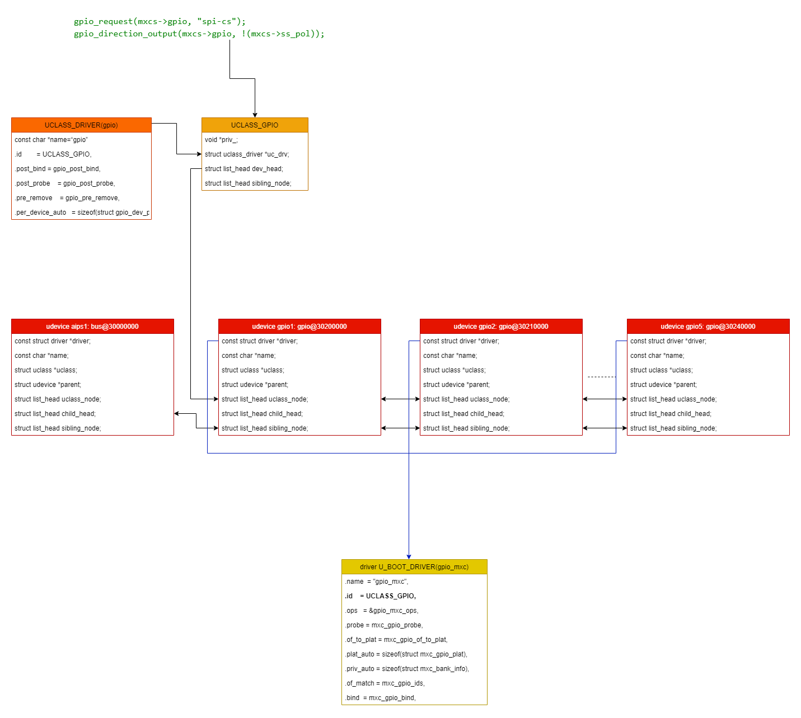
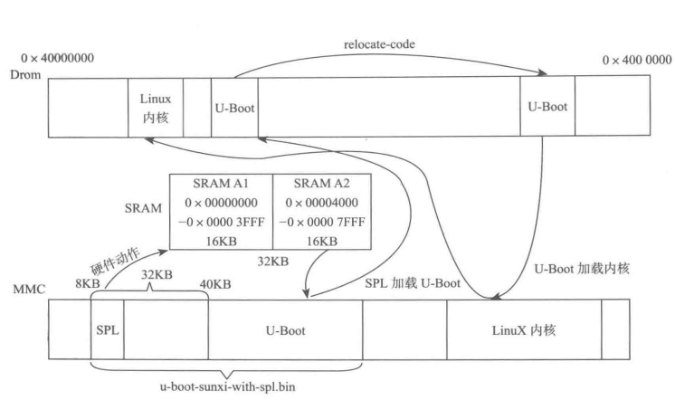

# Uboot DM分析



## 1. 描述u-boot驱动模型的数据结构

```
u-boot有一个功能强大的驱动模型，这一点与Linux内核一致。驱动模型对设备驱动相关操作做了一个抽象：使用uclass来描述设备类，使用driver来描述驱动，使用udevice来描述设备。
```

uclass是一个类，udevice是一个设备，driver是udevice的驱动。一个类下面的udevice连接到uclass上，driver是对应的udevice的具体的驱动。一个类可以有多个udevice。

### uclass

- uclass表示以相同特征方式运行的一组devicc。
- uclass提供一种以相同接口方式访问组内单个设备的方式。
- 该结构由`struct uclass`表示`(include/dm/uclass.h)`

```C
struct uclass {
        void *priv;// private data for this uclass
        struct uclass_driver *uc_drv;// 对应的uclass driver
        struct list_head dev_head;//该类中的设备列表（当设备的绑定方法被调用时，它们会被附加到它们的类上）。
        struct list_head sibling_node;//链表节点，用于把uclass连接到uclass_root链表上，类链表中的下一个类
}; 
```

- uclass driver：`spi-uclass.c`用于连接到uc_drv

### driver

- 用于提供与外设交互的高级接口
- 连接到`udevice→driver`

```C
struct driver {
        char *name;//device name
        enum uclass_id id;//该驱动属于哪个uclass                                                                                                                                                                                                      
        const struct udevice_id *of_match;//要匹配的兼容字符串列表
        int (*bind)(struct udevice *dev);//调用该函数将设备绑定到其驱动程序
        int (*probe)(struct udevice *dev);//用于探测设备，即激活设备
        int (*remove)(struct udevice *dev);//用于移除一个设备
        int (*unbind)(struct udevice *dev);//调用该函数来接触设备与驱动程序的绑定
        int (*ofdata_to_platdata)(struct udevice *dev);//在probe之前调用该函数以解析设备树
        int (*child_post_bind)(struct udevice *dev);//在一个新的子设备被绑定后调用
        int (*child_pre_probe)(struct udevice *dev);//在一个新的子设备被probe之前调用
        int (*child_post_remove)(struct udevice *dev);//在子设备被移除后调用
        int priv_auto_alloc_size;//如果非零，这是在设备的->priv指针中分配的私有数据大小
        int platdata_auto_alloc_size;//设备->platdata中分配的平台数据的大小，通常对设备树有效
        int per_child_auto_alloc_size;
        int per_child_platdata_auto_alloc_size;
        const void *ops;//由驱动定义的函数指针列表，实现uclass所需要的驱动函数 */
        uint32_t flags;//驱动标志
};
```

### udevice

- 与特定端口或外围设备绑定的驱动程序实例
- 连接到uclass中的 `dev_head`

```C
struct udevice {
        const struct driver *driver;
        const char *name;
        void *platdata;
        void *parent_platdata;
        void *uclass_platdata;
        int of_offset;
        ulong driver_data;
        struct udevice *parent;
        void *priv;
        struct uclass *uclass;
        void *uclass_priv;
        void *parent_priv;
        struct list_head uclass_node;
        struct list_head child_head;
        struct list_head sibling_node;
        uint32_t flags;
        int req_seq;
        int seq;
#ifdef CONFIG_DEVRES
        struct list_head devres_head;
#endif
};
```

- 连接到uclass中的 `dev_head`

```C
struct udevice {
        const struct driver *driver;
        const char *name;
        void *platdata;
        void *parent_platdata;
        void *uclass_platdata;
        int of_offset;
        ulong driver_data;
        struct udevice *parent;
        void *priv;
        struct uclass *uclass;
        void *uclass_priv;
        void *parent_priv;
        struct list_head uclass_node;
        struct list_head child_head;
        struct list_head sibling_node;
        uint32_t flags;
        int req_seq;
        int seq;
#ifdef CONFIG_DEVRES
        struct list_head devres_head;
#endif
};
```

## 2. 声明驱动

```
分析u-boot/drivers目录下的文件，驱动程序声明一般具有如下类似的结构`(drivers/demo/demo-shape.c)`
static const struct demo_ops shape_ops = {
    .hello = shape_hello,
    .status = shape_status,
};

U_BOOT_DRIVER(demp_shape_drv) = {
    .name = "demo_shape_drv",
    .id   = UCLASS_DEMO,
    .ops  = &shape_ops,
    .priv_data_size = sizeof(struct shape_data),
};
```

- 上述代码所示：

  - 首先创建xxx_ops结构，该结构与具体的设备驱动有关
  - 然后使用`U_BOOT_DRIVER`宏将其声明为u-boot驱动
  - 在`U_BOOT_DRIVER`中还可以指定用于绑定和解绑定的方法，这些方法在适当的时候被调用。对于大多数驱动程序来说，一般只会使用到probe和remove方法

- 在u-boot中，让一个设备工作的顺序是：

  

- `U_BOOT_DRIVER`宏创建了一个可从c访问的数据结构，因此驱动模型可以找到可用的驱动程序

## 3. U_BOOT_DRIVER宏分析

`U_BOOT_DRIVER`宏定义在`include/dm/device.h`文件宏：通过`__attribute__`的方式将所有的`U_BOOT_DRIVER`存放在`.u_boot_list_2_driver`这样单独的段中

```C
/* Declare a new U-Boot driver */
#define U_BOOT_DRIVER(__name)      \
 ll_entry_declare(struct driver, __name, driver)
 
 #define ll_entry_declare(_type, _name, _list)    \
 _type _u_boot_list_2_##_list##_2_##_name __aligned(4)  \
   __attribute__((unused,    \
   section(".u_boot_list_2_"#_list"_2_"#_name)))
    许多这样的`U_BOOT_DRIVER`声明出来的驱动会形成一张表(实质为数组),u-boot会使用这个表
```

- u-boot提供一些宏接口来访问这些定义出来的东西

```C
#define ll_entry_start(_type, _list)     \
({         \
 static char start[0] __aligned(4) __attribute__((unused, \
  section(".u_boot_list_2_"#_list"_1")));   \
 (_type *)&start;      \
})


#define ll_entry_end(_type, _list)     \
({         \
 static char end[0] __aligned(4) __attribute__((unused,  \
  section(".u_boot_list_2_"#_list"_3")));   \
 (_type *)&end;       \
})

#define ll_entry_count(_type, _list)     \
 ({        \
  _type *start = ll_entry_start(_type, _list);  \
  _type *end = ll_entry_end(_type, _list);  \
  unsigned int _ll_result = end - start;   \
  _ll_result;      \
 })
```

- 则实际上所有的驱动会以以下的形式组成：

  

## 4. udevice

```
    u-boot中用`struct udevice`来描述一个具体设备。该数据结构保存着一个设备的具体信息，这个设备是一个绑定到一个特定端口或外设(本质上是一个驱动实例)的驱动。
struct udevice {
        const struct driver *driver;//此设备使用的驱动程序
        const char *name;//设备名称，通常为FDT节点的名称
        void *platdata;//这个设备的配置数据
        void *parent_platdata;//父总线对此设备的配置数据
        void *uclass_platdata;//该uclass设备的配置数据
        int of_offset;//在设备树节点中的偏移量
        ulong driver_data;//驱动数据字，用于匹配该设备的驱动
        struct udevice *parent;//此设备的父设备，当为NULL时表示此设备为顶级设备
        void *priv;//私有数据
        struct uclass *uclass;//指向该设备所属类的指针
        void *uclass_priv;//uclass为该设备提供的私有数据
        void *parent_priv;//父设备为此设备提供的私有数据
        struct list_head uclass_node;//用于uclass链接到此设备
        struct list_head child_head;//设备子节点链表
        struct list_head sibling_node;//设备列表中的下一个设备
        uint32_t flags;//设备的标志
        int req_seq;//标志请求此设备的序列号
        int seq;//为该设备分配的虚列报。该只是在设备被探测时设置，并且在设备的类中是唯一的
#ifdef CONFIG_DEVRES
        struct list_head devres_head;
#endif
};
```

- 一个设备通过调用bind产生，分为两种方式：
  1. 由`U_BOOT_DEVICE`宏
  2. 通过设备树中的节点产生
- 如果是通过设备树中节点产生，则会将设备树信息转化为平台数据，通过驱动程序将数据转化为平台的实现方法(如果设备有设备树节点，则会在probe函数之前调用)
- 在驱动模型相关数据结构创建过程中，`platdata/priv/uclass_priv`可以由驱动分配，也可以使用`struct driver`和`struct uclass_driver`的`auto_alloc_size`成员来让驱动模型自动完成分配操作

## 5. 驱动模型分析

### 1. DM的初始化

- 创建根设备root的udevice，存放在`gd->dm_root`
- 根设备其实是一个虚拟设备，主要是为uboot的其他设备提供一个挂载点
- 初始化uclass链表`gd->uclass_root`

### 2. DM中udevice和uclass的解析

- udevice的创建和uclass的创建
  - 根据设备树创建 udevice
- udevice 和 uclass的绑定
  - 将 udevice 连接到 uclass 的链表`(((gd_t *)gd)->uclass_root)`上
- uclass_driver 和 uclass的绑定
- driver 和 udevice 的绑定
- 部分 driver 函数的调用

- <font color=red>执行完 `initr_dm`之后，只是建立了udevice和uclass之间的绑定关系，调用了driver的bind函数，但是设备还没有真正激活，也还没有执行设备的probe函数</font>


```c
//u-boot启动会从`board_init_f`到`board_init_r`。这里只分析`board_init_r`中的`initr_dm()`函数。
#ifdef CONFIG_DM
static int initr_dm(void)
{
        int ret; 

        /* Save the pre-reloc driver model and start a new one */
        gd->dm_root_f = gd->dm_root;
        gd->dm_root = NULL;
#ifdef CONFIG_TIMER
        gd->timer = NULL;
#endif                                                                                                                                                                                                                          
        // 用于初始化驱动模型的结构并扫描设备
        ret = dm_init_and_scan(false);
        if (ret)
                return ret; 
#ifdef CONFIG_TIMER_EARLY
        ret = dm_timer_init();
        if (ret)
                return ret; 
#endif

        return 0;
}
#endif
```

- `dm_init_and_scan`

```C
int dm_init_and_scan(bool pre_reloc_only)
{
        int ret;

        ret = dm_init();
        if (ret) {
                debug("dm_init() failed: %d\n", ret);
                return ret;
        }   
    	// 扫描平台数据
        ret = dm_scan_platdata(pre_reloc_only);
        if (ret) {
                debug("dm_scan_platdata() failed: %d\n", ret);
                return ret;
        }   

    	// 扫描设备树
        if (CONFIG_IS_ENABLED(OF_CONTROL) && !CONFIG_IS_ENABLED(OF_PLATDATA)) {
                ret = dm_scan_fdt(gd->fdt_blob, pre_reloc_only);
                if (ret) {
                        debug("dm_scan_fdt() failed: %d\n", ret);
                        return ret;
                }   
        }   

        ret = dm_scan_other(pre_reloc_only);
        if (ret)
                return ret;

        return 0;
}

//在u-boot的驱动模型中，驱动和类是以树形来构建和管理的，树根定义如下：
/* This is the root driver - all drivers are children of this */
U_BOOT_DRIVER(root_driver) = { 
        .name   = "root_driver",
        .id     = UCLASS_ROOT,
        .priv_auto_alloc_size = sizeof(struct root_priv),
};

/* This is the root uclass */
UCLASS_DRIVER(root) = {
        .name   = "root",
        .id     = UCLASS_ROOT,
};   

// 在dm_init_and_scan()函数中会初始化树和类似树的根，然后扫描并绑定来自平台数据和FDT的可用设备。
// 调用dm_init()来建立驱动模型结构
```

- `dm_init`

```C
int dm_init(void)
{
 int ret;
 
 //判断dm_root是否存在，如果存在则会返回。
 if (gd->dm_root) {
  dm_warn("Virtual root driver already exists!\n");
  return -EINVAL;
 }
  
  //初始化((gd_t *)gd)->uclass_root链表。
 INIT_LIST_HEAD(&DM_UCLASS_ROOT_NON_CONST);

#if defined(CONFIG_NEEDS_MANUAL_RELOC)
 fix_drivers();
 fix_uclass();
#endif

//创建设备并绑定驱动程序。
 ret = device_bind_by_name(NULL, false, &root_info, &DM_ROOT_NON_CONST);
 if (ret)
  return ret;
#if CONFIG_IS_ENABLED(OF_CONTROL)
 DM_ROOT_NON_CONST->of_offset = 0;
#endif
//探测（probe）一个设备，并激活它
 ret = device_probe(DM_ROOT_NON_CONST);
 if (ret)
  return ret;

 return 0;
}
```

- ```
  dm_scan_platdata
  ```

  - u-boot有两种方式描述设备：
    - 平台数据
    - 设备树
  - 此函数会扫描所有的平台数据并绑定驱动程序，扫描所有可用的平台数据并未每个数据创建驱动程序

```C
int dm_scan_platdata(bool pre_reloc_only)
{
 int ret;
 //搜索并将所有驱动程序绑定到父驱动程序
 ret = lists_bind_drivers(DM_ROOT_NON_CONST, pre_reloc_only);
 if (ret == -ENOENT) {
  dm_warn("Some drivers were not found\n");
  ret = 0;
 }

 return ret;
}
```

- ```
  dm_scan_fdt
  ```

  - 如果u-boot配置支持设备树，就会执行此函数
  - 次函数用于扫描设备书，绑定驱动程序。浙江扫描设备书并未每个节点创建一个驱动程序(只检查顶级子节点)

```C
int dm_scan_fdt_node(struct udevice *parent, const void *blob, int offset,
       bool pre_reloc_only)
{
 int ret = 0, err;

// 通过for循环从第一个子节点开始遍历到最后一个子节点
 for (offset = fdt_first_subnode(blob, offset);
      offset > 0;
      offset = fdt_next_subnode(blob, offset)) {
  if (pre_reloc_only &&
      !fdt_getprop(blob, offset, "u-boot,dm-pre-reloc", NULL))
   continue;
   
   // status = "okay"
  if (!fdtdec_get_is_enabled(blob, offset)) {
   dm_dbg("   - ignoring disabled device\n");
   continue;
  }
  
  err = lists_bind_fdt(parent, blob, offset, NULL);
  if (err && !ret) {
   ret = err;
   debug("%s: ret=%d\n", fdt_get_name(blob, offset, NULL),
         ret);
  }
 }

 if (ret)
  dm_warn("Some drivers failed to bind\n");

 return ret;
}

int dm_scan_fdt(const void *blob, bool pre_reloc_only)
{
 return dm_scan_fdt_node(gd->dm_root, blob, 0, pre_reloc_only);
}
```

- `lists_bind_fdt`

```C
int lists_bind_fdt(struct udevice *parent, const void *blob, int offset,
                ┆  struct udevice **devp)
{
        struct driver *driver = ll_entry_start(struct driver, driver);
        const int n_ents = ll_entry_count(struct driver, driver);
        const struct udevice_id *id;
        struct driver *entry;
        struct udevice *dev;
        bool found = false;
        const char *name;
        int result = 0;
        int ret = 0;

        dm_dbg("bind node %s\n", fdt_get_name(blob, offset, NULL));
        if (devp)
                *devp = NULL;
        // 查找所有使用 U_BOOT_DRIVER 宏定义的 struct driver
        // 使用 U_BOOT_DRIVER 中的 compatible 和 dts中的 compatible 进行匹配
        // blod：device tree point
        for (entry = driver; entry != driver + n_ents; entry++) {
                ret = driver_check_compatible(blob, offset, entry->of_match,
                                        ┆     &id);
                name = fdt_get_name(blob, offset, NULL);
                if (ret == -ENOENT) {
                        continue;
                } else if (ret == -ENODEV) {
                        dm_dbg("Device '%s' has no compatible string\n", name);
                        break;
                } else if (ret) {
                        dm_warn("Device tree error at offset %d\n", offset);
                        result = ret;
                        break;
                }   

                dm_dbg("   - found match at '%s'\n", entry->name);
                ret = device_bind_with_driver_data(parent, entry, name,
                                                ┆  id->data, offset, &dev);
                if (ret == -ENODEV) {
                        dm_dbg("Driver '%s' refuses to bind\n", entry->name);
                        continue;
                }   
                if (ret) {
                        dm_warn("Error binding driver '%s': %d\n", entry->name,
                                ret);
                        return ret;
                } else {
                        found = true;
                        if (devp)
                                *devp = dev;
                }   
                break;         
        }

        if (!found && !result && ret != -ENODEV) {
                dm_dbg("No match for node '%s'\n",
                ┆      fdt_get_name(blob, offset, NULL));
        }

        return result;
}
                
```

- `driver_check_compatible`

```C
/**
 * driver_check_compatible() - Check if a driver is compatible with this node
 *
 * @param blob:         Device tree pointer
 * @param offset:       Offset of node in device tree
 * @param of_match:     List of compatible strings to match
 * @param of_idp:       Returns the match that was found
 * @return 0 if there is a match, -ENOENT if no match, -ENODEV if the node
 * does not have a compatible string, other error <0 if there is a device
 * tree error
 */
static int driver_check_compatible(const void *blob, int offset,
                                ┆  const struct udevice_id *of_match,
                                ┆  const struct udevice_id **of_idp)
{
        int ret;

        *of_idp = NULL;
        if (!of_match)
                return -ENOENT;

        while (of_match->compatible) {
                ret = fdt_node_check_compatible(blob, offset,
                                                of_match->compatible);
                if (!ret) {
                        *of_idp = of_match;
                        return 0;
                } else if (ret == -FDT_ERR_NOTFOUND) {
                        return -ENODEV;
                } else if (ret < 0) {
                        return -EINVAL;
                }   
                of_match++;
        }   

        return -ENOENT;
}

int fdt_node_check_compatible(const void *fdt, int nodeoffset,
                        ┆     const char *compatible)
{
        const void *prop;
        int len;

        // 将设备树中该节点的 所有 compatible 字符串返回回来
        prop = fdt_getprop(fdt, nodeoffset, "compatible", &len);
        if (!prop)
                return len;
        // 将保存下来的 compatible 字符串与 U_BOOT_DRIVER.compatible 进行字符串比较
        if (fdt_stringlist_contains(prop, len, compatible))                                                                                                                                                                     
                return 0;
        else
                return 1;
}

int fdt_stringlist_contains(const char *strlist, int listlen, const char *str)                                                                                                                                                  
{               
        int len = strlen(str);
        const char *p; 

        while (listlen >= len) {
                if (memcmp(str, strlist, len+1) == 0)
                        return 1; 
                p = memchr(strlist, '\0', listlen);
                if (!p)
                        return 0; /* malformed strlist.. */
                listlen -= (p-strlist) + 1;
                strlist = p + 1;
        }
        return 0;
}

// !!!! 到这里只是将设备树中的 compatibe 和 U_BOOT_DRIVER 中的 compatible 匹配上，还未绑定
```

- `device_bind_with_driver_data`

```C
int device_bind_with_driver_data(struct udevice *parent,                                                                                                                                                                        
                                ┆const struct driver *drv, const char *name,
                                ┆ulong driver_data, int of_offset,
                                ┆struct udevice **devp)
{
        return device_bind_common(parent, drv, name, NULL, driver_data,
                                ┆ of_offset, 0, devp);
}


// 创建 device，通过 struct udevice **devp 带回去
// 将 device 连接到 uclass 链表上
// 执行一些 auto_malloc
// 执行一些  bind 函数，如果定义了的话
static int device_bind_common(struct udevice *parent, const struct driver *drv,
                        ┆     const char *name, void *platdata,
                        ┆     ulong driver_data, int of_offset,
                        ┆     uint of_platdata_size, struct udevice **devp)
{
        struct udevice *dev;
        struct uclass *uc;
        int size, ret = 0;

        if (devp)
                *devp = NULL;
        if (!name)
                return -EINVAL;

        // 获取 drv->id 对应的 uclass，如果uclass原先并不存在，那么会先在这里创建 uclass 并将其 ucass_driver 进行绑定
        ret = uclass_get(drv->id, &uc);
        if (ret) {
                debug("Missing uclass for driver %s\n", drv->name);
                return ret;
        }

    	// 分配一个 udevice，并在下面组建 struct udevice
        dev = calloc(1, sizeof(struct udevice));
        if (!dev)
                return -ENOMEM;

        INIT_LIST_HEAD(&dev->sibling_node);
        INIT_LIST_HEAD(&dev->child_head);
        INIT_LIST_HEAD(&dev->uclass_node);
#ifdef CONFIG_DEVRES
        INIT_LIST_HEAD(&dev->devres_head);
#endif
        dev->platdata = platdata;
        dev->driver_data = driver_data;
        dev->name = name;
        dev->of_offset = of_offset;
        dev->parent = parent;
        dev->driver = drv;
        dev->uclass = uc;

        dev->seq = -1;
        dev->req_seq = -1;
        if (CONFIG_IS_ENABLED(OF_CONTROL) && CONFIG_IS_ENABLED(DM_SEQ_ALIAS)) {
                /*
                ┆* Some devices, such as a SPI bus, I2C bus and serial ports
                ┆* are numbered using aliases.
                ┆*
                ┆* This is just a 'requested' sequence, and will be
                ┆* resolved (and ->seq updated) when the device is probed.  
                ┆*/
                if (uc->uc_drv->flags & DM_UC_FLAG_SEQ_ALIAS) {
                        if (uc->uc_drv->name && of_offset != -1) {
                                fdtdec_get_alias_seq(gd->fdt_blob,
                                                uc->uc_drv->name, of_offset,
                                                &dev->req_seq);
                        }
                }
        }

        // 处理 platdata，如果在U_BOOT_DRIVER宏中定义存在platdata的话，就分配一块空间
        if (drv->platdata_auto_alloc_size) {
                bool alloc = !platdata;

                if (CONFIG_IS_ENABLED(OF_PLATDATA)) {
                        if (of_platdata_size) {
                                dev->flags |= DM_FLAG_OF_PLATDATA;
                                if (of_platdata_size <
                                                drv->platdata_auto_alloc_size)
                                        alloc = true;
                        }
                }
                if (alloc) {
                        dev->flags |= DM_FLAG_ALLOC_PDATA;
                        dev->platdata = calloc(1,
                                        ┆      drv->platdata_auto_alloc_size);
                        if (!dev->platdata) {
                                ret = -ENOMEM;
                                goto fail_alloc1;
                        }
                        if (CONFIG_IS_ENABLED(OF_PLATDATA) && platdata) {
                                memcpy(dev->platdata, platdata,
                                ┆      of_platdata_size);
                        }
                }
        }

        // 如果UCLASS_DRIVER宏中定义了per_device_platdata_auto_alloc_size，就malloc一块空间
        size = uc->uc_drv->per_device_platdata_auto_alloc_size;
        if (size) {
                dev->flags |= DM_FLAG_ALLOC_UCLASS_PDATA;
                dev->uclass_platdata = calloc(1, size);
                if (!dev->uclass_platdata) {
                        ret = -ENOMEM;
                        goto fail_alloc2;
                }
        }
        // parent：gd->dm_root
        if (parent) {
                size = parent->driver->per_child_platdata_auto_alloc_size;
                if (!size) {
                        size = parent->uclass->uc_drv->
                                        per_child_platdata_auto_alloc_size;
                }
                if (size) {
                        dev->flags |= DM_FLAG_ALLOC_PARENT_PDATA;
                        dev->parent_platdata = calloc(1, size);
                        if (!dev->parent_platdata) {
                                ret = -ENOMEM;
                                goto fail_alloc3;
                        }
                }
        }

        /* put dev into parent's successor list */
        // 添加到父设备的子设备链表中
        if (parent)
                list_add_tail(&dev->sibling_node, &parent->child_head);

        // uclass 和 device 进行绑定，其实就是将 udevice 连接到uclass的链表上
        ret = uclass_bind_device(dev);
        if (ret)
                goto fail_uclass_bind;

        /* if we fail to bind we remove device from successors and free it */
        // 执行 U_BOOT_DRIVER 中的 bind 函数
        if (drv->bind) {
                ret = drv->bind(dev);
                if (ret)
                        goto fail_bind;
        }
        if (parent && parent->driver->child_post_bind) {
                ret = parent->driver->child_post_bind(dev);
                if (ret)
                        goto fail_child_post_bind;
        }
        if (uc->uc_drv->post_bind) {
                ret = uc->uc_drv->post_bind(dev);
                if (ret)
                        goto fail_uclass_post_bind;
        }

        if (parent)
                dm_dbg("Bound device %s to %s\n", dev->name, parent->name);
        // 通过二级指针，将dev带回去
        if (devp)
                *devp = dev;
                                                                                                                                                                                             // 设置已经绑定的标志
    	// 后续可以通过 dev->flags & DM_FLAG_ACTIVATED 或者 device_active 宏来判断设备是否已经激活
        dev->flags |= DM_FLAG_BOUND;

        return 0;

fail_uclass_post_bind:
        /* There is no child unbind() method, so no clean-up required */
fail_child_post_bind:
        if (CONFIG_IS_ENABLED(DM_DEVICE_REMOVE)) {
                if (drv->unbind && drv->unbind(dev)) {
                        dm_warn("unbind() method failed on dev '%s' on error path\n",
                                dev->name);
                }
        }

fail_bind:
        if (CONFIG_IS_ENABLED(DM_DEVICE_REMOVE)) {
                if (uclass_unbind_device(dev)) {
                        dm_warn("Failed to unbind dev '%s' on error path\n",
                                dev->name);
                }
        }
fail_uclass_bind:
        if (CONFIG_IS_ENABLED(DM_DEVICE_REMOVE)) {
                list_del(&dev->sibling_node);
                if (dev->flags & DM_FLAG_ALLOC_PARENT_PDATA) {
                        free(dev->parent_platdata);
                        dev->parent_platdata = NULL;
                }
        }
fail_alloc3:
        if (dev->flags & DM_FLAG_ALLOC_UCLASS_PDATA) {
                free(dev->uclass_platdata);
                dev->uclass_platdata = NULL;
        }
fail_alloc2:
        if (dev->flags & DM_FLAG_ALLOC_PDATA) {
                free(dev->platdata);
                dev->platdata = NULL;
        }
fail_alloc1:
        devres_release_all(dev);

        free(dev);

        return ret;
}
```

- `uclass_bind_device`

```C
int uclass_bind_device(struct udevice *dev)
{
        struct uclass *uc;
        int ret;

        uc = dev->uclass;
        // 把 udevice 连接到对应的 uclass上
        list_add_tail(&dev->uclass_node, &uc->dev_head);

        if (dev->parent) {
                struct uclass_driver *uc_drv = dev->parent->uclass->uc_drv;

                if (uc_drv->child_post_bind) {
                        ret = uc_drv->child_post_bind(dev);
                        if (ret)
                                goto err;
                }
        }

        return 0;
err:
        /* There is no need to undo the parent's post_bind call */
        list_del(&dev->uclass_node);

        return ret;
}
```

### 3. 设备probe

- 通过uclass来获取一个udevice并且进行probe，由模块自己实现。

- 分析 `device_probe`：
  - 分配设备的私有数据
  - 对父设备进行probe
  - 执行probe device之前uclass需要调用的一些函数
  - 调用driver的`ofdata_to_platdata`，将设备树信息转化为设备的平台数据
  - 调用driver的probe 函数
  - 执行probe device之后uclass需要调用的一些函数

```c
int device_probe(struct udevice *dev)
{
        const struct driver *drv;
        int size = 0;
        int ret;
        int seq;

        if (!dev)
                return -EINVAL;

    	// 表明这个设备已经被激活
        if (dev->flags & DM_FLAG_ACTIVATED)
                return 0;

        drv = dev->driver;
        assert(drv);

        /* Allocate private data if requested and not reentered */
        if (drv->priv_auto_alloc_size && !dev->priv) {
                dev->priv = alloc_priv(drv->priv_auto_alloc_size, drv->flags);
                if (!dev->priv) {
                        ret = -ENOMEM;
                        goto fail;
                }   
        }   
        /* Allocate private data if requested and not reentered */
        size = dev->uclass->uc_drv->per_device_auto_alloc_size;
        if (size && !dev->uclass_priv) {
                dev->uclass_priv = calloc(1, size);
                if (!dev->uclass_priv) {
                        ret = -ENOMEM;
                        goto fail;
                }   
        }   

        /* Ensure all parents are probed */
    	// 确保所有父设备已经probe过
        if (dev->parent) {
                size = dev->parent->driver->per_child_auto_alloc_size;
                if (!size) {
                        size = dev->parent->uclass->uc_drv->
                                        per_child_auto_alloc_size;
                }   
                if (size && !dev->parent_priv) {
                        dev->parent_priv = alloc_priv(size, drv->flags);
                        if (!dev->parent_priv) {
                                ret = -ENOMEM;
                                goto fail;
                        }   
                }                 
                ret = device_probe(dev->parent);
                if (ret)
                        goto fail;

                /*
                ┆* The device might have already been probed during
                ┆* the call to device_probe() on its parent device
                ┆* (e.g. PCI bridge devices). Test the flags again
                ┆* so that we don't mess up the device.
                ┆*/
                if (dev->flags & DM_FLAG_ACTIVATED)
                        return 0;
        }

        seq = uclass_resolve_seq(dev);
        if (seq < 0) {
                ret = seq;
                goto fail;
        }
        dev->seq = seq;

    	// 设置udevice的激活标志
        dev->flags |= DM_FLAG_ACTIVATED;

        /*
        ┆* Process pinctrl for everything except the root device, and
        ┆* continue regardless of the result of pinctrl. Don't process pinctrl
        ┆* settings for pinctrl devices since the device may not yet be
        ┆* probed.
        ┆*/
        if (dev->parent && device_get_uclass_id(dev) != UCLASS_PINCTRL)
                pinctrl_select_state(dev, "default");

        ret = uclass_pre_probe_device(dev);
        if (ret)
                goto fail;

        if (dev->parent && dev->parent->driver->child_pre_probe) {
                ret = dev->parent->driver->child_pre_probe(dev);
                if (ret)
                        goto fail;
        }

        if (drv->ofdata_to_platdata && dev->of_offset >= 0) {
                ret = drv->ofdata_to_platdata(dev);
                if (ret)
                        goto fail;
        }        
    	// 此处执行真正的driver->probe函数，到这里设备才真正激活了
        if (drv->probe) {
                ret = drv->probe(dev);
                if (ret) {
                        dev->flags &= ~DM_FLAG_ACTIVATED;
                        goto fail;
                }
        }

        ret = uclass_post_probe_device(dev);
        if (ret)
                goto fail_uclass;

        if (dev->parent && device_get_uclass_id(dev) == UCLASS_PINCTRL)
                pinctrl_select_state(dev, "default");

        return 0;
fail_uclass:
        if (device_remove(dev)) {
                dm_warn("%s: Device '%s' failed to remove on error path\n",
                        __func__, dev->name);
        }
fail:
        dev->flags &= ~DM_FLAG_ACTIVATED;

        dev->seq = -1;
        device_free(dev);

        return ret;
}

```


### 4. uclass的接口调用

- 可以通过先从`root_uclass`链表中提取对应的uclass，然后通过`uclass->uclass_driver->ops`来进行接口调用


# U-boot SPL

​		NOR Flash 的特点是带有SRAM接口，有足够的地址引脚来寻址，可以很容易地存取其内部的每一个字节，因此支持XIP。这样程序可以直接在Flash内运行，不必再把代码读到系统的RAM中。NOR 的读取效率很高，但是写入和擦除速度很慢。

​		NAND Flash 结构能提供极高的单元密度，可以达到高存储密度，并且写入和擦除的速度也很快。应用NAND Flash的困难在于其管理需要特殊的系统接口，因此NAND Flash并不支持XIP。

​		若系统仅使用NAND Flash，不再使用NOR Flash，也是有解决方法的，即使用芯片内的ROM或者其它机制加载固件到SRAM中。例如s3c24xx系列，内部有一块4KB大小的SRAM，当采用NAND Flash方式启动时，独有的硬件机制会将位于NAND Flash最前4kb的数据自动加载到SRAM中，在4KB代码中完成NAND Flash接口的初始化，就可以实现从NAND Flash完成系统的启动了。

​		这种时候就需要SPL，因为SPL短小精悍，适用于4KB或者更小的SRAM环境。第一步由SPL引导U-boot，第二部由U-boot再引导系统内核。



## SPL代码分析

​	查看`u-boot-spl.lds`链接文件，启动代码就是`arch/arm/cpu/armv7/start.S`，主要做的事情就是初始化系统的各个方面：

1. 设置CPU模式
2. 关闭看门狗
3. 关中断
4. 设置堆栈sp指针
5. 清bss段
6. 异常中断处理


# Uboot 设备树流程分析

```
dm_init_and_scan(true)
	dm_init(void)
		#define DM_UCLASS_ROOT_NON_CONST	(((gd_t *)gd)->uclass_root)
		device_bind_by_name(NULL, false, &root_info, &DM_ROOT_NON_CONST);
			drv = lists_driver_lookup_name(info->name); // 根据 info->name 找到对应的 struct driver，就是从所有的段(uboot.map)里面找到 info->name 对应的 driver 的地址，然后返回回来
			return device_bind_common(parent, drv, info->name, (void *)info->platdata, 0, -1, platdata_size, devp);
				// 根据 struct driver 创建 struct udevice、struct uclass
		ret = device_probe(DM_ROOT_NON_CONST);

```

